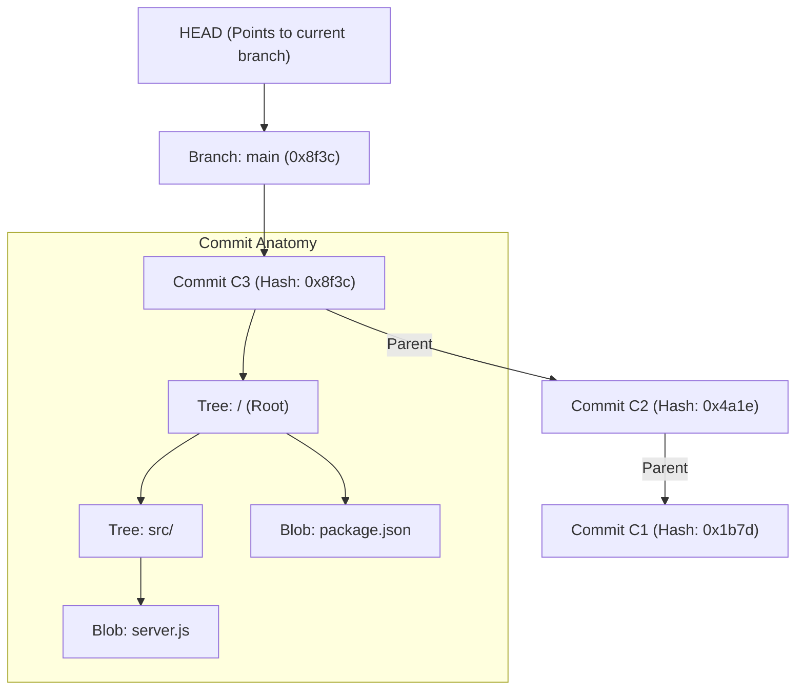
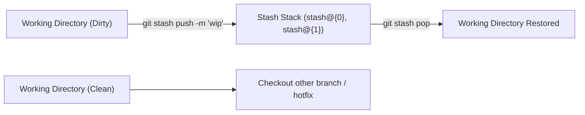

# 01 — Git Core Internals, Command Mastery & Git Graph Visual Workflow

> **Author / Mentor Context:** Production-Grade Source Control Mastery for Backend & Distributed Systems Engineers.  
> **Core Focus:** DAG Internals, `git stash`, `fetch`/`pull`/`push --force-with-lease`, `reflog`, and Visual Workflow with VS Code Git Graph.

---

## 1. Git Mental Model: It's Not a File Tracker, It's a DAG of Content-Addressed Snapshots

Many junior developers think of Git as tracking "diffs between files". **Senior engineers understand Git as a Directed Acyclic Graph (DAG) of immutable snapshots.**

```
Blob (File Content: SHA-1/SHA-256)
  ↑
Tree (Directory structure / file names / permissions)
  ↑
Commit Object (Metadata, Author, Timestamp, Tree Hash, Parent Commit Hash)
  ↑
References (Branches, Tags, HEAD -> pointers to Commit Hashes)
```



### Key Architectural Invariants
1. **Commits are Immutable:** Any change to code, commit message, author, or parent hash results in a completely new SHA hash.
2. **Branches are Cheap Pointers:** A branch is literally a 41-byte text file inside `.git/refs/heads/<branch-name>` containing a single 40-character commit SHA. Creating or moving a branch is an $O(1)$ pointer assignment.
3. **`HEAD` is the Current Context Pointer:** `HEAD` points either to a branch name (`ref: refs/heads/main`) or directly to a commit hash (**Detached HEAD state**).

---

## 2. Exhaustive Command Reference & Production Mechanics

### A. Information & State Inspection
| Command | What it actually does under the hood | Senior Production Tip |
| :--- | :--- | :--- |
| `git status -s` (or `-sb`) | Fast, concise summary of staging area, working tree, and branch tracking status. | Add `git status -sb` as your default terminal alias (`st`). |
| `git diff` | Diff between **Working Directory** and **Staging Index**. | Use `git diff --staged` (or `--cached`) to review exact changes staged for commit before executing `git commit`. |
| `git log --oneline --graph --decorate --all` | Renders a terminal-based ASCII DAG of all branches, commits, and remote tracking refs. | Ideal for remote SSH/bastion environments where GUI tools are unavailable. |
| `git reflog` | Chronological journal of every movement of `HEAD` on your local machine (even commits deleted via `git reset --hard` or failed rebases). | **Your safety net:** Commits are almost never lost in Git for 30–90 days until garbage collection (`git gc`) runs. |

---

### B. Remote Synchronization: `fetch`, `pull`, `push`

#### 1. `git fetch origin`
- **Mechanism:** Downloads all new commits, trees, blobs, and references from the remote server (`origin`) into your local `.git` repository and updates remote tracking pointers (e.g., `origin/main`, `origin/dev`).
- **Working Tree Impact:** **Zero.** It does NOT touch your working directory or alter your local branches.
- **Why Seniors Default to Fetch:** It allows non-destructive inspection of what teammates pushed before deciding how to integrate (`git diff HEAD..origin/main`).

#### 2. `git pull` vs `git pull --rebase`
- `git pull` = `git fetch` + `git merge origin/<branch>`.
  - Creates unnecessary "merge bubbles" (e.g., `Merge branch 'main' of github.com:...`), dirtying git history and breaking clean linear bisectability.
- `git pull --rebase` = `git fetch` + `git rebase origin/<branch>`.
  - Re-applies your unpushed local commits on top of the latest remote branch tip.
- **Production Standard:** Configure `git config --global pull.rebase true`.

#### 3. `git push` & Dangerous Force Operations
```bash
# Standard push (fails if remote has new commits)
git push origin feature/my-feature

# Set upstream tracking branch on first push
git push -u origin feature/my-feature

# ❌ DANGEROUS: Destroys remote commits pushed by others without warning
git push --force origin feature/my-feature

# ✅ PRODUCTION SAFE-FORCE: Fails if someone else pushed new commits to the branch since your last fetch
git push --force-with-lease origin feature/my-feature
```

> [!CAUTION]
> **Rule of Thumb:** Never use `git push --force` on shared team branches (`main`, `staging`, `dev`). On personal feature branches where you rebased or squashed commits, **always use `git push --force-with-lease`**.

---

### C. Workspace State Management: `git stash` Deep Dive

When you are midway through a feature and need to switch branches immediately (e.g., urgent production hotfix or helping a teammate), `git stash` saves your uncommitted dirty state into a stack.



#### Essential Stash Commands

```bash
# 1. Stash modified tracked files with a clear descriptive message
git stash push -m "WIP: redis caching logic before hotfix"

# 2. Stash EVERYTHING including untracked new files (-u) and ignored files (-a)
git stash push -u -m "WIP: full feature with new config files"

# 3. List all stashes in the stack
git stash list
# Output:
# stash@{0}: On feature/auth: WIP: redis caching logic before hotfix
# stash@{1}: On main: WIP: temporary debug logs

# 4. Inspect what changes are inside a stash without applying it
git stash show -p stash@{0}

# 5. Apply the latest stash AND remove it from the stack
git stash pop

# 6. Apply a specific stash from the stack without dropping it (safe mode)
git stash apply stash@{1}

# 7. Discard a specific stash or drop all
git stash drop stash@{0}
git stash clear

# 8. Create a new branch directly from a stash (avoids conflicts if base changed heavily)
git stash branch feature/resumed-caching stash@{0}
```

---

### D. Safe Navigation & Undo Mechanisms

#### Modern Alternatives to `git checkout`
Git 2.23+ separated the overloaded `git checkout` command into two focused commands:

```bash
# Branch Switching / Creation:
git switch main                     # Switch to existing branch
git switch -c feature/payment-v2    # Create and switch to new branch (equivalent to git checkout -b)

# File Discarding & Restoring:
git restore src/server.js           # Discard uncommitted modifications in working directory
git restore --staged src/server.js  # Unstage file (move from Staging Index back to Working Dir)
```

#### Commit Undoing: `reset` vs `revert`
- `git revert <commit-hash>`: Creates a **new forward commit** that inverses the diff of the specified commit. **Safe for public/shared branches.**
- `git reset --soft HEAD~1`: Moves branch pointer back by 1 commit, keeping changes in the **Staging Index**.
- `git reset --mixed HEAD~1` (default): Moves branch pointer back by 1 commit, keeping changes in **Working Directory (unstaged)**.
- `git reset --hard HEAD~1`: Moves branch pointer back and **destroys all uncommitted changes and commit code**. (Recoverable only via `git reflog`).

---

## 3. Visual Workflow with the VS Code Git Graph Extension

While CLI commands are essential for automation, CI/CD, and server operations, visual DAG tools like the **VS Code Git Graph Extension** drastically reduce cognitive load when handling complex branch histories.


```
* 8f3c1a2 (HEAD -> dev2, origin/dev2) [Teammate 2] feat: add analytics tracking (E)
* 4a1e9b0 [Teammate 1] fix: update redis timeout config (D)
* 1b7d5c3 [You] feat: implement stripe payment gateway (C)  <-- Target PR commit
* 90ef2a1 [You] feat: add payment validation DTO (B)
* 33bca41 [You] feat: create payment database schema (A)
* e529810 (origin/main, main) Initial baseline commit
```

### Git Graph Power Actions

1. **Creating a Clean Branch from Any Arbitrary Commit:**
   - Open Git Graph (`View -> Command Palette -> Git Graph: View Git Graph`).
   - Find the exact commit where your feature is finished (e.g., `1b7d5c3` - Commit C).
   - Right-click on the commit $\rightarrow$ Click **Create Branch...**
   - Name: `feature/stripe-isolated-pr`.
   - Result: A new branch pointer is created directly at `1b7d5c3`, ignoring all subsequent commits (`D`, `E`).

2. **Visual Diff Inspection Across Arbitrary Commits / Branches:**
   - In Git Graph, click on any commit to immediately view all files changed in that snapshot.
   - Hold `Ctrl` (or `Cmd` on Mac) and click **two different commits** $\rightarrow$ Git Graph will display the exact delta/diff between those two arbitrary points in time.

3. **Visual Cherry-Pick:**
   - Right-click any single commit from another branch $\rightarrow$ Select **Cherry-Pick Commit...**
   - Option to auto-commit or keep staged for manual inspection.

4. **Visual Rebase & Interactive Rebase:**
   - Right-click a target branch (e.g., `origin/main`) while checked out on your feature branch $\rightarrow$ Select **Rebase current branch on this branch...**
   - Enables visual conflict resolution and squash management.

---

## 4. Production Golden Rules for Senior Engineers

1. **Never commit secrets, `.env`, or build artifacts.** Always maintain strict `.gitignore` patterns.
2. **Atomic Commits:** Each commit should represent one cohesive logical change with a descriptive imperative commit message (e.g., `feat(payment): add idempotency key validation to checkout`).
3. **Keep Local Branches Rebased & Clean:** Rebase against `origin/main` before opening a Pull Request.
4. **Never Force-Push to Protected Branches:** Lock `main`, `staging`, and `release/*` on GitHub/GitLab with branch protection rules.
