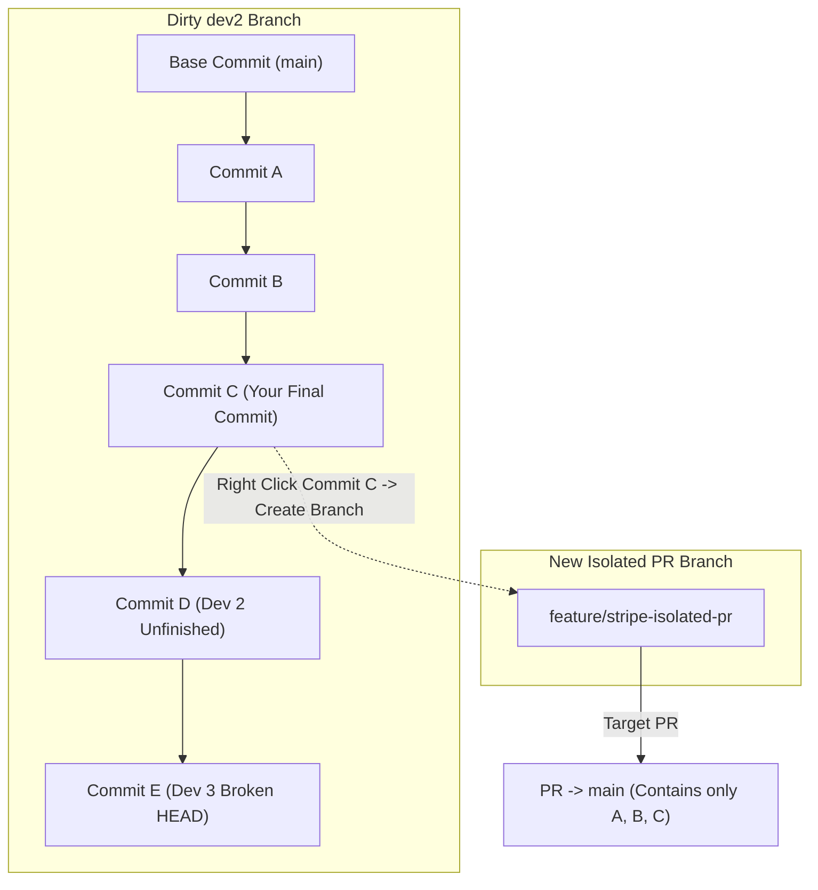
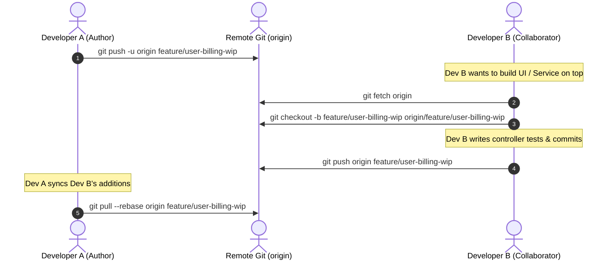

# 02 — Isolating Commits, Branch Surgery & WIP Sharing Workflows

> **Author / Mentor Context:** Production-Grade Branch Surgery for Backend & Distributed Systems Engineers.  
> **Core Focus:** Cutting PR branches from specific commits, removing unwanted commits from dirty branches, and safely sharing unmerged WIP branches across distributed teams.

---

## 1. Scenario 1: Isolating Your Commits from a Polluted Development Branch

### The Problem in Production
In fast-paced teams, developers often push work-in-progress code or experimental features to a shared branch (e.g., `dev`, `dev2`, `staging-qa`). 

Suppose you pushed your feature commits (**A, B, C**) on `dev2`. Before you could create a Pull Request to `main`, other developers pushed commits (**D, E**) on top of `dev2`.

```
main (at base X)
  |
  A  [You: Schema Migration]
  |
  B  [You: Service Logic]
  |
  C  [You: API Endpoints]  <--- YOUR CODE ENDS HERE
  |
  D  [Dev 2: Half-baked experimental feature]
  |
  E  [Dev 3: Broken test harness]  <--- HEAD of dev2
```

**Your Goal:** Raise a clean PR to `main` containing **ONLY Commits A, B, and C**, completely excluding `D` and `E`.

---

### Solution Path A: Visual Surgery using VS Code Git Graph (Fastest & Zero Error)



#### Step-by-Step Execution in Git Graph:
1. **Open Git Graph:** In VS Code, open the Git Graph window (`Cmd+Shift+P` $\rightarrow$ `Git Graph: View Git Graph` or click the "Git Graph" icon on the bottom status bar).
2. **Locate Commit C:** Scroll through the branch graph for `dev2` and find the exact commit hash of **Commit C** (the last commit containing your changes).
3. **Branch from Commit C:**
   - Right-click on the row for **Commit C**.
   - Select **"Create Branch..."**
   - Branch Name: `feature/stripe-isolated-pr`.
   - Check the checkbox **"Checkout branch"** (or switch to it manually).
4. **Push Upstream:**
   ```bash
   git push -u origin feature/stripe-isolated-pr
   ```
5. **Open PR:**
   - Base branch: `main`
   - Compare branch: `feature/stripe-isolated-pr`
   - Result: GitHub/GitLab will show exact diff of $A + B + C$ only. Commits $D$ and $E$ are completely absent.

---

### Solution Path B: Direct CLI Execution

```bash
# 1. Fetch latest remote state
git fetch origin

# 2. Identify the commit hash of C (e.g. 1b7d5c3)
git log --oneline origin/dev2

# 3. Create and switch to new branch pinned directly to commit C
git checkout -b feature/stripe-isolated-pr 1b7d5c3
# (Or using modern Git syntax: git switch -c feature/stripe-isolated-pr 1b7d5c3)

# 4. Push to remote
git push -u origin feature/stripe-isolated-pr
```

---

### Solution Path C: Advanced Surgery with `git rebase --onto` (When Dirty Commits Exist BEFORE Your Commits)

What if the history on `dev2` had someone else's dirty commit **BEFORE** your commits?

```
main (at Base X)
  |
  D0 [Dev 2: Unrelated dirty commit]
  |
  A  [You: Schema]
  |
  B  [You: Service]
  |
  C  [You: API]  <-- HEAD of your work
```

If you branch from C, your branch will still contain `D0`. How do you transplant **only [A..C]** directly onto `main`?

```bash
# Syntax: git rebase --onto <new-base> <upstream-to-exclude> <branch-to-move>

# 1. Create a branch at commit C
git checkout -b feature/clean-feature <hash-of-C>

# 2. Transplant commits from after D0 up to C directly onto origin/main
git rebase --onto origin/main <hash-of-D0> feature/clean-feature

# 3. Verify history with git log --oneline
# Result: main -> A' -> B' -> C' (D0 is eliminated!)

# 4. Push to remote
git push -u origin feature/clean-feature
```

---

## 2. Scenario 2: Sharing Unmerged WIP / Feature Branch with Teammates Safely

### The Problem in Production
You are building an intricate multi-tier feature (e.g., Kafka Event Consumer + DB Schema). You need a backend peer or frontend engineer to start testing against your branch **before** it is merged to `staging` or `main`.

Common amateur mistake: Merging unfinished code to `staging` or `dev` so others can access it, polluting shared environments.

### Production Best Practice: Ephemeral Remote Collaboration Branches



#### Step-by-Step Collaborative Protocol

1. **Author pushes feature branch:**
   ```bash
   git checkout -b feature/wip-billing-service
   git commit -m "feat(billing): initial db schema and stripe client"
   git push -u origin feature/wip-billing-service
   ```

2. **Collaborator fetches and tracks branch:**
   ```bash
   git fetch origin
   # Create local tracking branch mapped directly to remote branch
   git checkout --track origin/feature/wip-billing-service
   ```

3. **Collaborator makes commits and pushes:**
   ```bash
   git commit -m "feat(billing): add webhook event dispatcher"
   git push origin feature/wip-billing-service
   ```

4. **Author updates their local branch without messy merge bubbles:**
   ```bash
   git fetch origin
   git rebase origin/feature/wip-billing-service
   ```

---

## 3. Pre-PR Checklist: Verifying Your Isolated Branch

Before opening a PR on GitHub/GitLab, senior engineers run this 30-second audit:

```bash
# 1. Compare commit list against target base
git log --oneline origin/main..HEAD

# 2. Check exact files modified vs base
git diff --stat origin/main..HEAD

# 3. Ensure no unwanted files, credentials, or stray debug logs exist
git diff origin/main..HEAD --name-only
```
