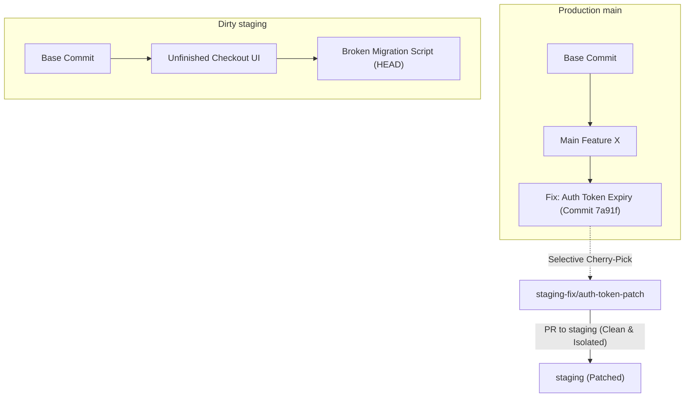
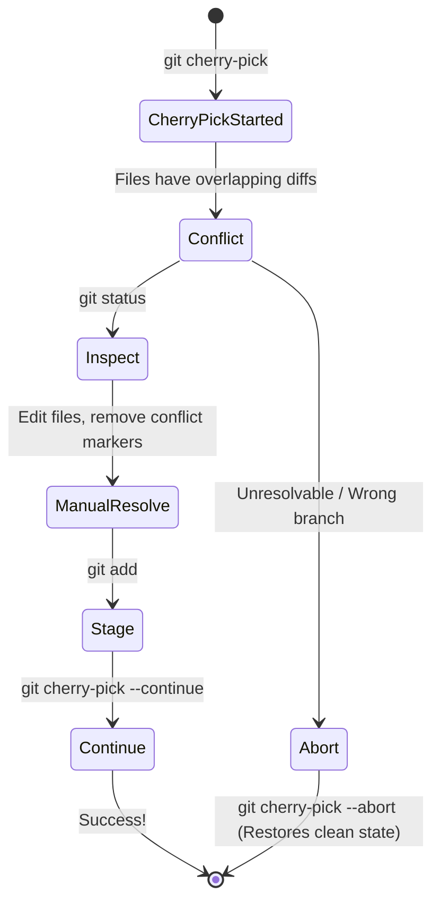

# 03 — Production Cherry-Pick, Hotfix Lifecycles & Conflict Resolution

> **Author / Mentor Context:** Production Deployment Workflows for Backend & Distributed Systems Engineers.  
> **Core Focus:** Selective Commit Promotion, Staging vs Main Branch Divergence, Cherry-Pick Mechanics, and Clean Merge Conflict Resolution.

---

## 1. The Production Dilemma: Why Direct Merges Fail Across Environments

In modern backend engineering setups, code flows through different environment branches:
- **`main` / `master` / `trunk`**: Source of truth running in Production.
- **`staging` / `qa`**: Testing environment where multiple teams merge features slated for upcoming releases.

### The Real-World Breakdown Scenario
1. You develop a critical bugfix or feature on a branch based on `main`.
2. QA asks you to deploy it to `staging` for immediate validation.
3. If you simply merge `main` into `staging`, or merge your feature branch directly into a dirty `staging`, you accidentally bring in:
   - Untested commits from other engineers on `main`.
   - Massive merge conflicts because `staging` has long-running, unmerged experimental code.
   - Accidental promotion of broken features.



---

## 2. Step-by-Step Production Cherry-Pick Workflow

### Step 1: Identify Your Commit Hashes
Find the exact commit SHA(s) of the fix/feature you built:
```bash
git log --oneline -n 5
# Output:
# 7a91f42 (HEAD -> fix/auth-token) fix(auth): refresh token rotation TTL calculation
# 3b2e109 fix(auth): add unit test for token expiry
```

### Step 2: Cut a Fresh, Clean Branch from Latest `staging`
Do NOT merge your existing local branch into staging. Instead, create a fresh workspace pinned to the latest remote `origin/staging`:

```bash
# 1. Fetch remote tracking refs
git fetch origin

# 2. Cut a clean branch directly from origin/staging
git checkout -b staging-patch/auth-token origin/staging
```

### Step 3: Cherry-Pick the Exact Commits

```bash
# Apply a single commit
git cherry-pick 7a91f42

# Apply multiple specific commits in sequence
git cherry-pick 3b2e109 7a91f42

# Apply a range of commits (from commit A exclusive to commit B inclusive)
git cherry-pick 3b2e109^..7a91f42

# Apply without auto-committing (stages changes so you can inspect/modify before committing)
git cherry-pick -n 7a91f42
```

---

## 3. Handling Cherry-Pick Merge Conflicts in Production

When cherry-picking onto a divergent branch (like `staging`), Git performs a **3-Way Merge** using:
1. **The Commit being picked** (The `THEIRS` / incoming state).
2. **The Parent of the commit being picked** (The `BASE` state).
3. **The Current branch HEAD** (`staging-patch`) (The `OURS` / local state).

```
<<<<<<< HEAD (Current branch on staging)
const TOKEN_TTL_SECONDS = process.env.STAGING_TOKEN_TTL || 3600;
=======
const TOKEN_TTL_SECONDS = config.auth.tokenTtlSeconds || 1800;
>>>>>>> 7a91f42 (fix(auth): refresh token rotation TTL calculation)
```

### The Conflict Resolution Lifecycle



```bash
# 1. If conflicts occur, inspect which files need attention
git status

# 2. Open conflicting files in VS Code / IDE, resolve logic, and save

# 3. Stage the resolved files (DO NOT run git commit!)
git add src/auth/token.service.ts

# 4. Continue the cherry-pick operation
git cherry-pick --continue
# Git will automatically open the commit message editor; save and exit (:wq).

# 5. Emergency escape hatch: Abort everything if something went wrong
git cherry-pick --abort
```

---

## 4. Push and Open Isolated PR to Staging

```bash
# Push the cherry-picked patch branch to origin
git push -u origin staging-patch/auth-token
```

Now open a Pull Request:
- **Base:** `staging`
- **Compare:** `staging-patch/auth-token`

### Why This is Senior-Grade:
- Zero unintended changes are introduced to `staging`.
- No unrelated code from `main` leaks into the staging build.
- When `staging` is rebuilt and deployed by CI/CD, only your tested patch is evaluated.

---

## 5. Visual Cherry-Pick in VS Code Git Graph

For visual developers:
1. Open Git Graph in VS Code.
2. Checkout your destination branch (`staging-patch/auth-token`).
3. Scroll to the source commit on `main` or your feature branch.
4. Right-click the commit $\rightarrow$ Click **"Cherry-Pick Commit..."**
5. Check or uncheck *"No Commit"* based on whether you want to inspect staged changes first.
6. If conflicts occur, Git Graph will highlight conflicting files in red for instant one-click resolution.
