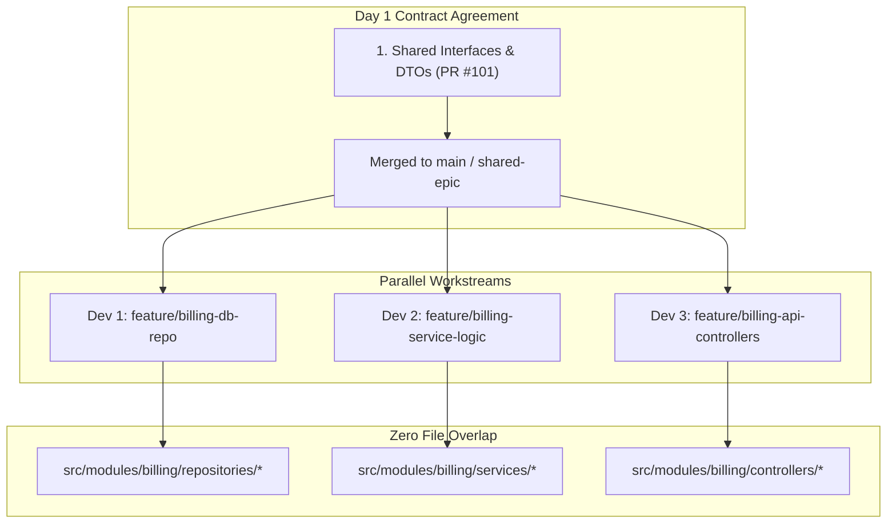
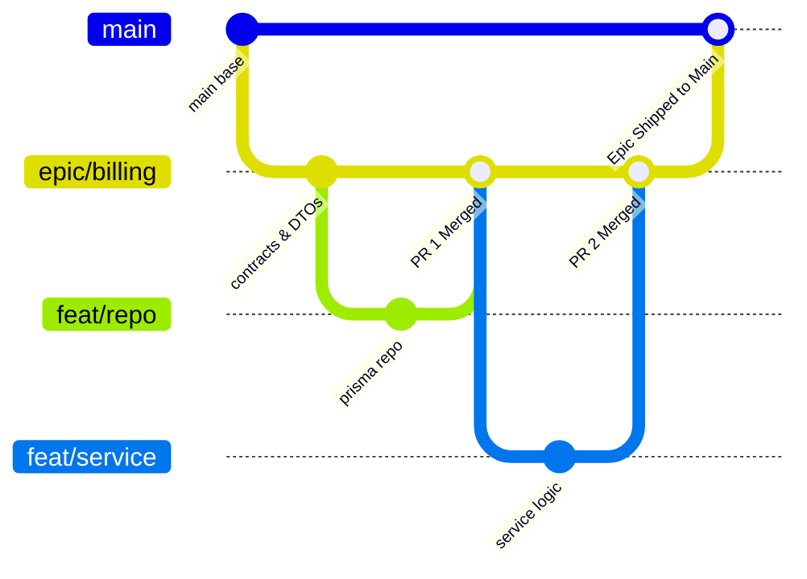

# 04 — Multi-Developer Collaboration & Zero-Conflict PR Architecture

> **Author / Mentor Context:** Team Scaling & Distributed Team Workflows for Backend Engineers.  
> **Core Focus:** Coordinating 2–4 developers on the same feature, Stacked PRs, Contract-First boundaries, and eliminating merge hell before it happens.

---

## 1. The Root Cause of Multi-Dev Merge Hell

When 2–3 developers are assigned to the same feature (e.g., "Subscription Billing & Stripe Integration"):
- Dev 1 builds the **Database Models & Repositories**.
- Dev 2 builds the **Business Service Logic & Stripe Webhook Handler**.
- Dev 3 builds the **REST/GraphQL API Controllers & Middleware**.

### The Amateur Pattern (High Conflict & Blocked Teams)
- All 3 devs create long-lived branches from `main`.
- Everyone touches shared files (`app.module.ts`, `schema.prisma`, `routes.ts`, `config.ts`).
- Nobody can test until everyone is finished.
- After 2 weeks, merging branch 1 breaks branches 2 and 3 $\rightarrow$ 3 days wasted resolving 200 conflict markers.

---

## 2. Production Pattern 1: Contract-First Architectural Separation

Senior engineers prevent Git conflicts **at the code architecture layer** before a single line of business logic is committed.



### The 4 Rules of Zero-Conflict File Design:
1. **Never edit a single giant `index.ts` or `routes.ts` file:** Use auto-discovery or modular route registration (e.g. `billing.routes.ts` registered inside `billing.module.ts`).
2. **Commit Shared Types / DTOs First:** Agree on the TypeScript interfaces or Protobuf schemas in a tiny 20-line PR on Day 1.
3. **Mock Dependencies Locally:** Dev 2 implements the service using the agreed interface while Dev 1 builds the database repository.
4. **Append-Only Config Files:** In shared configs or seed scripts, append new entries at the bottom or maintain dedicated sub-configs.

---

## 3. Production Pattern 2: Epic Base Branch vs Stacked PRs

### Strategy A: The Shared Epic Branch (Ideal for 2–3 Devs)

Instead of targeting `main` directly with fragmented parts:
1. Create a dedicated integration branch: `epic/subscription-billing` from `origin/main`.
2. All 3 developers cut their sub-branches from `epic/subscription-billing`:
   - `feat/billing-repo` $\rightarrow$ PR to `epic/subscription-billing`
   - `feat/billing-service` $\rightarrow$ PR to `epic/subscription-billing`
   - `feat/billing-controllers` $\rightarrow$ PR to `epic/subscription-billing`
3. As each sub-PR is reviewed and merged into `epic/subscription-billing`, the remaining developers rebase against `epic/subscription-billing` daily.
4. Once the feature is complete and validated end-to-end, open a single clean PR: `epic/subscription-billing` $\rightarrow$ `main`.



---

### Strategy B: Stacked Pull Requests (Trunk-Based High-Velocity Model)

If your company uses continuous deployment directly to `main`:
1. **PR 1 (Base):** Database migration & repository layer $\rightarrow$ Merged to `main`.
2. **PR 2 (Dependent):** Business logic service (branched from PR 1) $\rightarrow$ Merged to `main` as soon as PR 1 lands.
3. **PR 3 (User Facing):** API endpoints & feature flags (branched from PR 2) $\rightarrow$ Merged with feature flag disabled.

> [!TIP]
> **Keep PRs Micro-Sized:** PRs under 300 lines of code have a 95% lower conflict rate and get reviewed within 2 hours compared to 1,500-line monster PRs.

---

## 4. The Daily Multi-Dev Synchronization Routine

To avoid painful surprises on Friday afternoon, every engineer on the team must execute the **Morning Rebase Routine**:

```bash
# 1. Fetch latest changes from all teammates
git fetch origin

# 2. Rebase your active working branch on top of latest remote base
git rebase origin/epic/subscription-billing

# 3. If no conflicts: push cleanly
git push --force-with-lease origin feature/billing-service

# 4. If conflicts arise: resolve them immediately while diffs are tiny (1-2 lines)
git status
# (edit conflict)
git add <file>
git rebase --continue
```

---

## 5. Team Best Practices Summary Table

| Metric / Aspect | 2 YOE Junior Habit | Senior / Tech Lead Standard |
| :--- | :--- | :--- |
| **PR Size** | 1,200+ LOC after 2 weeks of isolated coding | 150–300 LOC daily stacked PRs |
| **Shared Files** | Editing central `routes.ts` directly | Pluggable module routers & contract interfaces |
| **Sync Frequency** | Merges `main` once right before opening PR | Daily `git fetch + git rebase` routine |
| **Conflict Resolution** | Blindly picks "Accept Incoming Changes" | Runs unit tests and verifies semantic contract validity |
| **Force Push Policy** | `git push -f` (blows away team commits) | `git push --force-with-lease` |
