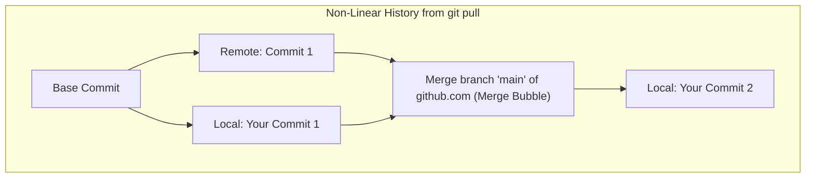
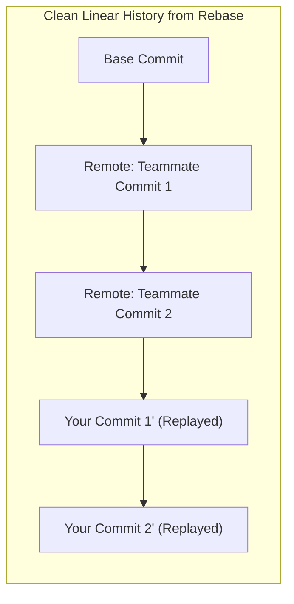
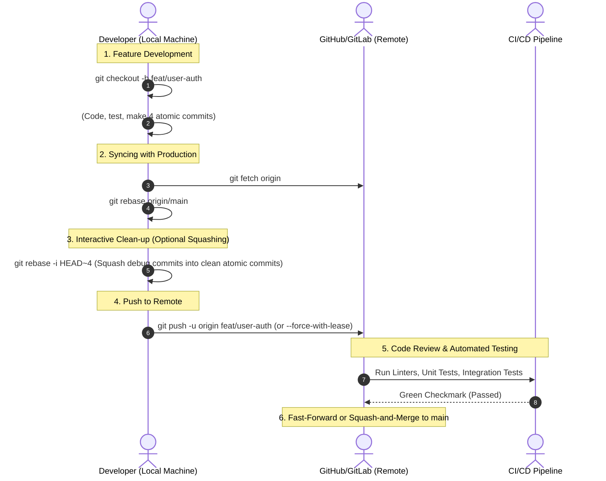

# 05 — Why Fetch + Rebase Beats Pull & The Production Git Lifecycle

> **Author / Mentor Context:** Clean History, Production CI/CD & Disaster Recovery for Senior Engineers.  
> **Core Focus:** Why `git pull` creates anti-patterns, Step-by-Step `fetch` + `rebase` lifecycle on `main`/`staging`, Interactive Rebase Squashing, and `git reflog` Disaster Recovery.

---

## 1. Why `git fetch + git rebase` is Superior to `git pull`

### The Under-the-Hood Difference

```
git pull           ===   git fetch + git merge FETCH_HEAD
git pull --rebase  ===   git fetch + git rebase FETCH_HEAD
```

### The "Merge Bubble" Pollution Disaster (`git pull`)
When you use default `git pull` on a branch with diverged commits, Git creates an automatic non-fast-forward merge commit.



#### Why Production Teams Ban Default `git pull`:
1. **Polluted History:** 30% of the commit log becomes useless `Merge branch 'main' of...` messages.
2. **Breaks `git bisect`:** When debugging a critical production outage, `git bisect` cannot isolate which exact commit introduced the regression because of circular parent merges.
3. **Harder Code Reviews:** PRs display diffs from other people that were pulled in, confusing reviewers.

---

### The Clean Linear Graph (`git fetch + git rebase`)

When you rebase:
1. Git temporarily parks your unpushed commits in a temporary patch queue.
2. Git fast-forwards your branch to match the latest remote tracking branch (`origin/main`).
3. Git replays your local commits **one by one** on top of the newest commit.



---

## 2. The Complete Production Lifecycle: Feature $\rightarrow$ Staging $\rightarrow$ Main



---

## 3. Step-by-Step Production Command Routine

### Step 1: Keep Feature Branch Clean
```bash
# 1. Fetch latest changes non-destructively
git fetch origin

# 2. Rebase onto the latest remote target branch (e.g. main or staging)
git rebase origin/main
```

### Step 2: Interactive Rebase to Squash Ugly Commits
If your branch has messy commits like `"fix typo"`, `"wip"`, `"test fix"`, squash them before code review:

```bash
# Clean up the last 4 commits
git rebase -i HEAD~4
```

In the editor that opens:
```text
pick 1a2b3c4 feat(auth): add JWT token verification service
squash 5d6e7f8 fix typo in header parser
squash 9a0b1c2 remove console logs
pick 3e4f5a6 feat(auth): add rate limiter middleware
```
*(Save and exit. All 3 initial commits will combine into 1 clean commit!)*

### Step 3: Push with Lease
```bash
git push --force-with-lease origin feat/user-auth
```

---

## 4. Production Git Failure Modes & Disaster Recovery

### Failure Mode 1: "I accidentally ran `git reset --hard` and lost my code!"

**Mental Model:** Git commits are never deleted immediately. They exist as "dangling commits" in the reflog.

```bash
# 1. Inspect the local reflog journal
git reflog

# Output:
# 4f82a1c HEAD@{0}: reset: moving to HEAD~1
# 9b2d3e4 HEAD@{1}: commit: feat(billing): complete stripe checkout logic  <-- YOUR LOST WORK!
# 1a7c5b2 HEAD@{2}: checkout: moving from main to feat/billing

# 2. Rescue the lost commit into a new branch immediately
git checkout -b feature/rescued-billing 9b2d3e4
```

---

### Failure Mode 2: "Rebase has 15 commits and asks me to resolve conflicts on every single step!"

**Why this happens:** If you have 15 micro-commits modifying the same lines, rebase attempts to replay each commit individually.

**The Fix (Squash first, then rebase):**
```bash
# 1. Abort the painful rebase
git rebase --abort

# 2. Soft reset all your 15 local commits into a single staged blob
git reset --soft origin/main

# 3. Create a single clean commit
git commit -m "feat(billing): complete end-to-end integration"

# 4. Now rebase - you only resolve conflicts ONCE!
git rebase origin/main
```

---

### Failure Mode 3: "I am stuck in 'Detached HEAD' state!"

**Why this happens:** You checked out a specific commit hash (`git checkout 8f3a1c`) instead of a branch name. Any new commits you make are orphaned and not attached to a branch.

**The Fix:**
```bash
# Create a new branch right where you are standing
git switch -c feature/new-branch-from-detached-head
```

---

### Failure Mode 4: "Never Rebase a Public / Shared Branch"

> [!CAUTION]
> **The Golden Rule of Rebase:**  
> Only rebase **private, local feature branches** before merging.  
> **NEVER rebase `main`, `staging`, or a branch that other developers have actively checked out and are building on.** Rebasing rewrites commit SHA hashes, forcing everyone else into divergent branch collisions.
