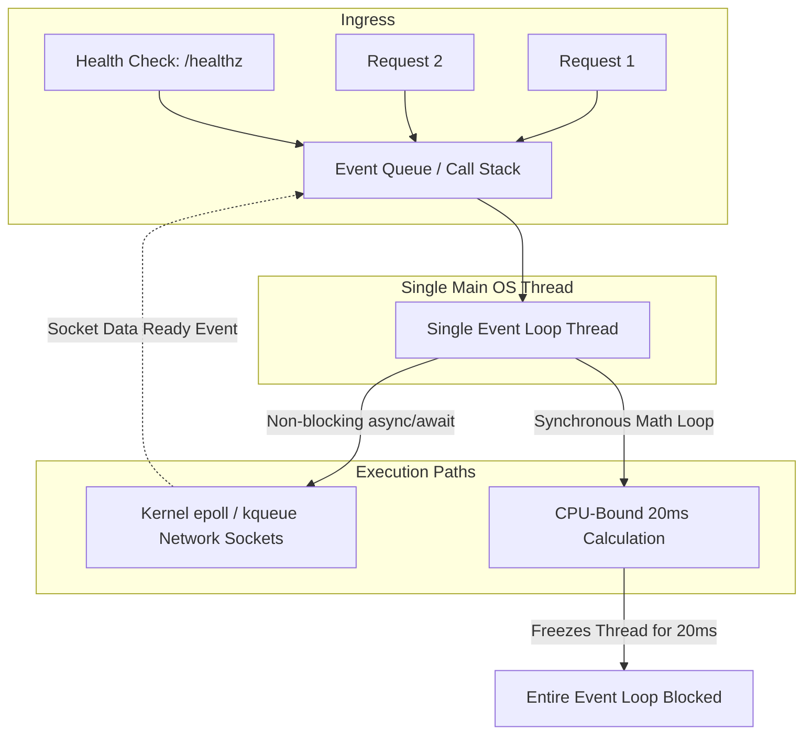
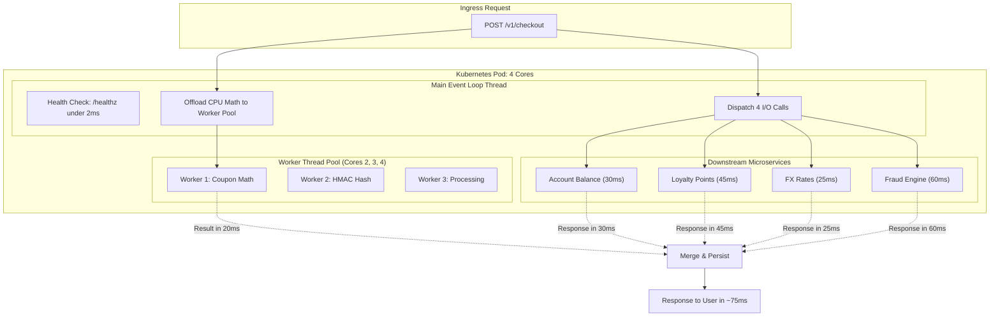

# ⚡ CONCURRENCY VS. PARALLELISM IN ASYNC BACKEND RUNTIMES
## Deep Dive: *I/O Fan-Out, CPU-Bound Event Loop Starvation, Multi-Core Underutilization & Pipelined Execution*

---

## 🏛️ PART 1: The Production Outage Postmortem

### 1. The Scenario & Workload Profile
A high-throughput **Checkout & Settlement Gateway** was migrated from a traditional multi-threaded model to an asynchronous event-driven runtime (e.g., Node.js / Python `asyncio`).

For every checkout request (`POST /v1/checkout`):
1. **Upstream Fan-out (I/O-Bound):**
   - Query 4 downstream microservices concurrently over HTTP/2:
     - Account Balance Service ($\sim 30\text{ ms}$)
     - Loyalty Points Engine ($\sim 45\text{ ms}$)
     - Dynamic FX Rate Provider ($\sim 25\text{ ms}$)
     - Risk & Fraud Rule Engine ($\sim 60\text{ ms}$)
2. **Cryptographic Validation & Price Optimization (CPU-Bound):**
   - HMAC-SHA256 signature verification.
   - Cart coupon combinatorial optimization algorithm ($\sim 15\text{ ms} - 25\text{ ms}$ of continuous synchronous CPU execution).
3. **Persistence (I/O-Bound):**
   - Audit write to PostgreSQL and Kafka event publish ($\sim 15\text{ ms}$).

---

### 2. The Production Incident (Symptoms & Metrics)
Under a rollout load of **3,500 requests/sec** across 10 Kubernetes pods (each allocated **4 vCPUs, 8 GB RAM**):

| Metric | Observed Value | Expected / SLA Target | Status |
| :--- | :--- | :--- | :--- |
| **P99 Request Latency** | $> 3,800\text{ ms}$ | $< 120\text{ ms}$ | 🚨 Critical Degraded |
| **Pod CPU Utilization** | $35\% - 40\%$ | $70\% - 85\%$ | ⚠️ Underutilized Hardware |
| **Liveness Probe (`/healthz`)** | $> 1,500\text{ ms}$ | $< 5\text{ ms}$ | 🚨 CrashLoopBackOff |
| **Error Rate** | $18\%$ HTTP 504 / Connection Drop | $0.00\%$ | 🚨 SLA Breach |

---

## 🔬 PART 2: First-Principles Mechanics

### 1. Concurrency vs. Parallelism
* **Concurrency (Dealing with many things at once):** Managing multiple tasks by switching between them while waiting on external events (non-blocking I/O).
* **Parallelism (Doing many things at the exact same physical instant):** Executing multiple instruction streams simultaneously across separate physical CPU cores.

In single-threaded event loop engines (Node.js, Python `asyncio`), the runtime is **concurrent by default for non-blocking I/O, but strictly single-threaded and non-parallel for application logic**.

---

### 2. The Anatomy of Event Loop Starvation
An async runtime manages incoming requests on a single main thread via an **Event Queue**:

#### The Starvation Math:
- Load per pod = $3,500\text{ RPS} \div 10\text{ pods} = \mathbf{350\text{ RPS per pod}}$.
- Each request executes a $20\text{ ms}$ synchronous coupon algorithm on the main thread:

$$\text{Required CPU time per second} = 350 \times 20\text{ ms} = 7,000\text{ ms of work every 1 second!}$$

Because a single thread can only deliver $1,000\text{ ms}$ of work per second:
1. Every second of real-world time accumulates a **6-second backlog**.
2. Tasks queue up in the Event Queue (Head-of-Line Blocking).
3. Kubernetes sends `GET /healthz`, which sits behind hundreds of $20\text{ ms}$ CPU tasks. It times out after $1.5\text{ s}$, causing Kubernetes to restart the pod.

---

### 3. Why Did CPU Sit at 35% – 40%?
Each container node had **4 vCPUs (4 physical cores)** allocated:
* The single-threaded main loop was maxing out **1 core at 100%**.
* On a 4-core machine: $1 \div 4 = \mathbf{25\%}$.
* Background worker threads in `libuv` (DNS lookups, SSL handshakes) consumed an additional $10\% - 15\%$.
* **The remaining 3 physical CPU cores (75% of server compute) sat 100% idle while requests were timing out.**

---

## 💡 PART 3: I/O, I/O Fan-Out vs. CPU-Bound

### 1. I/O (Input/Output)
* The CPU is **not computing**; it is waiting for data to travel across a physical network or disk.
* *Analogy:* Ordering food delivery. Once ordered, you don't spend energy waiting; you sleep or read until the bell rings.

### 2. I/O Fan-Out
* One incoming request triggers multiple parallel outgoing network calls to different dependencies.
* All calls are dispatched concurrently in non-blocking fashion; the thread sleeps until the slowest response returns.

### 3. CPU-Bound
* The CPU is **actively executing instructions in ALU and hardware registers** (hashing, JSON parsing, combinatorics).
* *Analogy:* Solving a physical puzzle with your hands. You cannot leave or multitask until it is completed.

---

## 🏗️ PART 4: The 4-Layer Architectural Solution

---

### Layer 1: Right-Sizing the Process Architecture (Hardware Alignment)
* **Option A (Container Right-Sizing - Recommended):**  
  Shrink pod limits from `4 vCPU / 8 GB` to **`1 vCPU / 2 GB`** and run 40 pods instead of 10. Single-threaded engines scale best horizontally at 1 core per container.
* **Option B (Clustering):**  
  If multi-core pods are mandatory, use Node's `cluster` module or `PM2` / `gunicorn -w 4` to run **4 independent worker processes per pod**, binding 1 process to each CPU core.

### Layer 2: Offload CPU Work to In-Process Worker Pool
* Never execute synchronous loops $> 5\text{ ms}$ on the main event loop.
* Offload the coupon combinatorics and HMAC verification to `worker_threads` (or Python `ProcessPoolExecutor`).
* The main thread dispatches the payload to the worker pool and immediately returns to processing new connections and `/healthz`.

### Layer 3: Pipelined Request Coordination
Instead of executing steps sequentially ($60\text{ ms I/O} + 20\text{ ms CPU} + 15\text{ ms DB} = 95\text{ ms}$):
1. Cart coupon optimization only depends on request payload data (already available at ingress).
2. The main thread simultaneously:
   - Dispatches the 4 external API calls (I/O Fan-out).
   - Offloads the coupon math to a background worker thread.
3. Total processing latency drops to:
   $$\text{Total Latency} = \max(\text{Slowest I/O [60ms]}, \text{Worker CPU [20ms]}) + \text{DB Write [15ms]} = \mathbf{75\text{ ms}}$$

### Layer 4: Liveness Protection & Early Backpressure
* Because CPU computation is isolated from the main thread, event loop lag remains **$< 2\text{ ms}$**, and `/healthz` responds instantly.
* **Backpressure:** If the worker thread task queue exceeds its capacity limit (e.g., $> 300$ queued tasks), reject incoming requests immediately with **`HTTP 429 / 503`** instead of buffering into multi-second latency spirals.

---

## 🎯 PART 5: Senior / Tech Lead Interview Strategy

### Common Anti-Pattern to Avoid:
> *"Just put a load balancer and add more instances."*
- **Why it fails the interview:** Shows lack of resource awareness. If each instance wastes 75% of its CPU cores, adding more instances multiplies cloud infrastructure waste without fixing internal head-of-line blocking or health check crashes.

### 4 Diagnostic Questions to Ask When Stuck:
1. **Data Dependencies:**  
   *"Does the CPU calculation depend on the responses of the 4 I/O calls, or can they run concurrently in parallel?"*
2. **Runtime & Threading Model:**  
   *"Are we constrained to a single-threaded event loop (Node.js/Python), or a multi-threaded OS/virtual thread runtime (Go/Java)?"*
3. **Core Utilization Breakdown:**  
   *"Given that CPU usage is at 35% on a 4-core container, is a single core pegged at 100% while the others sit idle?"*
4. **Latency Budget & SLA Allocation:**  
   *"What is our target P99 SLA, and what portion of that budget is allocated for compute versus network round-trips?"*
