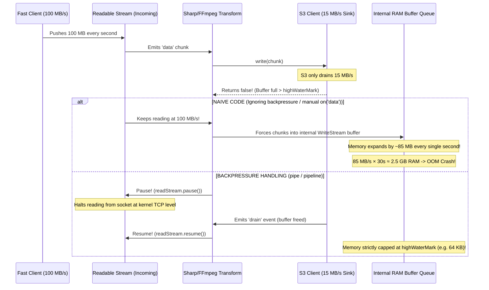

# ⚡ NODE.JS RUNTIME INTERNALS, STREAMS & EVENT LOOP CONCURRENCY
## Deep Dive: *Stream Backpressure, Event Loop Starvation, and Microtask Queues*

---

## 🏛️ PART 1: The Production Outage Postmortem

### 1. The Scenario
- **Source:** Fast network client uploading at **$100\text{ MB/s}$**.
- **Transformation:** Node.js stream running image/video processing (CPU/Memory bound).
- **Destination:** S3 egress sink capped at **$15\text{ MB/s}$**.
- **Symptom:** Memory spikes from $150\text{ MB}$ to $2.5\text{ GB}$ within 45s, triggering Pod OOMKilled.

---

### 2. Root Cause: Why Did Streaming Run Out of Memory?
A common misconception is: *"Because I am using streams, my memory usage is constant $O(1)$."*

In Node.js, `Readable` and `Writable` streams are independent buffers.
When a fast readable source pushes data faster than a writable destination can consume it, where does the excess data go?



#### What is `highWaterMark`?
- Every stream has a `highWaterMark` threshold (default **$16\text{ KB}$** for object streams or **$64\text{ KB}$** for byte streams).
- When you call `writable.write(chunk)`:
  - If the internal buffer is *below* `highWaterMark`, it returns `true`.
  - If the internal buffer reaches or exceeds `highWaterMark`, it returns `false`.
- **The Critical Rule:** If `.write()` returns `false`, the producer **MUST STOP** writing chunks until the writable stream emits the `'drain'` event.
- If code uses manual `.on('data', chunk => target.write(chunk))` without checking the boolean return value and pausing the source, Node.js stores all unbounded excess chunks in V8 heap memory until crash.

---

## 🛡️ PART 2: How `pipe()` and `stream.pipeline()` Solve This

### 1. `readable.pipe(writable)`
- Automatically handles:
  1. Listening for `writable.write(chunk) === false` and executing `readable.pause()`.
  2. Listening for `writable.on('drain')` and executing `readable.resume()`.
  3. Propagating TCP window shrinkage back to the network socket. When the readable pauses, the OS stops draining the TCP receive buffer, window size drops to 0, and the client throttles its upload automatically.
- **Gotcha with `.pipe()`:** It does **NOT** safely forward errors or close all streams in a chain if one intermediate stream crashes, leading to resource/file descriptor leaks.

### 2. `stream.pipeline(source, transform, destination, callback)` (Production Standard)
- Solves everything `.pipe()` does **plus**:
  - Properly destroys all streams in the chain if any stream errors or closes prematurely.
  - Automatically cleans up file descriptors and sockets.
  - Returns a Promise when used with `stream/promises`.

---

## ⚙️ PART 3: The Libuv Event Loop & Microtask Priority

### 1. The 6 Event Loop Phases vs Microtask Queues
In Node.js, the event loop has phases, but **Microtasks execute immediately after the current JavaScript operation completes, before the event loop moves to the next tick or next phase**.

```text
======================= JAVASCRIPT CALL STACK =======================
                                  │
                                  ▼
┌───────────────────────────────────────────────────────────────────┐
│                       MICROTASKS CHECKPOINT                       │
│  1. process.nextTick() Queue (Priority 1 - drained completely)   │
│  2. Promise.then() / catch / finally Queue (Priority 2)           │
└───────────────────────────────────────────────────────────────────┘
                                  │
                                  ▼
┌─────────────────── LIBUV 6 EVENT LOOP PHASES ─────────────────────┐
│ 1. Timers Phase:          setTimeout(), setInterval()             │
│ 2. Pending Callbacks:     System operations (e.g. TCP errors)     │
│ 3. Idle / Prepare:        Internal libuv only                     │
│ 4. Poll Phase:            I/O polling (HTTP, DB, FS read/write)   │
│ 5. Check Phase:           setImmediate() callbacks                │
│ 6. Close Callbacks:       socket.on('close')                      │
└───────────────────────────────────────────────────────────────────┘
```

---

### 2. Execution Priority: `process.nextTick` vs `Promise.then` vs `setImmediate`

| Priority | API | Execution Time | Purpose |
| :--- | :--- | :--- | :--- |
| **Highest (1)** | `process.nextTick()` | Right after current sync code finishes, **before** any other microtask or event loop phase | Clean up variables, handle sync errors before I/O continues |
| **High (2)** | `Promise.resolve().then()` | Right after all `process.nextTick()` callbacks in the current tick finish | Standard asynchronous microtasks |
| **Normal (3)** | `setImmediate()` | In the **Check Phase** of the Libuv Event Loop (after Poll phase) | Yielding to the event loop so I/O is not blocked |
| **Timer** | `setTimeout(cb, 0)` | In the **Timers Phase** of the next loop iteration | Minimum threshold timer execution |

---

### 3. How Recursive `process.nextTick()` Freezes the Entire Server (Event Loop Starvation)

When Node.js enters the Microtask checkpoint, it **drains the `nextTick` queue until it is completely empty**.

```javascript
// DANGEROUS: Event Loop Starvation
function freezeServer() {
  process.nextTick(() => freezeServer());
}
freezeServer();
```

- **Why it freezes:** Because `nextTick` queues new callbacks at the *front* of the microtask queue, Libuv is **never allowed to enter the Poll Phase or Check Phase**.
- **Consequence:**
  - Incoming HTTP requests cannot be accepted (`net.Server` connection events are trapped in Poll phase).
  - Database queries cannot return.
  - S3 upload chunks cannot flush.
  - Health check endpoints (`/healthz`) stop responding $\implies$ Kubernetes marks the container dead and restarts it.

### The Fix: Yielding with `setImmediate`
If you have a heavy loop or chunk processing, use `setImmediate()`:
```javascript
// SAFE: Yields to the Check phase, allowing Poll phase (I/O) to process in between
function safeChunkProcessing() {
  setImmediate(() => safeChunkProcessing());
}
```
`setImmediate()` queues the callback into the **Check phase**, guaranteeing that Libuv executes a full cycle of I/O polling and network packet processing between calls.
