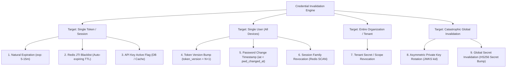
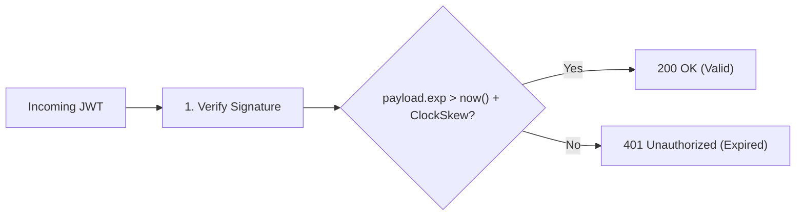
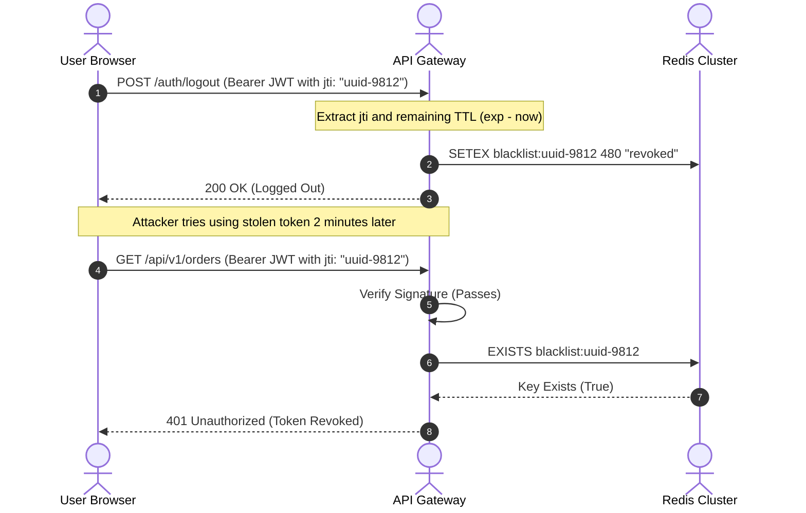
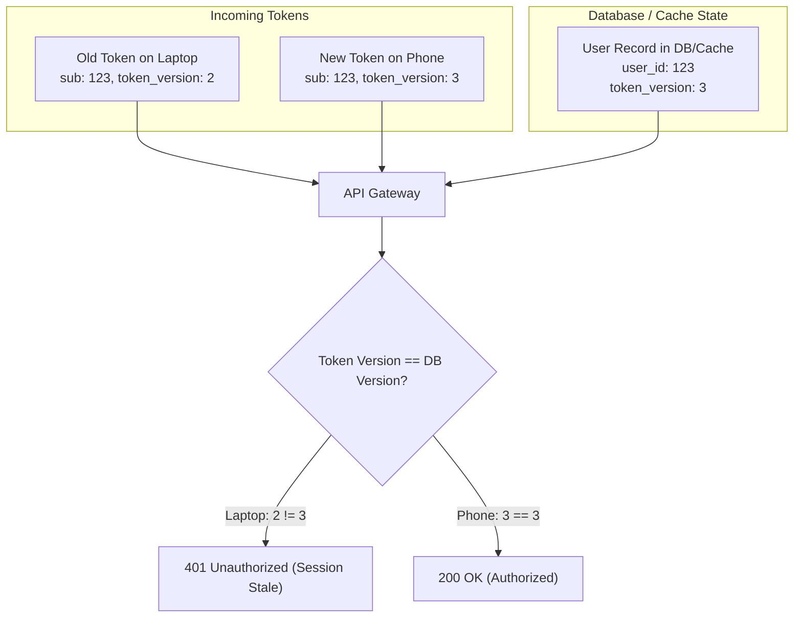
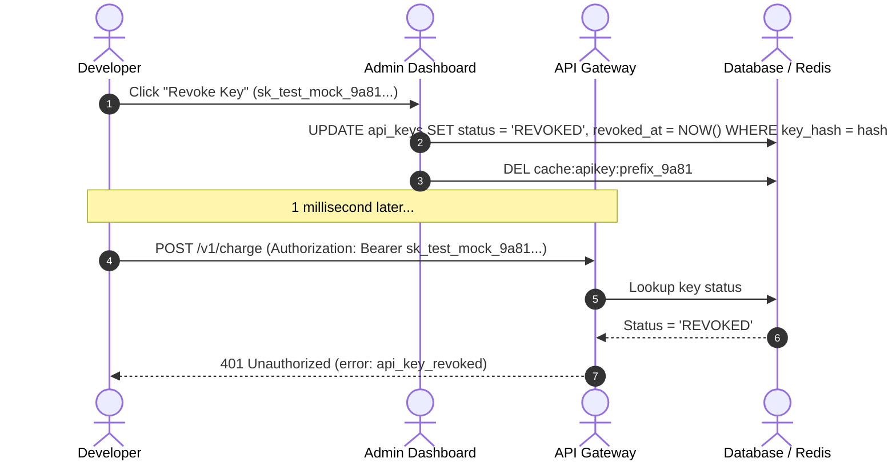
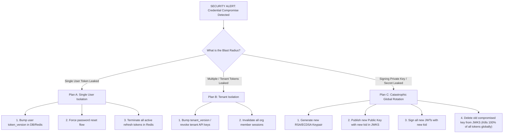

# 02 — Comprehensive JWT & API Key Invalidation, Revocation & Disaster Recovery

> **Author / Mentor Context:** Defensive Backend Architecture & High-Scale Invalidation for Senior/Staff Engineers.  
> **Core Focus:** Complete Token Invalidation Strategies, Redis Blacklists & Bloom Filters, User Token Versioning, Single-User vs Global Key Leak Runbooks, and API Key Rotation Lifecycles.

---

## 🧭 Executive Summary & Invalidation Taxonomy

Invalidating credentials over a stateless transport is one of the classic hard problems in distributed systems. The diagram below classifies all invalidation mechanisms by **granularity**, **performance overhead**, and **blast radius**:



---

## 1. Strategy 1: Natural Expiry Invalidation (`exp` Claim)

### How it Works
Every JWT carries a registered `exp` claim (Unix timestamp in seconds). When an API Gateway receives a request, it compares `exp` with the current system time.

```text
Condition: If now() >= payload.exp -> Reject with 401 Token Expired
```



### Production Mechanics & Edge Cases:
1. **Clock Skew Tolerance:** In distributed systems, microservice server clocks can drift by a few hundred milliseconds. JWT libraries must be configured with a strict clock tolerance (typically 5 to 30 seconds):
   ```typescript
   jwt.verify(token, publicKey, { clockTolerance: 10 }); // 10s leeway
   ```
2. **The "Short-Lived" Golden Standard:** Access tokens must have a lifespan of **5 to 15 minutes**. Even if an attacker steals an in-memory access token, it automatically becomes useless within minutes.

---

## 2. Strategy 2: Redis JTI Blacklist & Distributed Bloom Filters

When a user clicks **"Logout"**, you cannot modify the JWT in their browser. Instead, you blacklist the unique token identifier (`jti` - JWT ID) in a distributed cache.



### Key Engineering Rules:
1. **Auto-Expiring Keys (Zero Memory Leaks):** Never store blacklisted tokens permanently. Set Redis TTL exactly equal to the token's remaining time to live:
   ```text
   TTL = payload.exp - current_time()
   ```
   Once the token naturally expires, Redis automatically evicts the key from memory.
2. **Sub-Microsecond Optimization with Bloom Filters:**
   For gateways handling 100k+ req/sec, querying Redis on every request introduces connection pool contention.
   - Maintain an in-memory **Bloom Filter** or **Cuckoo Filter** directly inside the Gateway memory.
   - When a token is revoked, add `jti` to Redis and publish an event over Redis Pub/Sub to update all local Gateway Bloom Filters instantly.
   - If Bloom Filter returns `false` -> token is 100% NOT blacklisted (zero Redis I/O). If `true` -> fallback to Redis to confirm.

---

## 3. Strategy 3: Token Versioning (`token_version` / `jwt_version`)

### The Problem
What if a user's laptop is stolen, their password is changed, or their account is compromised? You must **invalidate all active JWTs on all devices** without maintaining thousands of individual token blacklists in Redis.

### The Solution: User-Level Version Counter



### Implementation Flow:
1. Add a `token_version: INT (default: 1)` column to your `users` table or Redis user profile.
2. When issuing a JWT, embed the current version into the payload:
   ```json
   {
     "sub": "usr_123",
     "token_version": 2,
     "exp": 1711680900
   }
   ```
3. **Invalidating All Sessions on All Devices:**
   When the user clicks *"Log out of all devices"* or changes their password:
   ```sql
   UPDATE users SET token_version = token_version + 1 WHERE id = 'usr_123';
   ```
   *(Also update `SET user:usr_123:version 3` in Redis).*
4. On every API request, the gateway verifies that `payload.token_version === cached_user.token_version`. Any token minted before the version bump is instantly dead.

---

## 4. Strategy 4: Password Changed Timestamp Invalidation (`iat < pwd_changed_at`)

A lightweight alternative to token versioning for security events (password resets, credential updates):

1. Store `password_changed_at: TIMESTAMP` in the user's database record.
2. Embed the issued-at timestamp `iat` inside the JWT payload.
3. During token verification:
   ```text
   Condition: If payload.iat < user.password_changed_at -> Reject with 401 Session Outdated
   ```
4. **Benefit:** Zero stateful counters required. Resetting the user's password automatically kills all pre-existing tokens across all web and mobile devices.

---

## 5. Strategy 5: API Key Invalidation & Rotation Workflows

Unlike JWTs, API Keys are stateful and persistent. When an API key is leaked or compromised, invalidation must happen with zero ambiguity.



### The 4 API Key Invalidation Patterns:

#### 1. Instant Hard Revocation (Emergency Kill-Switch)
- Update `status = 'REVOKED'` in Postgres and delete key from Redis cache.
- Gateway returns `401 Unauthorized` on all subsequent requests within `< 1 ms`.

#### 2. Graceful Zero-Downtime Key Rotation (Dual-Key Window)
When an enterprise customer needs to rotate their production API key without breaking live traffic:
1. Generate new key: `sk_test_mock_new_456`.
2. Keep old key `sk_test_mock_old_123` active in **Grace Period Mode** (e.g., valid for 48 hours).
3. The customer updates their production environment variables to `sk_test_mock_new_456`.
4. Once traffic on the old key drops to zero, the dashboard automatically revokes `sk_test_mock_old_123`.

#### 3. Automated Secret Leak Detection (GitHub Secret Scanning Webhook)
1. Developer accidentally commits a secret key to a public GitHub repository.
2. GitHub's Secret Scanning engine detects your key format regex (`sk_test_[a-zA-Z0-9]{24,}`) within seconds.
3. GitHub sends an automated webhook to your backend endpoint: `POST /webhooks/secret-leak-alert`.
4. Your backend automatically revokes the key, sends a high-priority alert email to the organization owner, and creates an audit log entry.

---

## 6. Disaster Recovery: What to Do in Mass Leak Scenarios



---

### Scenario A: A Single User's JWT is Stolen
1. **Action:** Execute an immediate `token_version` bump for that specific user.
2. **Action:** Delete all associated `refresh_token` records for that user in Redis/DB.
3. **Result:** The stolen JWT is rejected on its very next request. Legitimate devices are forced to re-authenticate.

---

### Scenario B: API Key Leaked on Public Forum / GitHub
1. **Action:** Trigger immediate status flip: `UPDATE api_keys SET status = 'REVOKED'`.
2. **Action:** Invalidate Redis cached permission record for that key.
3. **Action:** Automatically issue a replacement key and notify the developer.

---

### Scenario C: Catastrophic Leak — The JWT Signing Secret / Private Key is Compromised!

If your private signing key or symmetric secret (`HS256`) is leaked, an attacker can **forge valid JWTs for any user in your system with full admin privileges**.

#### The Zero-Downtime JWKS Key Rotation Runbook (RS256 / Asymmetric):

1. **Step 1: Generate New Keypair:**
   Generate a new RSA 4096-bit or Ed25519 keypair with a new Key ID (`kid: "key-2026-v2"`).
2. **Step 2: Update JWKS Endpoint (Dual-Key Phase):**
   Publish the new public key alongside the old public key at `/.well-known/jwks.json`.
   ```json
   {
     "keys": [
       { "kid": "key-2026-v1", "kty": "RSA", "use": "sig", "n": "...", "e": "AQAB" },
       { "kid": "key-2026-v2", "kty": "RSA", "use": "sig", "n": "...", "e": "AQAB" }
     ]
   }
   ```
3. **Step 3: Switch Active Signer:**
   Configure the Auth Identity Provider to sign all newly minted tokens using `key-2026-v2`.
4. **Step 4: Emergency Revocation (Delete Compromised Key):**
   Remove `key-2026-v1` from the JWKS endpoint.
   - **Immediate Impact:** Any token signed with the leaked key (`key-2026-v1`) will immediately fail signature verification across all microservices and API gateways worldwide.
   - All users are logged out and must re-authenticate, eliminating the attacker's forged tokens completely.

---

## 7. Master Comparison: Invalidation Strategies

| Strategy | Invalidation Speed | Database / Cache Load | Memory Usage | Implementation Complexity | Best Use Case |
| :--- | :--- | :--- | :--- | :--- | :--- |
| **Natural Expiry (`exp`)** | Delayed (5–15 min) | **Zero** | Zero | Lowest | Normal lifecycle for access tokens |
| **Redis JTI Blacklist** | **Instant (< 1 ms)** | Low (Only during logout/revocation) | Low (Auto-evicted via TTL) | Low | Explicit user logout button |
| **Bloom Filter at Gateway** | **Instant (< 0.1 ms)** | **Zero network I/O** | Fixed small buffer | Medium | High-scale gateways (> 100k req/s) |
| **Token Versioning** | **Instant** | 1 cached lookup per request | Tiny (1 integer per user) | Medium | Password reset / "Logout all devices" |
| **API Key Status Flag** | **Instant** | 1 DB/Cache query per request | Minimal | Low | Developer & partner integrations |
| **JWKS Key Rotation** | **Instant (Global)** | Zero (Cached public key) | Zero | High | Emergency compromise of signing key |

---

## 🛡️ Production Best Practice Summary

1. **Set Access Token Lifespans to 5–15 Minutes:** Minimize the damage window of any single token compromise.
2. **Implement User Token Versioning:** It provides a zero-friction way to invalidate all sessions for a compromised user without tracking individual tokens.
3. **Never Store Raw API Keys:** Store cryptographic hashes (`SHA-256`) and implement automated leak detection webhooks.
4. **Use Asymmetric RS256 with Key IDs (`kid`):** Allows instant global revocation during security emergencies by rotating public keys in the JWKS.
