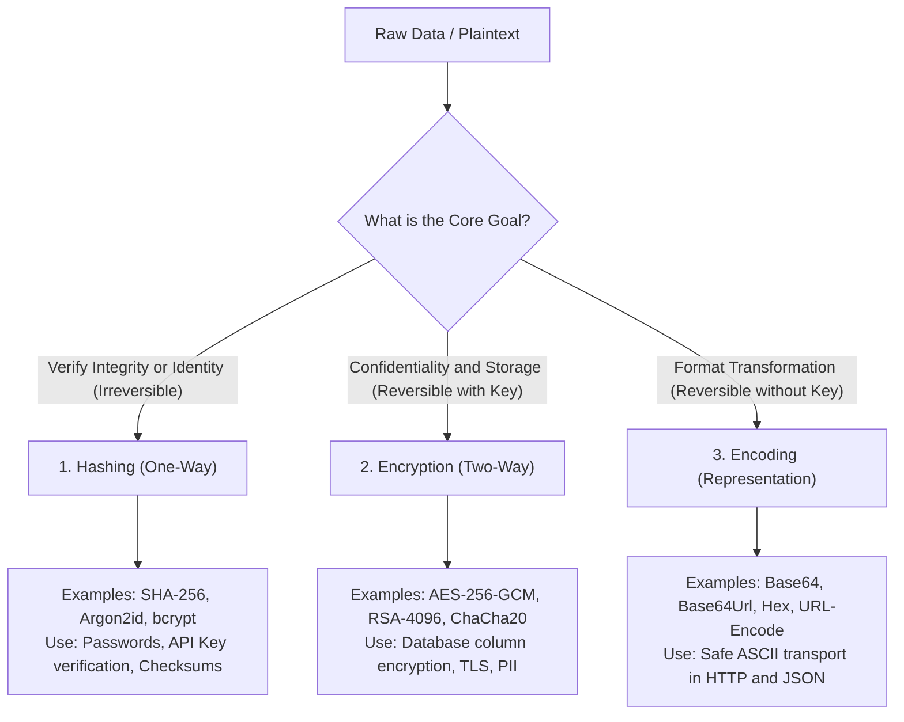
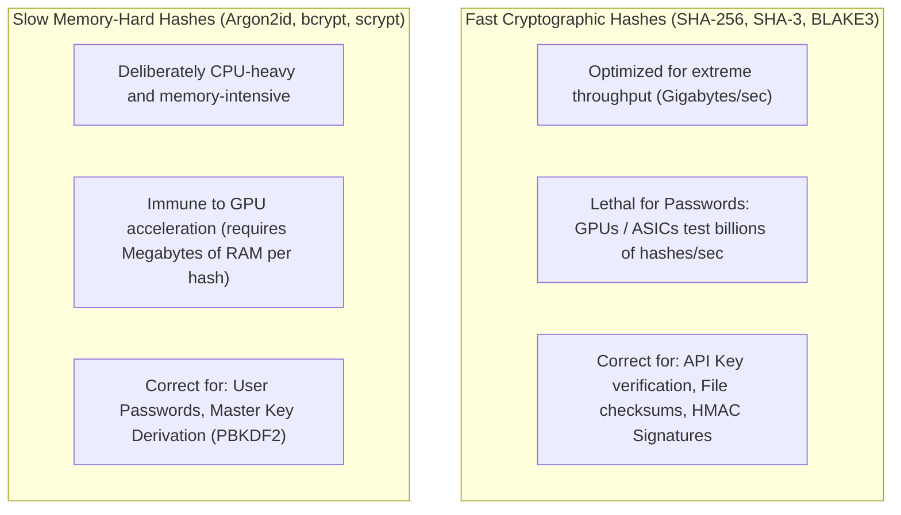
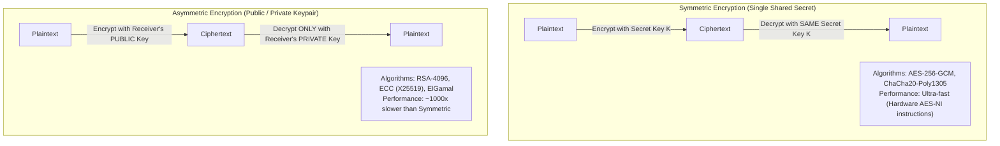
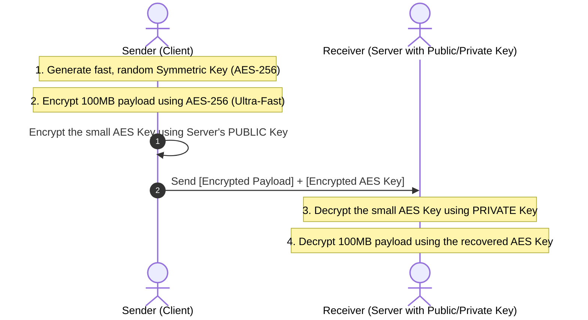
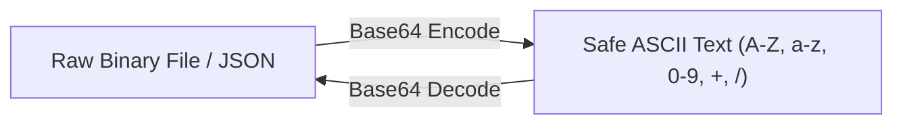
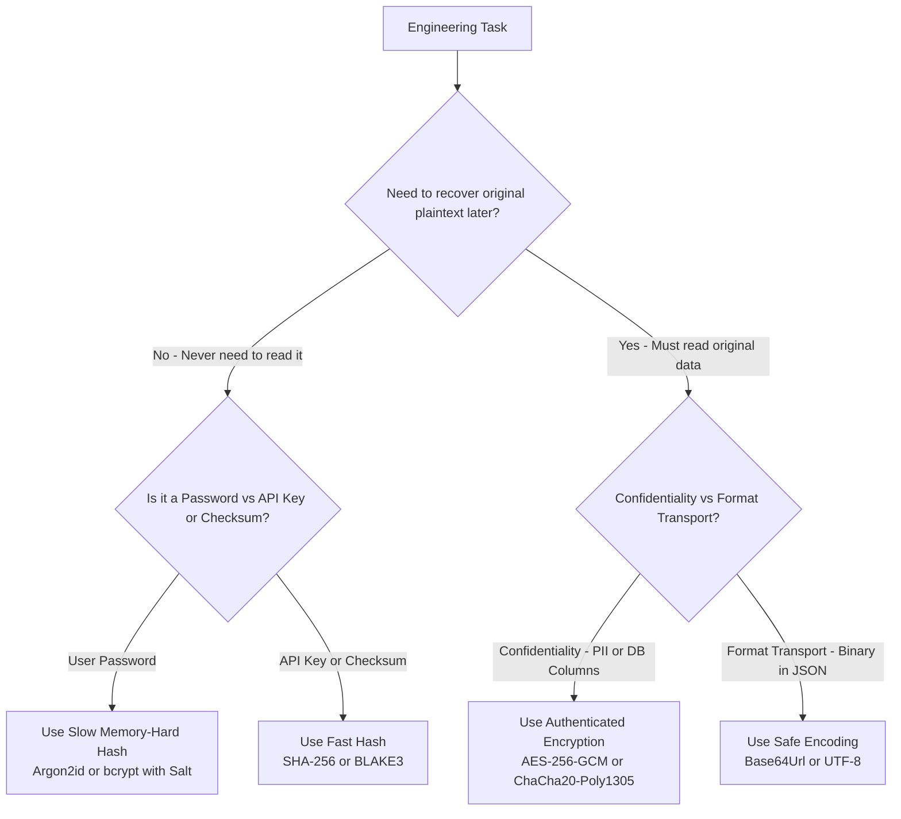

# 03 — Cryptography Essentials: Hashing vs. Encryption vs. Encoding

> **Author / Mentor Context:** First-Principles Security Architecture for Senior Backend Engineers.  
> **Core Focus:** The Cryptographic Trinity (One-Way Hashing, Two-Way Encryption, Representation Encoding), Password Hashing (Argon2 vs bcrypt vs SHA-256), Symmetric vs Asymmetric Ciphers, and Master Production Decision Trees.

---

## 🧭 The Cryptographic Trinity: At a Glance

The most common mistake in junior backend engineering is conflating **Hashing**, **Encryption**, and **Encoding**. 



---

## 1. Hashing: One-Way Mathematical Transformation

### A. What is Hashing?
Hashing takes an arbitrary-length input and converts it into a **fixed-size, deterministic digest** (e.g., 256 bits).

```text
Digest = Hash(Input)
```

#### Key Invariants:
1. **Strictly One-Way (Irreversible):** It is mathematically impossible to reconstruct the original input from the hash digest.
2. **Deterministic:** The same input always produces the exact same hash.
3. **Avalanche Effect:** Changing a single bit in the input completely randomizes the entire resulting hash.
4. **Collision Resistance:** It is computationally infeasible to find two different inputs (x != y) such that `Hash(x) == Hash(y)`.

---

### B. Fast Hashes vs. Slow (Memory-Hard) Password Hashes

A fatal architectural mistake is using fast general-purpose hashes (like MD5, SHA-1, or plain SHA-256) for password storage.



#### Why SHA-256 Fails for Passwords:
Modern consumer GPUs (like an NVIDIA RTX 4090) can compute over **20,000,000,000 SHA-256 hashes per second**. An 8-character password hashed with plain SHA-256 can be cracked via brute-force or rainbow tables in minutes.

#### The Password Hashing Standard:
1. **Argon2id (Winner of Password Hashing Competition — Current Industry Gold Standard):**
   - Configurable CPU time, parallelism, and memory cost (e.g., requires 64 MB of RAM per hash, paralyzing GPU brute-force attacks).
2. **bcrypt:**
   - Adaptive work factor (2^cost iterations) with built-in random salt.
3. **Salting:**
   - A unique, cryptographically random string appended to the password before hashing. Prevents pre-computed Rainbow Table attacks.

---

## 2. Encryption: Two-Way Confidentiality

### A. What is Encryption?
Encryption transforms readable plaintext into unreadable ciphertext using a secret cryptographic key. It is **fully reversible (two-way)** if and only if the recipient possesses the decryption key.

```text
Ciphertext = Encrypt(Plaintext, Key)
Plaintext  = Decrypt(Ciphertext, Key)
```

---

### B. Symmetric vs. Asymmetric Encryption



#### 1. Symmetric Encryption (AES-256-GCM)
- Uses the **same key** to encrypt and decrypt.
- **AEAD (Authenticated Encryption with Associated Data):** Modern ciphers (like AES-GCM) provide confidentiality *and* tamper-proofing. If the ciphertext is altered, decryption fails.
- **Use Cases:** Encrypting database columns (credit cards, PII), encrypting S3 buckets, disk encryption.

#### 2. Asymmetric Encryption (RSA, ECC / Curve25519)
- Uses a **mathematically linked keypair**:
  - **Public Key:** Shared openly with the world (used to encrypt or verify signatures).
  - **Private Key:** Guarded strictly on the server (used to decrypt or generate signatures).
- **Use Cases:** TLS/HTTPS handshake, SSH key authentication, PGP email encryption.

---

### C. Hybrid Encryption (How the Internet Actually Works)

Because asymmetric encryption is computationally slow and cannot encrypt large files directly, production systems (including TLS/HTTPS) use **Hybrid Encryption**:



---

## 3. Encoding: Representation & Safe Data Transport

### A. What is Encoding?
Encoding converts data from one format or character set to another for **safe transmission over protocols that only support certain characters** (e.g., sending binary images over HTTP/JSON).

```text
Encoded String = Encode(Data)
```

> [!CAUTION]
> **Encoding provides ZERO security, ZERO confidentiality, and ZERO integrity.**  
> Anyone can decode Base64, Hex, or URL-encoding instantly without a password or key.



### Common Encoding Formats:
1. **Base64 (RFC 4648):** Converts binary bytes into 64 ASCII printable characters (`A-Z`, `a-z`, `0-9`, `+`, `/`). Increases payload size by ~33%.
2. **Base64Url:** Replaces `+` with `-` and `/` with `_`, removing `=` padding so tokens can safely pass in URLs and HTTP headers without URL-encoding (used by JWTs).
3. **Hexadecimal (Base16):** Represents bytes using characters `0-9` and `a-f`.
4. **URL Encoding (Percent-encoding):** Replaces spaces with `%20` or `+` to conform to URI syntax.

---

## 4. Master Architectural Comparison Table

| Dimension | Hashing | Encryption | Encoding |
| :--- | :--- | :--- | :--- |
| **Core Purpose** | Integrity, fingerprinting, one-way verification | Confidentiality & privacy | Data format compatibility across networks |
| **Reversibility** | **One-Way (Irreversible)** | **Two-Way (Reversible with Key)** | **Two-Way (Reversible by anyone without a key)** |
| **Keys Required?** | None (except for HMACs) | **Mandatory** (Symmetric secret or Private key) | **None** (Standard public algorithm) |
| **Output Length** | Fixed size (e.g., 256 bits for SHA-256) | Proportional to input size + IV + Tag | Proportional to input size (+33% for Base64) |
| **Primary Standard Algorithms** | Argon2id, bcrypt, SHA-256, BLAKE3 | AES-256-GCM, ChaCha20, RSA, Ed25519 | Base64, Base64Url, Hex, UTF-8 |
| **Security Value** | Guarantees data was not altered | Protects data from unauthorized eyes | **Zero security value** |

---

## 5. Production Decision Tree: Which One Should You Use?



---

## 🛡️ Senior Engineer Golden Rules

1. **Passwords -> Argon2id / bcrypt only:** Never use SHA-256, MD5, or SHA-1 for passwords.
2. **API Keys -> SHA-256:** API keys possess high cryptographic entropy (256 bits), so fast hashing with SHA-256 is safe and prevents gateway latency.
3. **Database Column Encryption -> AES-256-GCM:** Always use authenticated ciphers (AEAD) to prevent ciphertext tampering.
4. **Base64 is NOT Encryption:** Never treat Base64, Base64Url, or Hex encoding as a security layer.
