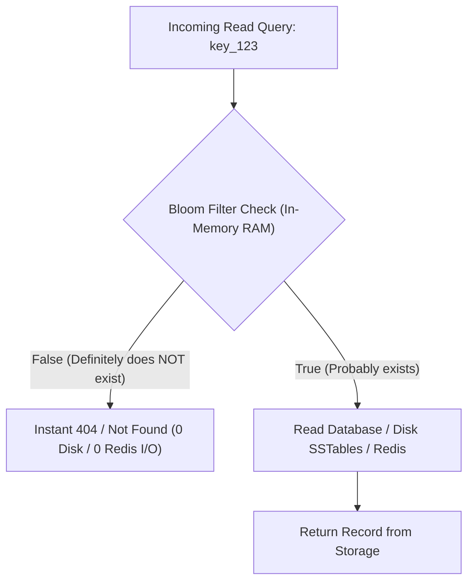
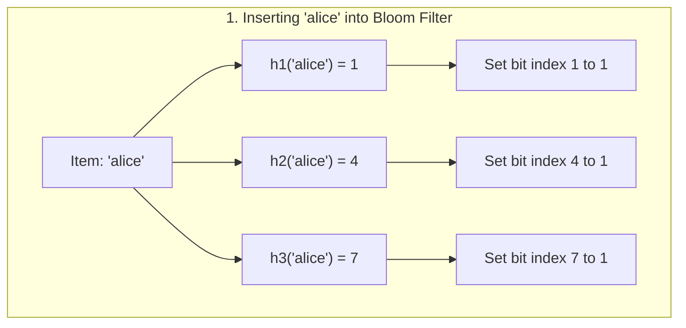
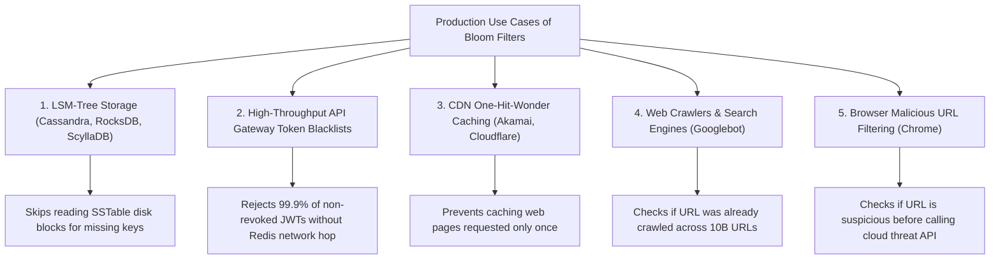
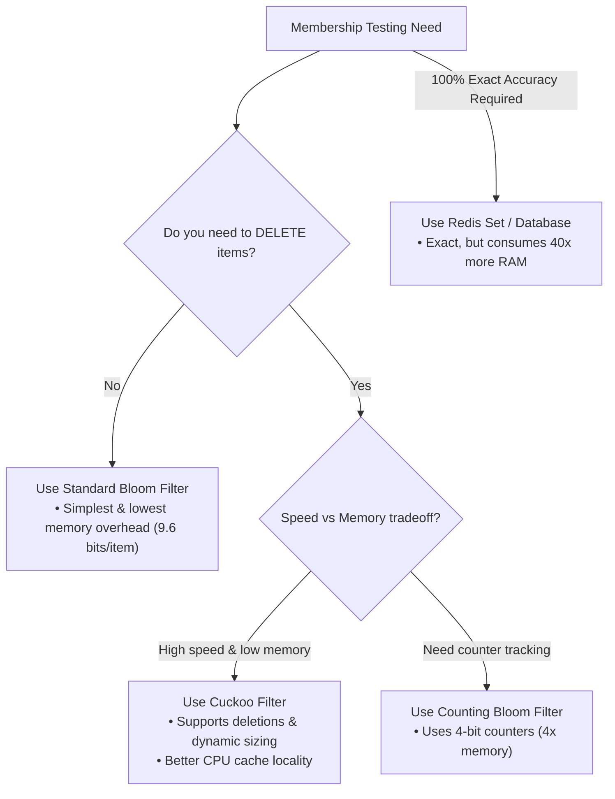

# 02 — Bloom Filter: Architecture, Mathematics & Production Mastery

> **Author / Mentor Context:** Probabilistic Data Structures & High-Throughput Distributed Systems for Senior/Staff Engineers.  
> **Core Focus:** The Bloom Filter Invariant (Zero False Negatives), Memory Savings Math, Dual-Hashing Optimization (Kirsch-Mitzenmacher), LSM-Tree Database Acceleration, Cuckoo Filter Alternatives, and TypeScript/Node.js Implementation.

---

## 🧭 Document Learning Flow

1. **Chapter 1: Foundations** — What is a Bloom Filter & The Golden Invariant.
2. **Chapter 2: The Core Problem** — What Problem Does It Solve? (The Expensive I/O Dilemma).
3. **Chapter 3: Under the Hood Mechanics** — Bit Array, Hash Functions, Insert & Query Flow.
4. **Chapter 4: The Deletion Dilemma** — Why Standard Bloom Filters Cannot Support Deletions.
5. **Chapter 5: Mathematical Foundations** — Calculating Optimal Bit Array Size ($m$) & Hash Count ($k$).
6. **Chapter 6: Production Use Cases** — LSM-Trees, API Gateways, CDNs, and Web Crawlers.
7. **Chapter 7: Alternatives** — Counting Bloom Filters vs. Cuckoo Filters vs. Redis Sets.
8. **Chapter 8: Production Implementation** — Full TypeScript / Node.js Engine with Dual Hashing.
9. **Chapter 9: Tradeoff Analysis** — Pros, Cons & Master Tech Lead Decision Rules.

---

## Chapter 1: What is a Bloom Filter & The Golden Invariant?

A **Bloom Filter** (invented by Burton Howard Bloom in 1970) is a space-efficient, probabilistic data structure designed to test whether an element is a member of a set in $O(k)$ constant time using minimal memory.

Unlike a standard Hash Set (which gives 100% exact answers but consumes massive RAM), a Bloom Filter trades absolute certainty for extreme memory efficiency:

| Query Return Value | What It Mathematically Guarantees | Error Probability |
| :--- | :--- | :--- |
| **`false` ("NOT in set")** | The element is **100% definitely NOT in the set** (**Zero False Negatives**). | **0%** (Absolute guarantee) |
| **`true` ("IN set")** | The element is **probably in the set** (**False Positives are possible**). | Configurable (e.g. 1%) |

```text
Core Mental Model:
Query: "Is user_9812 banned?"
  -> Returns FALSE: 100% GUARANTEED NOT BANNED (Skip DB/Redis lookup entirely!)
  -> Returns TRUE:  99% chance banned -> Go check Redis/Database to verify.
```

---

## Chapter 2: What Problem Does It Solve? (The Expensive I/O Dilemma)

### The Production Dilemma:
Imagine your database stores **100,000,000 user records** across 50 immutable disk files (SSTables in Cassandra or RocksDB).

When a query requests non-existent user `user_does_not_exist`:
- **Without Bloom Filter:** The storage engine must perform 50 random disk reads to search all SSTables on disk, burning massive Disk I/O only to return `404 Not Found`.
- **Using a Standard In-Memory HashSet:** Holding 100M string keys in RAM requires **~4.8 GB to 8 GB of RAM**, consuming expensive server memory.

### The Bloom Filter Solution:
A Bloom Filter represents all 100M keys in just **119 MB of RAM**.
- For 99% of non-existent queries, the Bloom Filter returns `false` in **0.0001 ms**, completely eliminating disk I/O.



---

## Chapter 3: How It Works Under the Hood: Bit Array & Hash Functions

A Bloom Filter consists of:
1. A **Bit Array** of size $m$ bits (all initialized to `0`).
2. $k$ independent, uniform **Hash Functions** ($h_1, h_2, \dots, h_k$).



### A. The Insert Operation (`insert(x)`)
1. Pass input $x$ through all $k$ hash functions to calculate $k$ array indices:
   ```text
   i_1 = h_1(x) % m
   i_2 = h_2(x) % m
   ...
   i_k = h_k(x) % m
   ```
2. Set the bits at all calculated indices to `1`.

```text
Bit Array Walkthrough (m = 10 bits, initially all 0):
[ 0, 0, 0, 0, 0, 0, 0, 0, 0, 0 ]

1. Insert "alice" -> Hashes: [1, 4, 7]:
[ 0, 1, 0, 0, 1, 0, 0, 1, 0, 0 ]

2. Insert "bob"   -> Hashes: [3, 4, 9]:
[ 0, 1, 0, 1, 1, 0, 0, 1, 0, 1 ]  <-- Note index 4 is shared by both!
```

---

### B. The Lookup Operation (`contains(x)`)
1. Hash input $x$ with the same $k$ hash functions.
2. Inspect the bits at all $k$ indices:
   - **If ANY bit is `0`:** The element was **never inserted** (because if it had been inserted, all $k$ bits would be `1`).
   - **If ALL bits are `1`:** The element is **probably in the set** (or other elements happened to set those bits, creating a **False Positive**).

---

## Chapter 4: The Deletion Dilemma

> **Why Standard Bloom Filters CANNOT Support Deletions:**  
> If you attempt to delete `"alice"` by setting bits `[1, 4, 7]` back to `0`:
> - Bit `4` was also set when inserting `"bob"`.
> - Setting bit `4` to `0` would cause subsequent queries for `"bob"` to return `false`, introducing a **fatal False Negative**!

To support element deletion, distributed systems use **Counting Bloom Filters** or **Cuckoo Filters** (detailed in Chapter 7).

---

## Chapter 5: Sizing & Memory: The Senior Engineer's Rule of Thumb

In production and interviews, nobody expects you to derive complex natural logarithm formulas on a whiteboard. Instead, senior engineers use a simple, battle-tested **Rule of Thumb**:

### 🎯 The "10 Bits & 7 Hashes" Rule (For a 1% False Positive Rate)

If you want a **1% error rate** (99% of non-existent queries are stopped instantly):
* **Memory Needed:** You need approximately **10 bits per item** ($~1.2$ bytes).
* **Hash Functions Needed:** You need approximately **7 hash functions**.

#### Concrete Example: 1,000,000 Items
```text
1,000,000 items × 10 bits = 10,000,000 bits
10,000,000 bits ÷ 8 = 1,250,000 bytes ≈ 1.19 MB of RAM!
```

---

### 📊 Real-World Scale Comparison: 1,000,000 Elements (1% Error Rate)

| Data Structure | Memory Required | Lookup Speed | Deletion Support |
| :--- | :--- | :--- | :--- |
| **Node.js / Java `Set<String>`** | **~50 to 80 MB** | Instant (In RAM) | Yes |
| **Redis `SADD` Set** | **~65 MB** | Network hop (1-2 ms) | Yes |
| **Bloom Filter** | **1.19 MB** | **Instant (CPU Cache)** | No |

*(A Bloom Filter gives you a **98% memory savings**, allowing you to hold hundreds of millions of keys directly in local RAM!)*

---

## Chapter 6: Production Use Cases in Distributed Systems



1. **LSM-Tree Databases (RocksDB, Cassandra, Apache HBase, Bigtable):**
   - Each SSTable file on disk has an in-memory Bloom filter. If `bloom.contains(key) == false`, the engine skips reading the SSTable disk file completely.
2. **API Gateways & Token Blacklists:**
   - Instead of querying Redis on all 100k req/sec to check if a JWT `jti` is revoked, the Gateway checks a local Bloom Filter. 99.9% of requests bypass Redis completely.
3. **CDN One-Hit-Wonder Cache Filtering (Akamai, Squid):**
   - 70% of web objects are requested only once. CDNs use a Bloom Filter to track seen URLs and only cache an object if it has been seen at least twice.
4. **Google Chrome Safe Browsing:**
   - Chrome stores a local Bloom Filter of malicious URLs. If a URL returns `true`, Chrome performs a full cloud check; if `false`, the page loads instantly.

---

## Chapter 7: Alternatives & Evolution of Probabilistic Data Structures



### Comparison Matrix

| Feature | Standard Bloom Filter | Counting Bloom Filter | Cuckoo Filter | Redis Set (`SISMEMBER`) |
| :--- | :--- | :--- | :--- | :--- |
| **Bits per Item (1% error)** | **~9.6 bits** | ~38 bits (4x higher) | ~12 bits | ~500 bits |
| **Deletions Supported?** | ❌ No | ✅ Yes (Decrements counter) | ✅ Yes (Removes fingerprint) | ✅ Yes |
| **CPU Cache Locality** | Medium ($k$ random bit jumps) | Medium | **High** (checks 2 buckets) | Low (pointer chasing) |
| **Accuracy** | 99% (Configurable) | 99% | 99% | **100% Exact** |

---

## Chapter 8: Production-Grade TypeScript / Node.js Implementation

In production, running $k$ separate cryptographic hashes is slow. We use the **Kirsch-Mitzenmacher optimization**: We compute **two 32-bit hashes** ($h_1$ and $h_2$) from a single SHA-256 and simulate $k$ hashes via:

```text
g_i(x) = ( h_1(x) + i * h_2(x) ) % m
```

```typescript
import crypto from 'crypto';

export class BloomFilter {
  private size: number; // m: bit array size in bits
  private hashCount: number; // k: number of hash functions
  private bitArray: Uint8Array;

  constructor(expectedItems: number, falsePositiveRate: number = 0.01) {
    // 1. Calculate optimal size: m = - (n * ln(p)) / (ln(2)^2)
    this.size = Math.ceil(
      (-expectedItems * Math.log(falsePositiveRate)) / Math.pow(Math.log(2), 2)
    );
    // 2. Calculate optimal hash count: k = (m / n) * ln(2)
    this.hashCount = Math.round((this.size / expectedItems) * Math.log(2));
    // Allocate byte array (each byte holds 8 bits)
    this.bitArray = new Uint8Array(Math.ceil(this.size / 8));
  }

  // Kirsch-Mitzenmacher dual-hashing simulation
  private getHashes(item: string): number[] {
    const hash = crypto.createHash('sha256').update(item).digest();
    const h1 = hash.readUInt32BE(0);
    const h2 = hash.readUInt32BE(4);

    const indices: number[] = [];
    for (let i = 0; i < this.hashCount; i++) {
      const combined = Math.abs((h1 + i * h2) % this.size);
      indices.push(combined);
    }
    return indices;
  }

  public add(item: string): void {
    const indices = this.getHashes(item);
    for (const bitIndex of indices) {
      const byteIndex = Math.floor(bitIndex / 8);
      const bitOffset = bitIndex % 8;
      this.bitArray[byteIndex] |= (1 << bitOffset);
    }
  }

  public contains(item: string): boolean {
    const indices = this.getHashes(item);
    for (const bitIndex of indices) {
      const byteIndex = Math.floor(bitIndex / 8);
      const bitOffset = bitIndex % 8;
      // If ANY bit is 0, element is 100% NOT in the set
      if ((this.bitArray[byteIndex] & (1 << bitOffset)) === 0) {
        return false;
      }
    }
    // All bits were 1 -> Element is probably in set (with false positive rate p)
    return true;
  }

  public getStats() {
    return {
      sizeInBits: this.size,
      sizeInBytes: this.bitArray.length,
      sizeInMB: (this.bitArray.length / (1024 * 1024)).toFixed(2),
      hashFunctionsCount: this.hashCount,
    };
  }
}
```

---

## Chapter 9: In-Depth Pros & Cons and Tech Lead Rules

### Pros:
1. **Unmatched Space Efficiency:** Uses $\approx 1.2\text{ MB}$ per 1,000,000 items (10x to 50x less than hash tables).
2. **Deterministic $O(k)$ Time Complexity:** Insert and lookup take $< 1\text{ microsecond}$ without memory reallocation or hash table resizing stalls.
3. **Zero False Negatives:** Critical for caching and database engines — if it says `false`, you can safely skip disk/database I/O without missing real data.

### Cons:
1. **False Positives Exist:** You must design the system so a false positive is just a harmless cache miss / extra DB lookup, not a critical bug.
2. **No Deletions in Standard Variant:** Deletions require migrating to Cuckoo Filters or rebuilding the filter periodically.
3. **Cannot Retrieve Stored Items:** You cannot list the elements in a Bloom filter; you can only query membership.

---

## 🛡️ Tech Lead Master Rules for Bloom Filters

1. **Use Bloom Filters for "Negative Caching":** When $>80\%$ of lookup requests are for non-existent items, Bloom filters eliminate 99% of backend database load.
2. **Pair with In-Memory Gateways:** For token revoking and fraud checks, keep the Bloom filter inside API Gateway memory and sync updates via Redis Pub/Sub.
3. **If Deletions are Required, Use Cuckoo Filters:** Cuckoo filters support deletions and have higher CPU cache locality.
4. **Never Use for Exact Verification:** Never use a Bloom Filter as the final authority for passwords, payments, or medical records where a false positive is catastrophic.
