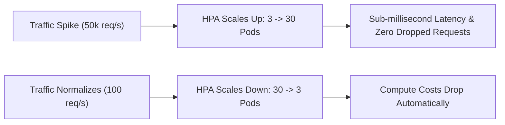
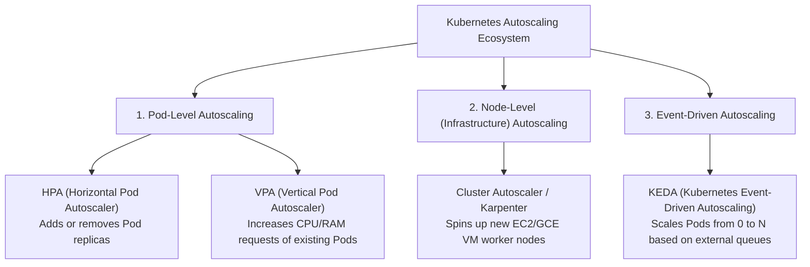
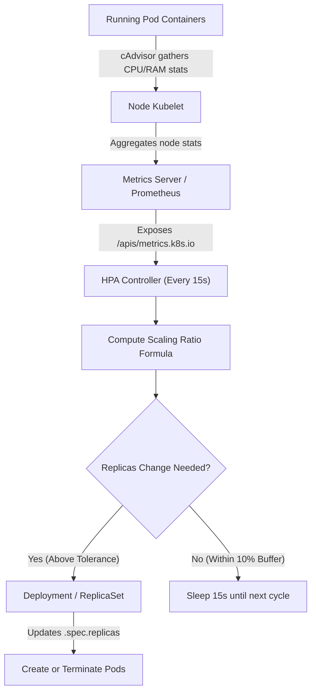
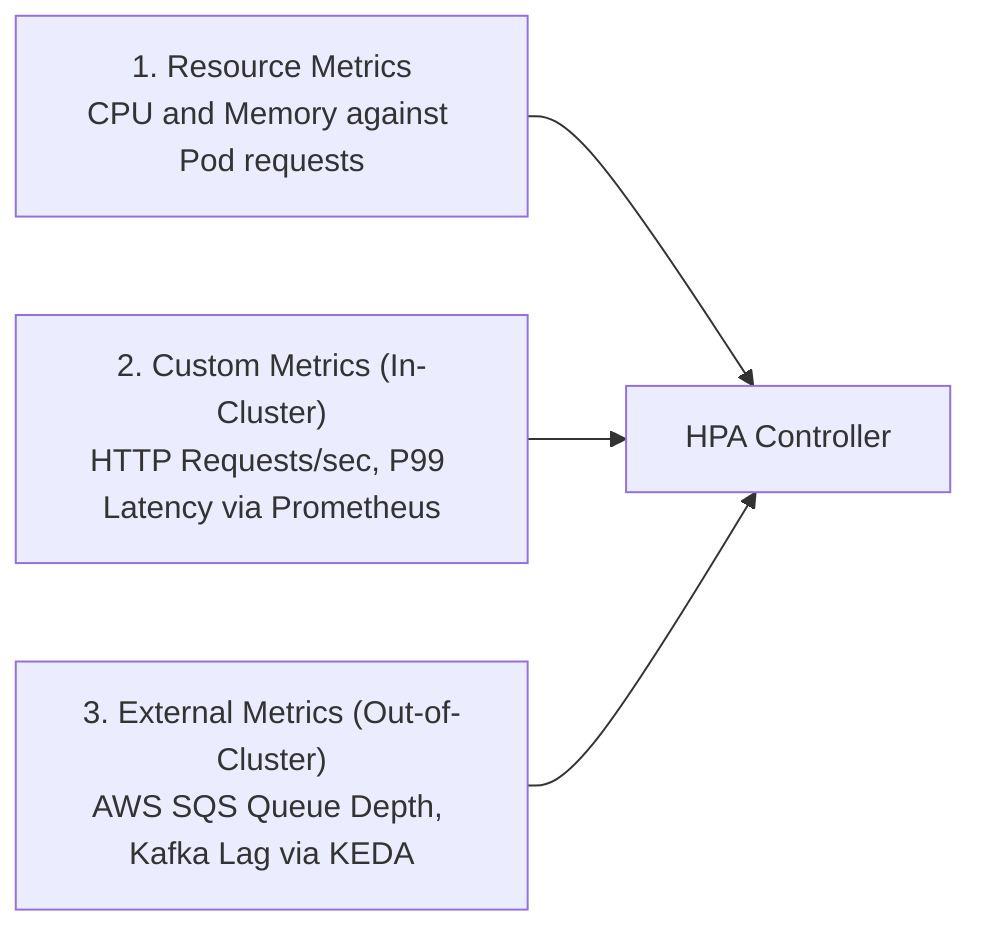

# 01 — Kubernetes Horizontal Pod Autoscaler (HPA): Complete Architecture & Production Guide

> **Author / Mentor Context:** Production Infrastructure & Cloud-Native Scaling for Senior/Staff Engineers.  
> **Core Focus:** HPA Internals, The 4 Types of K8s Autoscalers, Mathematical Scaling Formulas, Behavior Policies, Anti-Flapping Stabilization, and Production Pitfalls.

---

## 🧭 Document Learning Flow

1. **Chapter 1: Foundations** — What is HPA and What Problem Does It Solve?
2. **Chapter 2: Production Use Cases** — Where is HPA Used in Real-World Systems?
3. **Chapter 3: The 4 Kubernetes Autoscaling Types** — HPA vs. VPA vs. Cluster Autoscaler vs. KEDA.
4. **Chapter 4: Under the Hood** — The Control Loop, Metrics Pipeline & Scaling Formula.
5. **Chapter 5: Metric Sources** — Resource Metrics, In-Cluster Custom Metrics, and Out-of-Cluster External Metrics.
6. **Chapter 6: Production YAML Blueprint** — `autoscaling/v2` with Stabilization Windows & Rate-Limiting.
7. **Chapter 7: Tradeoff Analysis** — In-Depth Pros & Cons of HPA.
8. **Chapter 8: Senior Failure Modes & Traps** — Memory-leak traps, missing requests, and flapping thrashes.
9. **Chapter 9: Master Decision Matrix & Golden Rules**.

---

## Chapter 1: What is HPA and What Problem Does It Solve?

In cloud-native architectures, traffic is non-linear. An e-commerce backend might process 50 requests/sec at 3:00 AM and 50,000 requests/sec during a flash sale.

```
Without HPA (Static Capacity):
  - Over-provisioning: Running 50 Pods 24/7 wastes $10,000s/month on idle compute.
  - Under-provisioning: Running 5 Pods causes server crashes and 504 Gateway Timeouts during surges.

With HPA (Dynamic Elasticity):
  - Automatically adjusts Pod replica count up during surges and down during lulls.
```



---

## Chapter 2: Where is HPA Used in Production?

HPA is the gold standard for **Stateless Services** and **Elastic Workloads**:

1. **Stateless HTTP/REST & GraphQL Microservices:**
   - E-commerce checkout, user auth, API gateways, and search services.
2. **Asynchronous Message Queue Workers:**
   - Workers processing SQS, Kafka, or RabbitMQ message bursts (when paired with Prometheus/KEDA).
3. **AI / ML Inference Endpoints:**
   - Model serving containers (Triton, FastAPI, TorchServe) scaling based on GPU utilization or queue depth.
4. **Batch & Data Ingestion Pipelines:**
   - Ingesting large files or telemetry logs where volume fluctuates heavily throughout the day.

---

## Chapter 3: The 4 Types of Kubernetes Autoscaling

Senior engineers understand that HPA is only one layer of the Kubernetes autoscaling ecosystem:



### In-Depth Comparison Matrix

| Autoscaler | Target Managed | Scaling Axis | When to Use | Typical Limitation |
| :--- | :--- | :--- | :--- | :--- |
| **HPA** | Pods | **Horizontal ($N \rightarrow N+M$)** | Stateless APIs, high-throughput microservices | Cannot scale infrastructure (nodes) if cluster is full |
| **VPA** | Pods | **Vertical ($2\text{ CPU} \rightarrow 4\text{ CPU}$)** | Stateful apps, databases, batch ML jobs | Requires restarting the pod to apply new limits |
| **Cluster Autoscaler / Karpenter** | Worker Nodes (VMs) | **Infrastructure Nodes** | When existing nodes run out of CPU/Memory capacity | Takes 1 to 3 minutes to spin up a new VM node |
| **KEDA** | Pods & HPA | **Event-Driven (0 $\rightarrow$ N)** | SQS, Kafka, Redis, RabbitMQ workers | Requires installing custom CRD controllers |

---

## Chapter 4: How HPA Works Under the Hood

HPA operates as a **reconciliation control loop** inside the Kubernetes `kube-controller-manager`. By default, it executes every **15 seconds** (`--horizontal-pod-autoscaler-sync-period`).



---

### The Mathematical Scaling Formula

The HPA controller evaluates desired replicas using a strict ratio:

```text
desiredReplicas = ceil( currentReplicas * ( currentMetricValue / desiredMetricValue ) )
```

#### Step-by-Step Production Calculation:
* **Current Replicas:** 4 Pods
* **Target CPU Utilization:** 50%
* **Current Observed Average CPU:** 80%

```text
desiredReplicas = ceil( 4 * ( 80 / 50 ) )
                = ceil( 4 * 1.6 )
                = ceil( 6.4 )
                = 7 Pods
```

* **The Tolerance Buffer:** If the ratio `(currentMetricValue / desiredMetricValue)` is between `0.9` and `1.1` (within $\pm 10\%$), the controller skips scaling to prevent unnecessary Pod churn.

---

## Chapter 5: The 3 Metric Sources HPA Scales On



1. **Resource Metrics (Built-in via Metrics Server):**
   - Direct CPU/Memory utilization percentage calculated against container `resources.requests`.
2. **Custom Metrics (In-Cluster via Prometheus Adapter):**
   - Application-level metrics, such as `http_requests_per_second`, active WebSocket connections, or error rates.
3. **External Metrics (Cloud / Third-Party via KEDA):**
   - Metrics outside the Kubernetes cluster, such as AWS SQS backlog depth, Kafka consumer lag, or Redis stream length.

---

## Chapter 6: Production-Grade YAML Blueprint (`autoscaling/v2`)

```yaml
apiVersion: autoscaling/v2
kind: HorizontalPodAutoscaler
metadata:
  name: payment-service-hpa
  namespace: production
spec:
  scaleTargetRef:
    apiVersion: apps/v1
    kind: Deployment
    name: payment-service
  minReplicas: 3
  maxReplicas: 30
  metrics:
    # 1. Resource Metric: Average CPU across pods
    - type: Resource
      resource:
        name: cpu
        target:
          type: Utilization
          averageUtilization: 60
    # 2. Custom Metric: HTTP Requests Per Second
    - type: Pods
      pods:
        metric:
          name: http_requests_per_second
        target:
          type: AverageValue
          averageValue: 1000m # 1000 requests/sec per pod
  # Production Anti-Flapping & Rate Limiting Behavior
  behavior:
    scaleUp:
      stabilizationWindowSeconds: 0 # React instantly to surges
      policies:
        - type: Percent
          value: 100 # Double pods every 15s if traffic explodes
          periodSeconds: 15
        - type: Pods
          value: 4 # Or add at least 4 pods every 15s
          periodSeconds: 15
      selectPolicy: Max
    scaleDown:
      stabilizationWindowSeconds: 300 # Wait 5 minutes of low traffic before scaling down
      policies:
        - type: Percent
          value: 10 # Scale down at most 10% of pods per minute
          periodSeconds: 60
      selectPolicy: Min
```

---

## Chapter 7: In-Depth Pros & Cons of HPA

### Pros:
1. **Cost Optimization:** Automatically turns off idle pods during off-peak hours, slashing cloud compute bills by 40–70%.
2. **High Availability & Zero Manual Intervention:** Handles unexpected traffic spikes automatically without needing an on-call engineer to scale deployments.
3. **Multi-Dimensional Metrics:** Supports scaling on CPU, RAM, custom Prometheus metrics, and cloud message queues simultaneously.
4. **Graceful Anti-Flapping:** `behavior` rules allow fine-grained rate-limiting on scale-down to protect databases from connection storms.

### Cons:
1. **Cannot Fix Infrastructure Bottlenecks Alone:** If the Kubernetes cluster runs out of EC2/VM worker nodes, HPA creates Pods in `Pending` state until Cluster Autoscaler provisions new hardware.
2. **Cold Start Lag:** If your container image takes 60 seconds to start (e.g. heavy Java/Spring Boot app), traffic spikes might cause 504 errors before new pods pass readiness probes.
3. **Database Connection Flooding:** Scaling from 5 to 50 pods can instantly exhaust PostgreSQL/MySQL connection pools unless connection poolers (PgBouncer) are in place.

---

## Chapter 8: Senior Production Traps & Failure Modes

### ⚠️ Trap 1: Scaling on Memory (The Garbage Collection Trap)
* **The Failure:** In Node.js (V8) and Java (JVM), memory allocated to the heap is rarely returned to the OS immediately by garbage collection.
* **Impact:** Once a traffic spike pushes memory to 85%, memory stays at 85% even when traffic drops to zero. **HPA never scales down**, permanently wasting money.
* **Best Practice:** Use **CPU** or **Requests/sec** for stateless microservices.

### ⚠️ Trap 2: Forgetting Container `resources.requests`
* **The Failure:** HPA computes utilization percentages against `requests.cpu`, **NOT** `limits.cpu`.
* **Impact:** If `requests.cpu` is omitted in the Deployment YAML, HPA displays `<unknown>/50%` and completely refuses to scale.

### ⚠️ Trap 3: Scale Flapping / Thrashing
* **The Failure:** Quick scale-up leads to an immediate drop in average CPU, triggering a scale-down, which immediately overloads remaining pods and triggers another scale-up.
* **Impact:** Continuous Pod creation and destruction causes network packet drops.
* **The Fix:** Enforce `stabilizationWindowSeconds: 300` on `scaleDown`.

---

## Chapter 9: Tech Lead Master Rules for HPA

1. **Always set `minReplicas >= 2` (or 3):** Spreads replicas across distinct Availability Zones (AZs) for high availability.
2. **Always define `requests.cpu` and `limits.cpu`:** Ensures the scheduler and HPA have deterministic baselines.
3. **Use KEDA for Queue Workers:** Never scale asynchronous worker pods on CPU; scale directly on queue depth (SQS / Kafka / RabbitMQ).
4. **Implement PgBouncer / Connection Pooling:** Protect databases before enabling high `maxReplicas` on API services.
