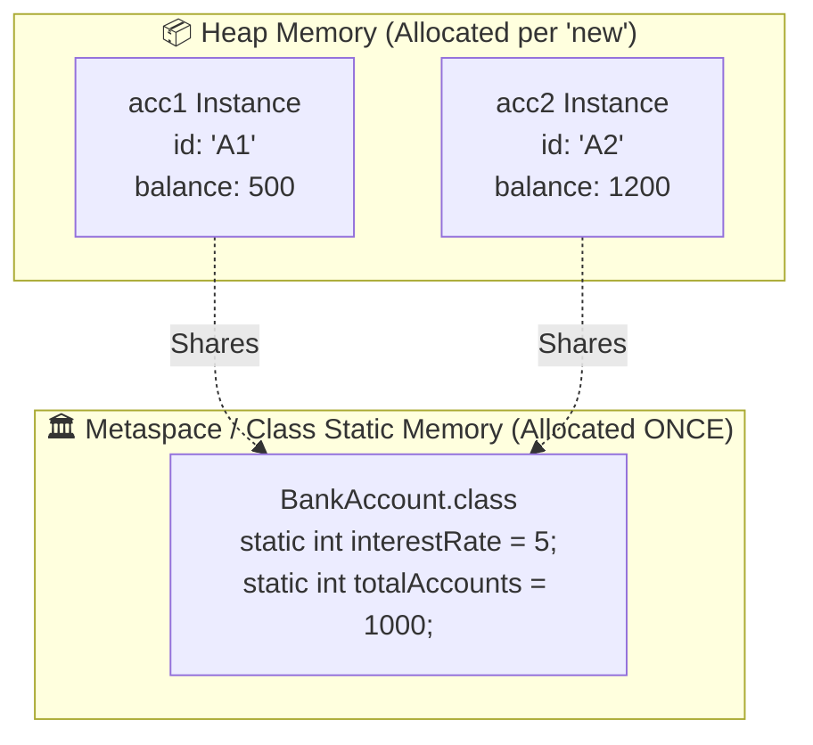

# Language Runtime Mechanics: `new`, `this`, `final`, `static` in Java vs. JavaScript

> **Track:** LLD & Core OOP Runtimes  
> **Topic:** Execution Mechanics of `new`, `this`, `super`, `final`, `static`, & `instanceof` (Java JVM vs. JavaScript V8 Engine)  
> **Level:** SDE-1 / SDE-2 $\rightarrow$ Senior Engineer / Tech Lead  
> **Purpose:** Deep mechanical understanding, runtime memory layout, and interview mastery.

---

## 🧭 Executive Summary: Class-Based (Java) vs. Prototype-Based (JavaScript)

```
┌────────────────────────────────────────────────────────────────────────────────────────┐
│                                 THE RUNTIME DIVIDE                                     │
├────────────────────────────────────────┬───────────────────────────────────────────────┤
│ JAVA (JVM)                             │ JAVASCRIPT (V8 / Node.js)                     │
├────────────────────────────────────────┼───────────────────────────────────────────────┤
│ • Strict Class-Based OOP.              │ • Prototype-Based OOP under ES6 syntax sugar. │
│ • Static, compile-time type system.   │ • Dynamic, runtime type & prototype chain.    │
│ • Deterministic 'this' (JVM stack).    │ • Dynamic 'this' based on execution context.  │
│ • 'new' allocates typed JVM heap memory│ • 'new' links prototype & binds 'this'.       │
└────────────────────────────────────────┴───────────────────────────────────────────────┘
```

---

## 1. The `new` Keyword: Step-by-Step Runtime Mechanics

---

### ☕ A. What `new` does in Java (Inside the JVM)

When you execute:
```java
BankAccount acc = new BankAccount("acc_101", 500);
```

```
[ 1. Class Loading ] ➔ [ 2. Heap Allocation ] ➔ [ 3. Zero-Init ] ➔ [ 4. Constructor <init> ] ➔ [ 5. Stack Ref ]
```

1. **Class Loading & Metaspace Check:**  
   The JVM checks if `BankAccount.class` is loaded in Metaspace. If not, the ClassLoader loads bytecodes, validates them, and initializes static fields.
2. **Heap Memory Allocation:**  
   The JVM calculates the exact byte size required (Object header: 12-16 bytes + primitive fields + reference pointers) and allocates space on the **Heap**.
3. **Default Zero-Initialization:**  
   The allocated memory is wiped to default values (`0` for `int`, `false` for `boolean`, `null` for references).
4. **Constructor Execution (`<init>` method):**  
   The JVM executes the constructor method (`<init>`). It first calls the superclass constructor (`super()`), executes field initializers, and runs user constructor code.
5. **Stack Reference Assignment:**  
   The 64-bit memory address (pointer) of the heap object is stored in the local stack variable (`acc`).

---

### 🟨 B. What `new` does in JavaScript (Inside the V8 Engine)

JavaScript classes (`class User {}`) are syntactic sugar over **Prototype-based constructor functions**.

When you execute:
```javascript
const user = new User("Alice", 25);
```

#### The 4 Steps V8 Executes Mechanically:
1. **Creates a brand new empty plain object:** `{}` in V8 heap memory.
2. **Sets the Prototype Pointer:** Links the new object's internal `[[Prototype]]` (accessible via `__proto__`) to `User.prototype`.
3. **Binds `this` & Executes Constructor:** Invokes `User.call(newObj, "Alice", 25)`, pointing `this` inside the constructor to the newly created object.
4. **Returns the Object:** If the constructor doesn't explicitly return another object, it automatically returns `newObj` (`this`).

#### 💡 The Exact V8 Polyfill of `new`:
If `new` did not exist in JavaScript, this is the exact mechanical implementation:

```javascript
function myNew(ConstructorFunction, ...args) {
    // 1. Create a blank object linked to Constructor's prototype
    const newObj = Object.create(ConstructorFunction.prototype);

    // 2. Execute constructor with 'this' bound to the new object
    const result = ConstructorFunction.apply(newObj, args);

    // 3. Return result if it's an object, otherwise return newObj
    return (typeof result === "object" && result !== null) ? result : newObj;
}
```

---

## 2. The `this` Keyword: Deterministic vs. Dynamic Context

---

### ☕ A. `this` in Java (Deterministic & Lexical)

In Java, `this` **ALWAYS** refers to the current instance of the class executing the method. It is resolved deterministically at compile-time/runtime.

#### How Java implements `this` under the hood:
Every non-static method in Java secretly receives `this` as the **first hidden parameter**:

```java
// What you write:
public void deposit(int amount) {
    this.balance += amount;
}

// What the JVM actually compiles bytecode to:
public static void deposit(BankAccount this, int amount) {
    this.balance += amount;
}
```

#### Core Uses of `this` in Java:
1. **Disambiguate instance variable from method parameter:** `this.balance = balance;`
2. **Constructor Chaining (Telescoping constructors):**
   ```java
   public class BankAccount {
       private String id;
       private int balance;

       public BankAccount(String id) {
           this(id, 0); // 👈 Calls the 2-parameter constructor!
       }

       public BankAccount(String id, int balance) {
           this.id = id;
           this.balance = balance;
       }
   }
   ```
3. **Pass current instance as callback:** `eventListener.register(this);`

---

### 🟨 B. `this` in JavaScript (Dynamic Invocation Context)

Unlike Java, `this` in JavaScript is **NOT** bound to the class where it was written.  
👉 **`this` is determined strictly by HOW the function is CALLED at runtime.**

```
┌─────────────────────────────────────────────────────────────────────────────┐
│                       THE 5 'THIS' BINDING RULES (JS)                       │
├───────────────────────┬─────────────────────────────┬───────────────────────┤
│ Rule                  │ Example Call                │ What 'this' points to │
├───────────────────────┼─────────────────────────────┼───────────────────────┤
│ 1. Default Binding    │ fn()                        │ window / undefined    │
│ 2. Implicit Binding   │ obj.fn()                    │ obj                   │
│ 3. Explicit Binding   │ fn.call(customObj)          │ customObj             │
│ 4. 'new' Binding      │ new fn()                    │ Brand new empty obj   │
│ 5. Lexical Arrow      │ () => this.val              │ Surrounding scope this│
└───────────────────────┴─────────────────────────────┴───────────────────────┘
```

#### 🚨 The Classic JavaScript Production Bug: Losing `this`

```javascript
class PaymentProcessor {
    constructor() {
        this.gateway = "Stripe";
    }

    process() {
        console.log(`Processing with ${this.gateway}`);
    }
}

const processor = new PaymentProcessor();
processor.process(); // ✅ Logs: "Processing with Stripe" (Implicit binding)

// 💥 PRODUCTION BUG: Passing method as a callback
setTimeout(processor.process, 1000); 
// ❌ Output: "Processing with undefined" (this is lost / refers to Timeout object!)
```

#### The 3 Solutions to Fix `this` in JavaScript:

```javascript
// Solution 1: Arrow Function wrapper (Lexical this)
setTimeout(() => processor.process(), 1000);

// Solution 2: Explicit Binding (.bind)
setTimeout(processor.process.bind(processor), 1000);

// Solution 3: Class Field Arrow Function
class PaymentProcessorFixed {
    gateway = "Stripe";
    process = () => { // 🔒 Bound to instance at creation time
        console.log(`Processing with ${this.gateway}`);
    };
}
```

---

## 3. Essential OOP Keywords Deep-Dive

---

### 3.1 `final` (Java) vs. `const` / `readonly` / `Object.freeze` (JS/TS)

In Java, `final` is a powerful keyword with **3 completely different meanings** depending on where it is placed:

```
┌─────────────────────────────────────────────────────────────────────────────┐
│                          THE 3 USES OF 'FINAL' (JAVA)                       │
├────────────────────┬────────────────────────────────────────────────────────┤
│ 1. final Variable  │ Cannot be reassigned after initialization.             │
│ 2. final Method    │ Cannot be overridden by any subclass.                  │
│ 3. final Class     │ Cannot be inherited/extended by any class.             │
└────────────────────┴────────────────────────────────────────────────────────┘
```

#### A. `final` Variable:
```java
final BankAccount acc = new BankAccount("A1", 100);
// acc = new BankAccount("A2", 200); // ❌ COMPILE ERROR: Cannot reassign reference!
acc.deposit(50); // ✅ ALLOWED: The object internals can still mutate unless fields are final!
```

#### B. `final` Method (Security & Performance):
Prevents subclasses from breaking critical invariant algorithms (and allows JIT compiler to inline methods):
```java
public abstract class SecurityTokenValidator {
    // Subclasses CANNOT override validateToken (Protects security workflow!)
    public final boolean validateToken(String token) {
        if (token == null) return false;
        return executeVerification(token);
    }
    protected abstract boolean executeVerification(String token);
}
```

#### C. `final` Class (Immutable & Sealed Value Objects):
```java
// Prevents malicious/broken subclasses (e.g., java.lang.String is final)
public final class Money {
    private final long amount;
    private final String currency;
    public Money(long amount, String currency) {
        this.amount = amount;
        this.currency = currency;
    }
}
```

#### 🟨 Equivalent in TypeScript & JavaScript:

| Java Keyword | TypeScript / JavaScript Equivalent |
| :--- | :--- |
| `final` reference variable | `const` variable |
| `final` class field | `readonly` (TypeScript compile-time check) |
| Deep Immutability | `Object.freeze(instance)` (Runtime immutability) |
| `final` class | `#private` constructor or TS `private constructor` |

---

### 3.2 `static`: Class-Level Memory vs. Heap Instance Memory

* **Instance Member:** Exists separately for **every single object created** on the Heap.
* **Static Member:** Exists **exactly once in memory** (stored in JVM Metaspace / Class Object), shared across all instances.



#### ☕ Java `static`:
```java
public class Counter {
    public static int globalCount = 0; // Shared across all instances
    public int instanceCount = 0;      // Unique per instance

    public Counter() {
        globalCount++;
        instanceCount++;
    }
}
```

#### 🟨 JavaScript `static`:
```javascript
class Counter {
    static globalCount = 0; // Attached directly to the Counter constructor function!
    instanceCount = 0;

    constructor() {
        Counter.globalCount++;
        this.instanceCount++;
    }
}
```

---

### 3.3 `super`: Calling Parent Constructors & Overridden Methods

* **`super(...)`:** Calls the parent class constructor.
  - *Java Rule:* Must be the **first line** in the child constructor.
  - *JS Rule:* In a subclass with a constructor, you **must call `super()` before accessing `this`**.
* **`super.method()`:** Delegates call to the parent class's method implementation.

```typescript
class BaseNotification {
    constructor(protected recipientId: string) {}
    send() { console.log(`Sending base notification to ${this.recipientId}`); }
}

class EmailNotification extends BaseNotification {
    constructor(recipientId: string, private emailAddress: string) {
        super(recipientId); // 👈 Calls BaseNotification constructor
    }

    override send() {
        super.send(); // 👈 Executes base send behavior first
        console.log(`Dispatching email to ${this.emailAddress}`);
    }
}
```

---

### 3.4 `instanceof`: Runtime Type Checking

* **☕ In Java:** Checks if the heap object’s internal VTable/class pointer derives from the specified Class or Interface.
* **🟨 In JavaScript:** Checks if `Constructor.prototype` exists anywhere in the object’s **prototype chain (`__proto__`)**.

```javascript
class Animal {}
class Dog extends Animal {}

const d = new Dog();
console.log(d instanceof Dog);    // true (d.__proto__ === Dog.prototype)
console.log(d instanceof Animal); // true (d.__proto__.__proto__ === Animal.prototype)
console.log(d instanceof Object); // true (d.__proto__.__proto__.__proto__ === Object.prototype)
```

---

## 📊 Summary Comparison Matrix (Interview Cheat Sheet)

| Concept / Keyword | Java (JVM) | JavaScript (V8 Engine) |
| :--- | :--- | :--- |
| **`new`** | Allocates typed heap block, zero-initializes, executes `<init>`. | Creates `{}`, links `__proto__`, binds `this`, executes constructor. |
| **`this`** | Deterministic reference to current instance on heap. | Dynamic context resolved at call-time (unless arrow function). |
| **`final`** | Restricts reassignment (variable), overriding (method), or extension (class). | Simulated via `const`, `readonly`, and `Object.freeze()`. |
| **`static`** | Stored once in JVM Metaspace; accessed via `ClassName.member`. | Property attached to constructor function object. |
| **`super`** | Calls parent constructor (`super()`) or parent method (`super.m()`). | Must call `super()` before using `this` in child constructor. |
| **`instanceof`** | Checks class metadata pointer in JVM. | Traverses `__proto__` prototype chain up to `null`. |

---

## 🔗 Related Vault Topics
- [00_oop_core_fundamentals_interview_layman_guide.md](file:///Users/flixstock/Desktop/personal%20project/learn/06-LLD-AND-CLEAN-ARCHITECTURE/01-oops/00_oop_core_fundamentals_interview_layman_guide.md)
- [02_interface_vs_abstract_class_vs_base_class_is_a_has_a.md](file:///Users/flixstock/Desktop/personal%20project/learn/06-LLD-AND-CLEAN-ARCHITECTURE/01-oops/abstraction/02_interface_vs_abstract_class_vs_base_class_is_a_has_a.md)
- [04_production_drill_wallet_subscription_auto_renew_encapsulation.md](file:///Users/flixstock/Desktop/personal%20project/learn/06-LLD-AND-CLEAN-ARCHITECTURE/01-oops/encapsulation/04_production_drill_wallet_subscription_auto_renew_encapsulation.md)
- [02_production_drill_http_client_combinatorial_explosion_decorator_pipeline.md](file:///Users/flixstock/Desktop/personal%20project/learn/06-LLD-AND-CLEAN-ARCHITECTURE/01-oops/inheritance/02_production_drill_http_client_combinatorial_explosion_decorator_pipeline.md)
