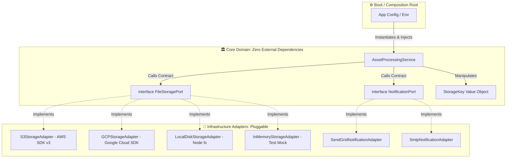
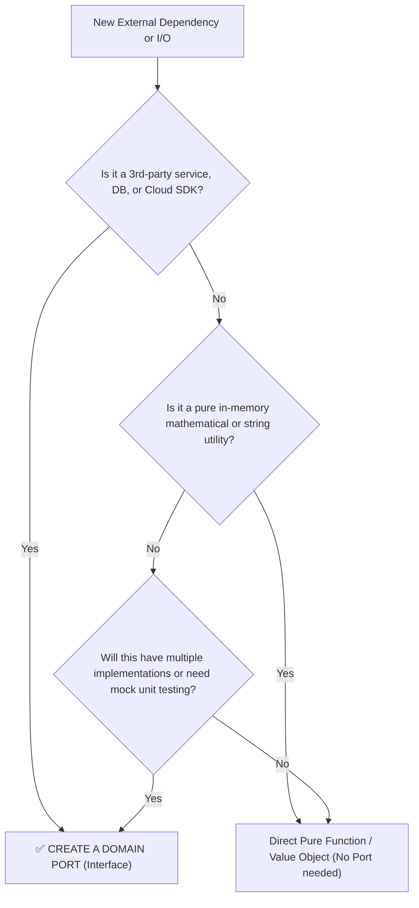

# Abstraction, Domain Contracts & Boundary Isolation

> **Track:** LLD & Clean Architecture  
> **Topic:** True Abstraction, Ports & Adapters (Hexagonal Architecture), Leaky Abstractions, & Zero-Dependency Domain Core  
> **Level:** SDE-1 / SDE-2 $\rightarrow$ Senior Engineer / Tech Lead  
> **Real-World Reference:** Multi-Cloud AI Asset Storage & Notification Pipeline (AWS S3, GCP, Local Disk, SendGrid, SMTP)

---

## 🧭 Executive Summary: What is Abstraction from First Principles?

In naive OOP tutorials, **Abstraction** is often simplified as *"hiding implementation details and showing only essential features."*

In high-scale production systems, **Abstraction is the architectural boundary that protects high-level business policies from low-level infrastructure churn.**

```
❌ NAIVE JUNIOR INTUITION:
"I will make an abstract class BaseStorage and put some common helper methods in it."

✅ SENIOR TECH LEAD FORMULATION:
"The Domain Core owns the contract (Port). Infrastructure implements the contract (Adapter). 
Business logic never imports a single line of SDK code, HTTP client, or database driver. 
Illegal vendor-specific concepts are prevented from leaking across the boundary."
```

---

## 🚨 The 10-Step First-Principles Breakdown

### 1. Problem: The "Leaky Abstraction" & Vendor Lock-in Trap
When business services directly import vendor SDKs (`@aws-sdk/client-s3`, `@sendgrid/mail`, `knex`), the business rules become permanently coupled to third-party data structures:
- Business methods accept S3-specific types like `PutObjectCommandInput` or return S3 `ETags`.
- If an enterprise client requests an **On-Premises deployment** (using local Linux disks or MinIO) or the company migrates to **Google Cloud Storage (GCS)**, developers must rewrite **dozens of business files**, creating massive regressions.
- Unit testing becomes slow, painful, and brittle because testing a simple business calculation requires running mock HTTP servers or Dockerized LocalStack containers.

---

### 2. Mechanical Explanation: Dependency Inversion at the Memory Boundary

In traditional procedural design, the source code dependency direction follows the control flow direction:

```
[AssetService (High Level)] ─────────► [AWS S3 SDK (Low Level)]
        (Business Core depends directly on Third-Party I/O)
```

With **True Abstraction & Dependency Inversion (Ports & Adapters)**, the source code dependency is **inverted**:

```
[AssetService (High Level)] ─────────► [FileStoragePort (Domain Interface)]
                                                    ▲
                                                    │ (Implements / Inverted)
                                       [S3StorageAdapter (Low Level)]
```

#### At Runtime:
- The `AssetService` holds a memory reference to an interface pointer (VTable in C++/Java or structural interface in TypeScript/Go).
- When `storage.save()` is executed, dynamic dispatch resolves to the concrete adapter registered at application startup.
- The business layer is completely insulated: it does not know or care if the bytes are written to a magnetic tape, an NVMe SSD, or an S3 bucket in `us-east-1`.

---

### 3. The Primitives: Interface (Port) vs. Adapter vs. Value Object

| Primitive | Architectural Role | Layer | Rules & Constraints |
| :--- | :--- | :--- | :--- |
| **Domain Port** | Interface defining *what* the business needs. | **Domain Core** | 0 external libraries, pure domain types only. |
| **Value Object** | Type-safe, immutable parameters passed to Ports. | **Domain Core** | Validates self on instantiation (e.g. `StorageKey`). |
| **Adapter** | Concrete class translating Port calls to SDK calls. | **Infrastructure** | Implements the Port, handles vendor errors/retry policies. |
| **Factory / DI Container** | Wires concrete Adapters into Domain Services at boot. | **Composition Root** | Reads `.env` / config and injects the right Adapter. |

---

## 🏗️ Production Architecture: Ports & Adapters (Hexagonal)



---

## 💻 Full Production Code Implementation

### 1. Pure Domain Layer (Zero Third-Party Dependencies)

#### A. The `StorageKey` Value Object
```typescript
// domain/value-objects/StorageKey.ts
export class StorageKey {
    private readonly normalizedPath: string;

    constructor(rawPath: string) {
        if (!rawPath || rawPath.trim().length === 0) {
            throw new Error("Domain Invariant Violation: StorageKey cannot be empty.");
        }
        // Eliminate traversal vulnerabilities & normalize
        const sanitized = rawPath.replace(/\.\./g, "").replace(/^\/+/, "");
        if (sanitized.length === 0) {
            throw new Error("Invalid storage path.");
        }
        this.normalizedPath = sanitized;
        Object.freeze(this);
    }

    public getPath(): string {
        return this.normalizedPath;
    }

    public getExtension(): string {
        const parts = this.normalizedPath.split(".");
        return parts.length > 1 ? parts.pop()!.toLowerCase() : "";
    }

    public equals(other: StorageKey): boolean {
        return this.normalizedPath === other.normalizedPath;
    }
}
```

#### B. The `FileStoragePort` Interface
```typescript
// domain/ports/FileStoragePort.ts
import { StorageKey } from "../value-objects/StorageKey";

export interface FileStoragePort {
    /**
     * Persists raw bytes/buffer to underlying storage.
     */
    save(key: StorageKey, content: Buffer | Uint8Array, mimeType: string): Promise<void>;

    /**
     * Reads the file as a stream (prevents loading gigabytes of video into RAM).
     */
    readStream(key: StorageKey): Promise<NodeJS.ReadableStream>;

    /**
     * Generates a time-limited public/signed access URL for client download.
     */
    getPublicAccessUrl(key: StorageKey, ttlSeconds: number): Promise<string>;

    /**
     * Deletes a file.
     */
    delete(key: StorageKey): Promise<void>;

    /**
     * Checks if a file exists.
     */
    exists(key: StorageKey): Promise<boolean>;
}
```

#### C. The `NotificationPort` Interface
```typescript
// domain/ports/NotificationPort.ts
export interface NotificationPort {
    send(recipientId: string, subject: string, messageBody: string, actionUrl?: string): Promise<void>;
}
```

#### D. The Domain Business Service
```typescript
// domain/services/AssetProcessingService.ts
import { FileStoragePort } from "../ports/FileStoragePort";
import { NotificationPort } from "../ports/NotificationPort";
import { StorageKey } from "../value-objects/StorageKey";

export class AssetProcessingService {
    constructor(
        private readonly storage: FileStoragePort,
        private readonly notifier: NotificationPort
    ) {}

    /**
     * Core business workflow: Stores AI-generated asset, generates signed link, notifies user.
     */
    public async processUpscaledAsset(
        jobId: string,
        userId: string,
        processedImageBuffer: Buffer,
        mimeType: string = "image/png"
    ): Promise<{ storageKey: string; downloadUrl: string }> {
        // 1. Construct Domain Value Object
        const key = new StorageKey(`users/${userId}/ai-upscales/${jobId}.png`);

        // 2. Persist via abstract Port
        await this.storage.save(key, processedImageBuffer, mimeType);

        // 3. Obtain signed access URL (valid for 1 hour)
        const downloadUrl = await this.storage.getPublicAccessUrl(key, 3600);

        // 4. Dispatch notification via abstract Port
        await this.notifier.send(
            userId,
            "Your Upscaled Image is Ready!",
            "Your high-resolution asset has been rendered successfully.",
            downloadUrl
        );

        return {
            storageKey: key.getPath(),
            downloadUrl
        };
    }
}
```

---

### 2. Infrastructure Layer (Adapters)

#### Adapter 1: AWS S3 Storage Adapter
```typescript
// infrastructure/storage/S3StorageAdapter.ts
import { S3Client, PutObjectCommand, GetObjectCommand, DeleteObjectCommand, HeadObjectCommand } from "@aws-sdk/client-s3";
import { getSignedUrl } from "@aws-sdk/s3-request-presigner";
import { FileStoragePort } from "../../domain/ports/FileStoragePort";
import { StorageKey } from "../../domain/value-objects/StorageKey";

export class S3StorageAdapter implements FileStoragePort {
    constructor(
        private readonly s3Client: S3Client,
        private readonly bucketName: string
    ) {}

    async save(key: StorageKey, content: Buffer, mimeType: string): Promise<void> {
        await this.s3Client.send(
            new PutObjectCommand({
                Bucket: this.bucketName,
                Key: key.getPath(),
                Body: content,
                ContentType: mimeType
            })
        );
    }

    async readStream(key: StorageKey): Promise<NodeJS.ReadableStream> {
        const response = await this.s3Client.send(
            new GetObjectCommand({
                Bucket: this.bucketName,
                Key: key.getPath()
            })
        );
        return response.Body as NodeJS.ReadableStream;
    }

    async getPublicAccessUrl(key: StorageKey, ttlSeconds: number): Promise<string> {
        const command = new GetObjectCommand({
            Bucket: this.bucketName,
            Key: key.getPath()
        });
        return await getSignedUrl(this.s3Client, command, { expiresIn: ttlSeconds });
    }

    async delete(key: StorageKey): Promise<void> {
        await this.s3Client.send(
            new DeleteObjectCommand({
                Bucket: this.bucketName,
                Key: key.getPath()
            })
        );
    }

    async exists(key: StorageKey): Promise<boolean> {
        try {
            await this.s3Client.send(
                new HeadObjectCommand({
                    Bucket: this.bucketName,
                    Key: key.getPath()
                })
            );
            return true;
        } catch (error: any) {
            if (error.name === "NotFound" || error.$metadata?.httpStatusCode === 404) {
                return false;
            }
            throw error;
        }
    }
}
```

#### Adapter 2: Local POSIX / On-Premise Disk Storage Adapter
```typescript
// infrastructure/storage/LocalDiskStorageAdapter.ts
import * as fs from "fs/promises";
import * as path from "path";
import { createReadStream } from "fs";
import * as crypto from "crypto";
import { FileStoragePort } from "../../domain/ports/FileStoragePort";
import { StorageKey } from "../../domain/value-objects/StorageKey";

export class LocalDiskStorageAdapter implements FileStoragePort {
    constructor(
        private readonly baseDirectory: string,
        private readonly publicServerUrl: string, // e.g. "https://onprem.enterprise.internal/api/v1/files"
        private readonly hmacSecret: string
    ) {}

    async save(key: StorageKey, content: Buffer): Promise<void> {
        const destination = path.join(this.baseDirectory, key.getPath());
        await fs.mkdir(path.dirname(destination), { recursive: true });
        await fs.writeFile(destination, content);
    }

    async readStream(key: StorageKey): Promise<NodeJS.ReadableStream> {
        const destination = path.join(this.baseDirectory, key.getPath());
        return createReadStream(destination);
    }

    async getPublicAccessUrl(key: StorageKey, ttlSeconds: number): Promise<string> {
        const expiresAt = Date.now() + ttlSeconds * 1000;
        const signature = crypto
            .createHmac("sha256", this.hmacSecret)
            .update(`${key.getPath()}:${expiresAt}`)
            .digest("hex");

        return `${this.publicServerUrl}/${key.getPath()}?expires=${expiresAt}&signature=${signature}`;
    }

    async delete(key: StorageKey): Promise<void> {
        const destination = path.join(this.baseDirectory, key.getPath());
        try {
            await fs.unlink(destination);
        } catch (err: any) {
            if (err.code !== "ENOENT") throw err;
        }
    }

    async exists(key: StorageKey): Promise<boolean> {
        const destination = path.join(this.baseDirectory, key.getPath());
        try {
            await fs.access(destination);
            return true;
        } catch {
            return false;
        }
    }
}
```

#### Adapter 3: In-Memory Storage Adapter (Lightning-Fast Unit Testing)
```typescript
// test/mocks/InMemoryStorageAdapter.ts
import { Readable } from "stream";
import { FileStoragePort } from "../../domain/ports/FileStoragePort";
import { StorageKey } from "../../domain/value-objects/StorageKey";

export class InMemoryStorageAdapter implements FileStoragePort {
    private readonly memoryStore = new Map<string, Buffer>();

    async save(key: StorageKey, content: Buffer): Promise<void> {
        this.memoryStore.set(key.getPath(), Buffer.from(content));
    }

    async readStream(key: StorageKey): Promise<NodeJS.ReadableStream> {
        const data = this.memoryStore.get(key.getPath());
        if (!data) throw new Error("File not found");
        return Readable.from(data);
    }

    async getPublicAccessUrl(key: StorageKey, _ttlSeconds: number): Promise<string> {
        return `https://mock-cdn.local/${key.getPath()}`;
    }

    async delete(key: StorageKey): Promise<void> {
        this.memoryStore.delete(key.getPath());
    }

    async exists(key: StorageKey): Promise<boolean> {
        return this.memoryStore.has(key.getPath());
    }

    // Helper for test assertions
    public getStoredBuffer(key: string): Buffer | undefined {
        return this.memoryStore.get(key);
    }
}
```

---

## ⚡ The Ultimate Unit Test (Zero Mocks, Zero Network, < 5ms Execution)

Because the domain depends strictly on the Port interface, writing unit tests is effortless:

```typescript
// test/AssetProcessingService.spec.ts
import { AssetProcessingService } from "../domain/services/AssetProcessingService";
import { InMemoryStorageAdapter } from "./mocks/InMemoryStorageAdapter";
import { NotificationPort } from "../domain/ports/NotificationPort";

describe("AssetProcessingService (Boundary Isolated)", () => {
    it("should store the upscaled asset and dispatch user notification", async () => {
        // 1. Arrange In-Memory Test Doubles
        const storage = new InMemoryStorageAdapter();
        const sentNotifications: any[] = [];
        const notifier: NotificationPort = {
            send: async (recipientId, subject, body, actionUrl) => {
                sentNotifications.push({ recipientId, subject, body, actionUrl });
            }
        };

        const service = new AssetProcessingService(storage, notifier);
        const mockFile = Buffer.from("fake-png-binary-stream");

        // 2. Act
        const result = await service.processUpscaledAsset("job_101", "usr_999", mockFile);

        // 3. Assert
        expect(result.storageKey).toBe("users/usr_999/ai-upscales/job_101.png");
        expect(result.downloadUrl).toContain("users/usr_999/ai-upscales/job_101.png");
        expect(storage.getStoredBuffer("users/usr_999/ai-upscales/job_101.png")).toEqual(mockFile);
        expect(sentNotifications).toHaveLength(1);
        expect(sentNotifications[0].recipientId).toBe("usr_999");
    });
});
```

---

## 🚨 Common Leaky Abstraction Code Smells

### 1. Leaking Vendor Types into Domain Ports
```typescript
// ❌ LEAKY: Imports AWS S3 types directly into the domain interface!
import { PutObjectCommandOutput } from "@aws-sdk/client-s3";
export interface FileStoragePort {
    save(path: string, content: Buffer): Promise<PutObjectCommandOutput>; // 🚨 Breaks if using GCP!
}
```

### 2. Leaking Vendor Exceptions across Boundaries
If AWS throws `NoSuchBucket` or Local Disk throws `ENOENT`, the adapter must **catch and translate** it into a Domain Exception (`AssetNotFoundException`) before letting it bubble into the business logic.

### 3. Assuming Global Features (The "Presigned URL" Assumption)
Assuming that all storage systems inherently provide HTTP pre-signed URLs. The contract must declare the *business capability* (`getPublicAccessUrl`), letting cloud adapters return S3 URLs and local disk adapters return HMAC-signed server routes.

---

## 🎯 Senior Decision Matrix: When to Create an Abstraction Port



---

## 🔗 Related Vault Topics
- [01_advanced_encapsulation_state_invariants_tell_dont_ask.md](file:///Users/flixstock/Desktop/personal%20project/learn/06-LLD-AND-CLEAN-ARCHITECTURE/01-oops/encapsulation/01_advanced_encapsulation_state_invariants_tell_dont_ask.md)
- [04_production_drill_wallet_subscription_auto_renew_encapsulation.md](file:///Users/flixstock/Desktop/personal%20project/learn/06-LLD-AND-CLEAN-ARCHITECTURE/01-oops/encapsulation/04_production_drill_wallet_subscription_auto_renew_encapsulation.md)
- [01_inheritance_vs_composition_fragile_base_class.md](file:///Users/flixstock/Desktop/personal%20project/learn/06-LLD-AND-CLEAN-ARCHITECTURE/01-oops/inheritance/01_inheritance_vs_composition_fragile_base_class.md)
