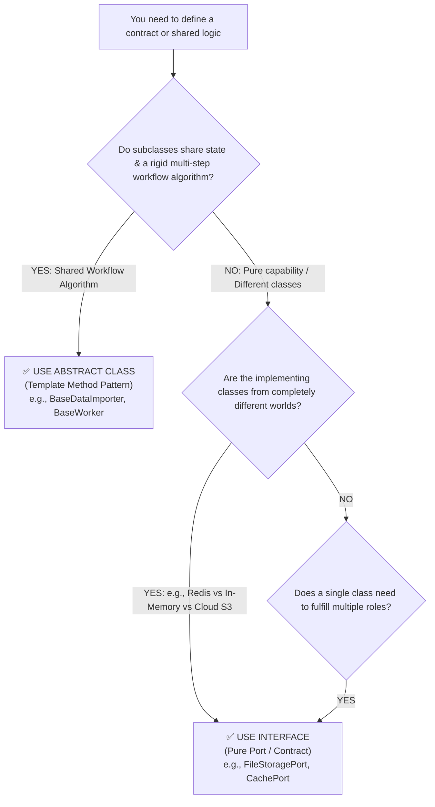

# Interface vs. Abstract Class vs. Base Class & IS-A vs. HAS-A

> **Track:** LLD & Clean Architecture  
> **Topic:** Core OOP Mental Models: Abstraction, Interface, Abstract Class, Base Class, IS-A vs. HAS-A  
> **Level:** SDE-1 / SDE-2 $\rightarrow$ Senior Engineer / Tech Lead  
> **Purpose:** Clear mental models, decision flowcharts, and production architectural rules.

---

## 🧭 Executive Summary & Mental Landscape

```
┌─────────────────────────────────────────────────────────────────────────────┐
│                           THE OOP SPECTRUM                                  │
│                                                                             │
│  1. ABSTRACTION   ➔ The "Concept" / "What it does" (The Remote Control)     │
│  2. INTERFACE     ➔ The "Pure Contract" (0% Code, 100% Abstract Contract)   │
│  3. ABSTRACT CLASS➔ The "Half-Baked Skeleton" (Template Algorithm + Holes) │
│  4. BASE CLASS    ➔ The "Complete Parent" (100% Concrete Code & State)      │
│                                                                             │
│  5. IS-A          ➔ Inheritance ("A Tesla IS-A Vehicle")                   │
│  6. HAS-A         ➔ Composition ("A Car HAS-A Battery")                    │
└─────────────────────────────────────────────────────────────────────────────┘
```

---

## 1. What is Abstraction (From First Principles)?

### The Real-World Mental Model
Think of your **Car’s Accelerator Pedal**:
* You press the pedal $\rightarrow$ The car goes faster.
* You **do not know or care** whether underneath the hood there is a 4-cylinder petrol engine, a V8 turbo, or a dual-motor electric battery.
* The pedal is the **Abstraction**. It exposes a simple *behavior* (`accelerate()`) while completely hiding the complex internal mechanics.

> **First-Principles Definition of Abstraction:**  
> Exposing **WHAT** an entity does while completely hiding **HOW** it achieves it.  
> It decouples high-level business decisions from low-level infrastructure (network, disk, vendor SDKs).

---

## 2. Interface vs. Abstract Class vs. Base Class

```typescript
// 1. INTERFACE: Pure Contract (Zero Code, Zero State)
// "Here is what you MUST be able to do. I do not care how you do it."
export interface PaymentGateway {
    processPayment(amountInCents: bigint): Promise<PaymentResult>;
}

// 2. ABSTRACT CLASS: Half-Baked Skeleton (Partial Code + Abstract Holes)
// "Here is the master workflow algorithm, but subclasses MUST fill in the blank steps."
export abstract class BasePaymentGateway implements PaymentGateway {
    protected apiKey: string;

    constructor(apiKey: string) {
        this.apiKey = apiKey;
    }

    // Concrete method: Reusable, shared workflow (Template Method Pattern)
    public async processPayment(amountInCents: bigint): Promise<PaymentResult> {
        this.logAttempt(amountInCents);
        const result = await this.executeCharge(amountInCents); // 🕳️ Abstract step!
        this.saveAuditLog(result);
        return result;
    }

    // Abstract hole: Subclasses MUST implement their specific provider API
    protected abstract executeCharge(amountInCents: bigint): Promise<PaymentResult>;

    private logAttempt(amount: bigint) { console.log(`Charging ${amount}`); }
    private saveAuditLog(res: PaymentResult) { console.log(`Saved audit log`); }
}

// 3. BASE (CONCRETE) CLASS: Fully Baked Class
// "I am a complete, functioning class. You can instantiate me directly."
export class StandardLogger {
    public log(message: string): void {
        console.log(`[${new Date().toISOString()}] ${message}`);
    }
}
```

---

### 📊 The Comprehensive Comparison Matrix

| Dimension | **Interface** | **Abstract Class** | **Base (Concrete) Class** |
| :--- | :--- | :--- | :--- |
| **Can you instantiate (`new`)?** | ❌ No | ❌ No | ✅ Yes |
| **Can it have method implementation?** | ❌ No (Only method signatures) | ✅ Yes (Can mix concrete & abstract methods) | ✅ Yes (All methods have full code) |
| **Can it hold state / variables?** | ❌ No state (No constructor/fields) | ✅ Yes (Has constructors and state fields) | ✅ Yes (Full state and constructors) |
| **Multiple Inheritance allowed?** | ✅ Yes (`implements A, B, C`) | ❌ No (Can only `extends` ONE class) | ❌ No (Can only `extends` ONE class) |
| **Coupling Level** | **Zero Coupling** (Black-box contract) | **High Coupling** (White-box inheritance) | **High Coupling** (White-box inheritance) |
| **Primary Design Intent** | **Define a Role or Capability** ("What you can do") | **Template Method Pattern** (Share an algorithm lifecycle) | **Standard reusable component** |

---

## 3. "IS-A" vs. "HAS-A" Relationship

### 🔴 "IS-A" (Inheritance / `extends`)
When Class B **is literally a specialized subtype** of Class A.

* **Examples:** 
  * A `SavingsAccount` **IS-A** `BankAccount`.
  * A `Square` **IS-A** `Shape`.
  * A `PushNotification` **IS-A** `Notification`.
* **When to use:** Only when polymorphic substitutability (Liskov Substitution) is 100% true for all methods and invariants.
* **The Danger:** White-box coupling. If the parent class changes internal method delegation, child classes can silently suffer from infinite recursion or broken invariants.

---

### 🟢 "HAS-A" (Composition / Field Reference)
When Class B **uses, contains, or collaborates with** Class A as a tool.

* **Examples:**
  * A `Car` **HAS-A** `Engine` (A Car is *not* an Engine).
  * A `UserService` **HAS-A** `UserRepository` (A UserService is *not* a Database Repository).
  * An `OrderService` **HAS-A** `PaymentGateway` (An OrderService is *not* a PaymentGateway).
* **When to use:** **Default choice for 95% of software design.**
* **The Power:** Black-box isolation. You can swap implementations at runtime, mock them in unit tests effortlessly, and combine behaviors without class explosion.

---

## 4. Senior Decision Matrix: Abstract Class vs. Interface



---

### 🎯 Concrete Production Code Case Studies

#### Scenario A: When to use an `Interface` (Pure Swappable Drivers)
When two classes have **completely different internal plumbing** but satisfy the same business contract:

```typescript
// ✅ INTERFACE: Neither class shares any internal code
export interface CachePort {
    get(key: string): Promise<string | null>;
    set(key: string, value: string, ttlSeconds: number): Promise<void>;
}

// Concrete Class 1: Uses TCP Network Socket
export class RedisCacheAdapter implements CachePort {
    constructor(private redisClient: any) {}
    async get(key: string) { return await this.redisClient.get(key); }
    async set(key: string, value: string, ttl: number) { await this.redisClient.setex(key, ttl, value); }
}

// Concrete Class 2: Uses Local Memory Map (Zero Network)
export class InMemoryCacheAdapter implements CachePort {
    private map = new Map<string, { val: string; exp: number }>();
    async get(key: string) {
        const item = this.map.get(key);
        if (!item || item.exp < Date.now()) return null;
        return item.val;
    }
    async set(key: string, value: string, ttl: number) {
        this.map.set(key, { val: value, exp: Date.now() + ttl * 1000 });
    }
}
```

---

#### Scenario B: When to use an `Abstract Class` (The Template Method Pattern)
When 80% of a multi-step business process is **identical and must follow a strict order**, but 1 or 2 steps vary by format:

```typescript
// ✅ ABSTRACT CLASS: Master ETL Importer
export abstract class BaseReportImporter {
    // 🔒 Master Workflow Algorithm (Enforced once in abstract parent)
    public async importReport(filePath: string): Promise<void> {
        this.validatePath(filePath);
        const rawBytes = await this.readFile(filePath);
        
        // 🕳️ Abstract step: Child classes define how to parse their specific format!
        const parsedRows = this.parseRecords(rawBytes); 
        
        this.validateRows(parsedRows);
        await this.persistToDb(parsedRows);
        this.sendAlert("Import succeeded");
    }

    private validatePath(path: string) { /* ... */ }
    private readFile(path: string) { /* ... */ }
    private validateRows(rows: any[]) { /* ... */ }
    private persistToDb(rows: any[]) { /* ... */ }
    private sendAlert(msg: string) { /* ... */ }

    // 🕳️ Abstract hook that subclasses must provide
    protected abstract parseRecords(data: Buffer): any[];
}

// Subclasses are tiny, clean, and cannot break the master import sequence:
export class CsvReportImporter extends BaseReportImporter {
    protected parseRecords(data: Buffer): any[] {
        return parseCsvString(data.toString());
    }
}

export class JsonReportImporter extends BaseReportImporter {
    protected parseRecords(data: Buffer): any[] {
        return JSON.parse(data.toString());
    }
}
```

---

## 🔗 Related Vault Topics
- [01_abstraction_domain_contracts_and_boundary_isolation.md](file:///Users/flixstock/Desktop/personal%20project/learn/06-LLD-AND-CLEAN-ARCHITECTURE/01-oops/abstraction/01_abstraction_domain_contracts_and_boundary_isolation.md)
- [01_inheritance_vs_composition_fragile_base_class.md](file:///Users/flixstock/Desktop/personal%20project/learn/06-LLD-AND-CLEAN-ARCHITECTURE/01-oops/inheritance/01_inheritance_vs_composition_fragile_base_class.md)
- [00_oop_core_fundamentals_interview_layman_guide.md](file:///Users/flixstock/Desktop/personal%20project/learn/06-LLD-AND-CLEAN-ARCHITECTURE/01-oops/00_oop_core_fundamentals_interview_layman_guide.md)
