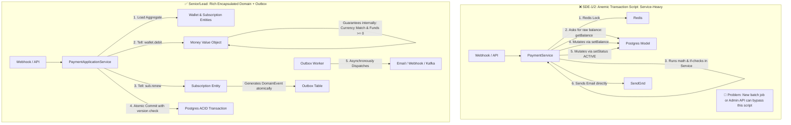

# Production Drill: Wallet & Subscription Auto-Renew Engine (Encapsulation Mastery)

> **Track:** LLD & Clean Architecture  
> **Topic:** True Encapsulation, State Invariants, Value Objects, Optimistic Locking, & Domain Events  
> **Level:** SDE-1 / SDE-2 $\rightarrow$ Senior Engineer / Tech Lead  
> **Real-World Reference:** Webhook-Driven Recurring Subscriptions & Prepaid Wallets

---

## 🧭 Executive Summary & Architecture Paradigm Shift

Most production backend systems start as **Anemic Transaction Scripts**:
- Data models are dumb bags of getters and setters.
- A monolithic service script fetches data, makes decisions in procedurally chained `if/else` statements, mutates data models, and calls database updates.
- Concurrency and safety are patched with **external infrastructure** (like Redis distributed locks).

While this works in happy-path MVPs, it causes severe architectural decay as teams scale:
1. **The "Leaky Gate" Vulnerability:** Any new endpoint, background worker, or CLI migration that touches the database can bypass the service script and corrupt state.
2. **Temporal & Transactional Drift:** If a database write fails midway, external webhooks and side-effects (emails, analytics) become inconsistent with database state.

This drill bridges the gap by demonstrating **Rich Domain Encapsulation**: making illegal business states unrepresentable in memory, backed by **Optimistic Concurrency Control** and the **Transactional Outbox Pattern**.

---

## 🏢 The Production Problem Scenario

### Business Context
A SaaS platform charges users for recurring compute and API tier subscriptions via a prepaid **Wallet Balance**.
When a subscription billing cycle triggers, or when a payment webhook arrives from payment gateways (Stripe, Razorpay, PayPal), the system must:
1. Validate account active status and plan integrity.
2. Deduct funds from the user's wallet without risking overdrafts or negative balances.
3. Transition the subscription to `ACTIVE` only upon confirmed funds deduction.
4. Issue notifications and trigger downstream fulfillment.

---

## ⚔️ Architectural Comparison: Procedural vs Senior Encapsulated



---

## 📊 Critique & Code Smell Breakdown

### 1. The Anemic Domain Anti-Pattern (What went wrong)

```typescript
// ❌ WRONG: The Data Holder has no defenses
class WalletModel {
    public id: string;
    public userId: string;
    public balance: number; // Raw float: allows negative numbers, lacks currency!
    public currency: string;
}

// ❌ WRONG: Procedural Transaction Script (Feature Envy & Leaky Invariants)
class SubscriptionService {
    async handleRenewal(walletId: string, subId: string, planCost: number, currency: string) {
        const wallet = await walletRepo.findById(walletId);
        const sub = await subRepo.findById(subId);

        // 🚨 Logic spread across service: if an engineer forgets this in another file, bug happens!
        if (wallet.currency !== currency) {
            throw new Error("Currency mismatch");
        }
        if (wallet.balance < planCost) {
            throw new Error("Insufficient funds");
        }

        // 🚨 Setter abuse: outside world forces internal state
        wallet.balance = wallet.balance - planCost;
        sub.status = "ACTIVE";

        await walletRepo.save(wallet);
        await subRepo.save(sub);
        await emailClient.sendReceipt(sub.userId); // 🚨 Side-effect in request lifecycle!
    }
}
```

### Why is this dangerous in production?
* **Zero Self-Defense:** `wallet.balance = -9999` is completely valid code in the runtime.
* **Temporal Coupling:** If `emailClient.sendReceipt()` fails or if `subRepo.save()` throws a database deadlock, the wallet was deducted or email was sent without subscription activation.
* **Float Precision Loss:** `50.10 - 20.00` in JavaScript floats evaluates to `30.100000000000005`.

---

## 🛠️ The Senior First-Principles Solution

### 1. The `Money` Value Object (Immutable Invariant Protector)

A Value Object has **no identity** and is defined solely by its values. It is **100% immutable**.

```typescript
// ✅ PRODUCTION-GRADE VALUE OBJECT: Money
export class Money {
    private readonly amountInCents: bigint; // Uses integer math (cents/paise) to prevent float drift
    private readonly currency: string;

    constructor(amountInCents: bigint, currency: string) {
        if (amountInCents < 0n) {
            throw new Error("State Invariant Violation: Money amount cannot be negative.");
        }
        const supported = ["USD", "EUR", "INR", "GBP"];
        if (!supported.includes(currency.toUpperCase())) {
            throw new Error(`Unsupported currency: ${currency}`);
        }

        this.amountInCents = amountInCents;
        this.currency = currency.toUpperCase();
        Object.freeze(this); // Guarantees immutability in runtime
    }

    public static of(amount: number, currency: string): Money {
        return new Money(BigInt(Math.round(amount * 100)), currency);
    }

    public add(other: Money): Money {
        this.assertSameCurrency(other);
        return new Money(this.amountInCents + other.amountInCents, this.currency);
    }

    public subtract(other: Money): Money {
        this.assertSameCurrency(other);
        if (other.amountInCents > this.amountInCents) {
            throw new Error(`Insufficient funds: Cannot deduct ${other.toString()} from ${this.toString()}`);
        }
        return new Money(this.amountInCents - other.amountInCents, this.currency);
    }

    public isGreaterThanOrEqualTo(other: Money): boolean {
        this.assertSameCurrency(other);
        return this.amountInCents >= other.amountInCents;
    }

    private assertSameCurrency(other: Money): void {
        if (this.currency !== other.currency) {
            throw new Error(`Currency Mismatch Exception: Cannot operate on ${this.currency} and ${other.currency}`);
        }
    }

    public getAmountInCents(): bigint {
        return this.amountInCents;
    }

    public getCurrency(): string {
        return this.currency;
    }

    public toString(): string {
        return `${this.currency} ${(Number(this.amountInCents) / 100).toFixed(2)}`;
    }
}
```

---

### 2. The `TransactionReceipt` Value Object

```typescript
export class TransactionReceipt {
    constructor(
        public readonly transactionId: string,
        public readonly walletId: string,
        public readonly amount: Money,
        public readonly type: "DEBIT" | "CREDIT",
        public readonly reason: string,
        public readonly timestamp: Date
    ) {
        Object.freeze(this);
    }

    public isConfirmed(): boolean {
        return Boolean(this.transactionId && this.amount);
    }
}
```

---

### 3. The Self-Governing `Wallet` Entity (Optimistic Locking & Encapsulated Invariants)

```typescript
export class Wallet {
    private readonly id: string;
    private readonly userId: string;
    private balance: Money;
    private version: number; // DB Optimistic Locking Version

    constructor(id: string, userId: string, initialBalance: Money, version: number = 0) {
        this.id = id;
        this.userId = userId;
        this.balance = initialBalance;
        this.version = version;
    }

    // 🔒 BEHAVIORAL METHOD: Tell, Don't Ask
    public debit(amount: Money, reason: string, transactionId: string): TransactionReceipt {
        // The Money Value Object internally enforces non-negative & currency integrity
        this.balance = this.balance.subtract(amount);
        this.version += 1;

        return new TransactionReceipt(
            transactionId,
            this.id,
            amount,
            "DEBIT",
            reason,
            new Date()
        );
    }

    public credit(amount: Money, reason: string, transactionId: string): TransactionReceipt {
        this.balance = this.balance.add(amount);
        this.version += 1;

        return new TransactionReceipt(
            transactionId,
            this.id,
            amount,
            "CREDIT",
            reason,
            new Date()
        );
    }

    // Defensive read-only access
    public getSnapshot() {
        return {
            id: this.id,
            userId: this.userId,
            balance: this.balance,
            version: this.version
        };
    }
}
```

---

### 4. The `Subscription` Entity (State Machine & Domain Events)

```typescript
export interface DomainEvent {
    eventId: string;
    eventName: string;
    occurredOn: Date;
    payload: Record<string, any>;
}

export class SubscriptionRenewedEvent implements DomainEvent {
    public readonly eventId = crypto.randomUUID();
    public readonly eventName = "Subscription.Renewed";
    public readonly occurredOn = new Date();
    public readonly payload: Record<string, any>;

    constructor(subscriptionId: string, userId: string, receiptId: string, nextPeriodEnd: Date) {
        this.payload = { subscriptionId, userId, receiptId, nextPeriodEnd };
    }
}

export class Subscription {
    private readonly id: string;
    private readonly userId: string;
    private status: "PENDING" | "ACTIVE" | "PAST_DUE" | "CANCELLED";
    private periodEnd: Date;
    private domainEvents: DomainEvent[] = [];

    constructor(id: string, userId: string, status: "PENDING" | "ACTIVE" | "PAST_DUE" | "CANCELLED", periodEnd: Date) {
        this.id = id;
        this.userId = userId;
        this.status = status;
        this.periodEnd = periodEnd;
    }

    // 🔒 BEHAVIORAL METHOD: State transition protected internally
    public renew(receipt: TransactionReceipt, renewalDays: number = 30): void {
        if (this.status === "CANCELLED") {
            throw new Error("Illegal State Exception: Cannot renew a cancelled subscription.");
        }
        if (!receipt.isConfirmed()) {
            throw new Error("Security Violation: Cannot renew subscription without confirmed payment receipt.");
        }

        this.status = "ACTIVE";
        this.periodEnd = new Date(Date.now() + renewalDays * 86400000);

        // 📢 Record Domain Event for the Transactional Outbox
        this.domainEvents.push(
            new SubscriptionRenewedEvent(this.id, this.userId, receipt.transactionId, this.periodEnd)
        );
    }

    public markPaymentFailed(): void {
        if (this.status === "CANCELLED") return;
        this.status = "PAST_DUE";
    }

    public pullDomainEvents(): DomainEvent[] {
        const events = [...this.domainEvents];
        this.domainEvents = []; // Clear upon extraction (defensive)
        return events;
    }

    public getStatus() {
        return this.status;
    }
}
```

---

## 🔬 Mechanical Deep Dive: Concurrency, Failures & Distributed Safety

### Failure Mode 1: The Half-Dead Transaction (Server Dies Mid-Webhook)

```
[Payment Gateway: Stripe Charges $50 Card] ➔ [Webhook Arrives] ➔ [Server Processes in Memory] ➔ 💥 [DB Outage / Node Crash]
```

#### How the architecture guarantees zero data corruption:
1. **Idempotency Gate:** Webhooks carry a unique `event_id` (e.g., `evt_stripe_12345`). We attempt an insert into `processed_webhook_events (event_id, status)` within the DB transaction.
2. **ACID Boundary with Outbox:**
   ```sql
   BEGIN TRANSACTION;
     -- 1. Insert Idempotency Key (Fails if duplicate)
     INSERT INTO idempotency_keys (key, handler) VALUES ('evt_stripe_12345', 'subscription_renew');
     
     -- 2. Update Wallet with Version Check
     UPDATE wallets SET balance = 15000, version = version + 1 WHERE id = 'w_01' AND version = 2;
     
     -- 3. Update Subscription
     UPDATE subscriptions SET status = 'ACTIVE', period_end = '2026-10-22' WHERE id = 'sub_99';
     
     -- 4. Write Domain Event to Outbox (Same DB transaction!)
     INSERT INTO outbox_events (id, event_name, payload) VALUES ('evt_uuid', 'Subscription.Renewed', '{"subId":"sub_99"}');
   COMMIT;
   ```
3. **If Database Crashes:**
   - Entire transaction rolls back.
   - HTTP 500 returned to Stripe.
   - Stripe retries webhook after 5 minutes.
   - Server re-runs with zero partial updates, no phantom emails, and no orphaned charges.

---

### Failure Mode 2: Concurrent Race Conditions (Admin Top-Up + Auto-Renew Worker)

If two threads execute concurrently against the same wallet without locks or with expired Redis locks:

| Step | Thread A (Auto-Renew: -$30) | Thread B (Admin Top-up: +$50) | Database State (`balance`, `version`) |
| :--- | :--- | :--- | :--- |
| 1 | Reads Wallet | Reads Wallet | Balance: $100, Version: 1 |
| 2 | Computes: $100 - $30 = $70 | Computes: $100 + $50 = $150 | Balance: $100, Version: 1 |
| 3 | Executes `UPDATE ... WHERE version = 1` | - | **Succeeds!** Balance: $70, Version: 2 |
| 4 | - | Executes `UPDATE ... WHERE version = 1` | **Fails! Rows affected: 0** (Version is now 2) |
| 5 | Returns Success | Catch optimistic lock error $\rightarrow$ Retry read & apply | Reloads Balance $70 $\rightarrow$ Computes $120 $\rightarrow$ Version 3 |

**Result:** Zero money lost. Overwrite race condition is mathematically impossible.

---

## 🎯 Summary Checklist: Elevating to Tech Lead Standards

| Dimension | Junior / Mid-Level Approach (2 YOE) | Senior / Tech Lead Standard |
| :--- | :--- | :--- |
| **Money Handling** | Plain `number` / `float` floating around services. | Immutable `Money` Value Object with integer cents and currency checks. |
| **State Mutation** | `wallet.setBalance(newBalance)` via service script. | Behavioral `wallet.debit(cost)` enforcing state invariants internally. |
| **State Transitions** | `sub.setStatus("ACTIVE")` called arbitrarily anywhere. | Explicit state machine `sub.renew(receipt)` requiring verified proofs. |
| **Side Effects** | Direct API/email calls inside controller requests. | Domain Events stored in **Transactional Outbox Table** in the same DB unit of work. |
| **Concurrency** | Blind faith in Redis lock expiration timeouts. | Defense-in-depth: Redis Lock + Entity Invariants + **DB Optimistic Locking (`version`)**. |

---

## 🔗 Related References
* [01_advanced_encapsulation_state_invariants_tell_dont_ask.md](file:///Users/flixstock/Desktop/personal%20project/learn/06-LLD-AND-CLEAN-ARCHITECTURE/01-oops/encapsulation/01_advanced_encapsulation_state_invariants_tell_dont_ask.md)
* [02_encapsulation_deep_dive_code_smells_and_interview_analogy.md](file:///Users/flixstock/Desktop/personal%20project/learn/06-LLD-AND-CLEAN-ARCHITECTURE/01-oops/encapsulation/02_encapsulation_deep_dive_code_smells_and_interview_analogy.md)
* [03_senior_production_nuances_defensive_copying_orm_ddd_domain_events.md](file:///Users/flixstock/Desktop/personal%20project/learn/06-LLD-AND-CLEAN-ARCHITECTURE/01-oops/encapsulation/03_senior_production_nuances_defensive_copying_orm_ddd_domain_events.md)
