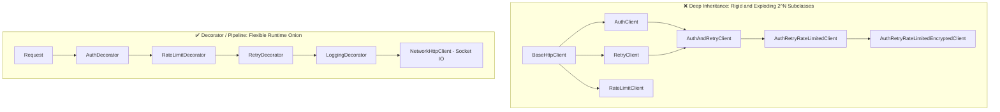

# Production Drill: Combinatorial Class Explosion & The Fragile Base-Class (Decorator Pipeline)

> **Track:** LLD & Clean Architecture  
> **Topic:** Inheritance Hazards, Fragile Base-Class, Combinatorial Class Explosion ($2^N$), & The Decorator Pipeline Pattern  
> **Level:** SDE-1 / SDE-2 $\rightarrow$ Senior Engineer / Tech Lead  
> **Real-World Reference:** Resilient Fintech HTTP Client / Event Dispatcher (Auth, Retry, Rate Limiting, Encryption, Logging)

---

## 🧭 Executive Summary

In naive Object-Oriented designs, developers frequently use class inheritance (`extends`) to add cross-cutting capabilities (like Authentication, Retries, Rate-Limiting, or Logging) to a base service.

This leads to two catastrophic production failure modes:
1. **Combinatorial Class Explosion ($2^N$):** As features grow, creating classes for every combination (`AuthAndRetryClient`, `AuthRetryAndRateLimitedClient`) leads to exponential code duplication and maintenance paralysis.
2. **The Fragile Base-Class Problem:** Changes in the parent class's internal private execution flow trigger unexpected recursion loops, double executions, or stack overflows in child classes.

This guide demonstrates how **Composition (`HAS-A`)** and the **Decorator / Interceptor Pipeline Pattern** eliminate class explosion, isolate failures, and enable dynamic runtime assembly.

---

## 💣 Part 1: The Anatomy of the Two Production Failures



---

### Failure 1: The Combinatorial Class Explosion

When each cross-cutting concern is modeled as a subclass:
- **1 Feature:** 1 subclass (`AuthClient`)
- **2 Features:** 3 subclasses (`Auth`, `Retry`, `AuthAndRetry`)
- **3 Features:** 7 subclasses
- **$N$ Features:** $2^N - 1$ subclasses!

If Bank A needs `Auth + RateLimit`, Bank B needs `Auth + Retry + Encryption`, and Bank C needs `Logging + Retry`, you are forced to write and maintain **31 different class variations for just 5 features**.

---

### Failure 2: The Fragile Base-Class Stack Overflow (Dynamic Dispatch Bug)

Here is the exact bug that crashes production systems when using deep inheritance:

```typescript
// ❌ INHERITANCE TRAP: Base Class
class BaseHttpClient {
    public send(req: any): any {
        // Step 1: Base method delegates to helper 'execute'
        console.log("[Base] Delegating to execute...");
        return this.execute(req);
    }

    public execute(req: any): any {
        console.log("[Base] Performing raw socket HTTP call");
        return { status: 200, body: "OK" };
    }
}

// ❌ INHERITANCE TRAP: Child Subclass
class RetryHttpClient extends BaseHttpClient {
    // Child overrides 'execute' to wrap it in a retry loop
    public override execute(req: any): any {
        let attempts = 0;
        while (attempts < 3) {
            try {
                console.log(`[Retry] Attempt ${attempts + 1}`);
                // 🚨 FATAL MISTAKE: Calls super.send() thinking it executes the base send logic
                return super.send(req); 
            } catch (err) {
                attempts++;
            }
        }
        throw new Error("Retries exhausted");
    }
}

// 💥 EXECUTION TRACE:
const client = new RetryHttpClient();
client.execute({ url: "https://api.bank.com" });
```

#### What happens inside the CPU & Runtime?
1. `client.execute()` is invoked on the `RetryHttpClient` instance.
2. `RetryHttpClient.execute` calls `super.send(req)`.
3. Inside `BaseHttpClient.send`, it executes `this.execute(req)`.
4. **Dynamic Dispatch Resolution:** Because the runtime object is `RetryHttpClient`, `this.execute(req)` resolves back to `RetryHttpClient.execute()`!
5. `RetryHttpClient.execute` runs again and calls `super.send(req)` again.
6. **Result:** Infinite recursion until:
   ```
   RangeError: Maximum call stack size exceeded (Stack Overflow Crash)
   ```

---

## 🛠️ Part 2: The Senior Solution — The Decorator / Interceptor Pipeline

Instead of using `extends` (**IS-A**), every feature is a self-contained component that **HAS-A** reference to the next handler in the chain.

Every layer implements the exact same interface: **`HttpClient`**.

---

### 1. The Core Contract & Value Objects

```typescript
// domain/types.ts
export interface HttpRequest {
    url: string;
    method: "GET" | "POST" | "PUT" | "DELETE";
    headers: Record<string, string>;
    body?: string | Buffer;
    timeoutMs?: number;
}

export interface HttpResponse {
    statusCode: number;
    headers: Record<string, string>;
    body: string;
}

// ✅ PURE INTERFACE (The common contract for all layers)
export interface HttpClient {
    send(request: HttpRequest): Promise<HttpResponse>;
}
```

---

### 2. The Leaf Node (Terminal Socket Client)

The bottom of the chain performs the actual network I/O. It does not wrap anything.

```typescript
// infrastructure/http/NetworkHttpClient.ts
import { HttpClient, HttpRequest, HttpResponse } from "../../domain/types";

export class NetworkHttpClient implements HttpClient {
    async send(request: HttpRequest): Promise<HttpResponse> {
        console.log(`🌐 [Network I/O] Executing ${request.method} ${request.url}`);
        
        // Simulating actual socket call (e.g., fetch, axios, or native node:http)
        return {
            statusCode: 200,
            headers: { "content-type": "application/json" },
            body: JSON.stringify({ success: true, timestamp: Date.now() })
        };
    }
}
```

---

### 3. The Self-Contained Decorator Layers

#### A. Authentication Decorator
```typescript
// infrastructure/decorators/AuthDecorator.ts
import { HttpClient, HttpRequest, HttpResponse } from "../../domain/types";

export class AuthDecorator implements HttpClient {
    constructor(
        private readonly next: HttpClient, // 🔒 Composition: HAS-A reference to next layer
        private readonly tokenProvider: () => Promise<string>
    ) {}

    async send(request: HttpRequest): Promise<HttpResponse> {
        const token = await this.tokenProvider();
        
        // Clone request defensively and inject Authorization header
        const authenticatedRequest: HttpRequest = {
            ...request,
            headers: {
                ...request.headers,
                Authorization: `Bearer ${token}`
            }
        };

        console.log(`🔑 [Auth] Injected Bearer token for ${request.url}`);
        return await this.next.send(authenticatedRequest);
    }
}
```

#### B. Retry with Exponential Backoff Decorator
```typescript
// infrastructure/decorators/RetryDecorator.ts
import { HttpClient, HttpRequest, HttpResponse } from "../../domain/types";

export class RetryDecorator implements HttpClient {
    constructor(
        private readonly next: HttpClient,
        private readonly maxRetries: number = 3,
        private readonly baseBackoffMs: number = 100
    ) {}

    async send(request: HttpRequest): Promise<HttpResponse> {
        let attempt = 0;
        let lastError: any = null;

        while (attempt < this.maxRetries) {
            try {
                attempt++;
                console.log(`🔁 [Retry Layer] Attempt ${attempt} of ${this.maxRetries}`);
                const response = await this.next.send(request);

                // If 5xx server error, trigger retry
                if (response.statusCode >= 500 && attempt < this.maxRetries) {
                    await this.delay(attempt);
                    continue;
                }
                return response;
            } catch (error) {
                lastError = error;
                console.warn(`⚠️ [Retry Layer] Attempt ${attempt} failed: ${error}`);
                if (attempt >= this.maxRetries) break;
                await this.delay(attempt);
            }
        }

        throw new Error(`Max retries (${this.maxRetries}) exhausted. Last error: ${lastError}`);
    }

    private delay(attempt: number): Promise<void> {
        const backoff = this.baseBackoffMs * Math.pow(2, attempt - 1);
        return new Promise((resolve) => setTimeout(resolve, backoff));
    }
}
```

#### C. Rate Limiting (Token Bucket) Decorator
```typescript
// infrastructure/decorators/RateLimitDecorator.ts
import { HttpClient, HttpRequest, HttpResponse } from "../../domain/types";

export class RateLimitDecorator implements HttpClient {
    private tokens: number;
    private lastRefill: number = Date.now();

    constructor(
        private readonly next: HttpClient,
        private readonly capacity: number = 10,
        private readonly refillPerSecond: number = 2
    ) {
        this.tokens = capacity;
    }

    async send(request: HttpRequest): Promise<HttpResponse> {
        this.refill();

        if (this.tokens < 1) {
            console.warn(`🛑 [RateLimiter] Throttled request to ${request.url}. Waiting for token...`);
            await new Promise((resolve) => setTimeout(resolve, 500));
            this.refill();
        }

        this.tokens -= 1;
        console.log(`⏱️ [RateLimiter] Token consumed. Remaining tokens: ${this.tokens}`);
        return await this.next.send(request);
    }

    private refill(): void {
        const now = Date.now();
        const elapsedSec = (now - this.lastRefill) / 1000;
        const tokensToAdd = elapsedSec * this.refillPerSecond;
        this.tokens = Math.min(this.capacity, this.tokens + tokensToAdd);
        this.lastRefill = now;
    }
}
```

#### D. Audit Logging & Latency Metrics Decorator
```typescript
// infrastructure/decorators/LoggingDecorator.ts
import { HttpClient, HttpRequest, HttpResponse } from "../../domain/types";

export class LoggingDecorator implements HttpClient {
    constructor(private readonly next: HttpClient) {}

    async send(request: HttpRequest): Promise<HttpResponse> {
        const startTime = Date.now();
        console.log(`📝 [Logging] Started -> ${request.method} ${request.url}`);

        try {
            const response = await this.next.send(request);
            const duration = Date.now() - startTime;
            console.log(`✅ [Logging] Completed -> ${request.url} | Status: ${response.statusCode} | Time: ${duration}ms`);
            return response;
        } catch (error) {
            const duration = Date.now() - startTime;
            console.error(`❌ [Logging] Failed -> ${request.url} | Error: ${error} | Time: ${duration}ms`);
            throw error;
        }
    }
}
```

---

## 🏗️ Part 3: The Fluent Pipeline Builder (Assembly at Runtime)

Look how clean and readable client assembly becomes using a Fluent Builder:

```typescript
// infrastructure/builder/HttpClientBuilder.ts
import { HttpClient } from "../../domain/types";
import { NetworkHttpClient } from "../http/NetworkHttpClient";
import { AuthDecorator } from "../decorators/AuthDecorator";
import { RetryDecorator } from "../decorators/RetryDecorator";
import { RateLimitDecorator } from "../decorators/RateLimitDecorator";
import { LoggingDecorator } from "../decorators/LoggingDecorator";

export class HttpClientBuilder {
    private client: HttpClient = new NetworkHttpClient(); // Base terminal leaf

    public withLogging(): this {
        this.client = new LoggingDecorator(this.client);
        return this;
    }

    public withAuth(tokenProvider: () => Promise<string>): this {
        this.client = new AuthDecorator(this.client, tokenProvider);
        return this;
    }

    public withRetries(maxRetries: number = 3): this {
        this.client = new RetryDecorator(this.client, maxRetries);
        return this;
    }

    public withRateLimiting(capacity: number = 10, refillPerSec: number = 2): this {
        this.client = new RateLimitDecorator(this.client, capacity, refillPerSec);
        return this;
    }

    public build(): HttpClient {
        return this.client;
    }
}
```

---

## 🚀 Part 4: Production Usage Demonstration

```typescript
// app.ts
import { HttpClientBuilder } from "./infrastructure/builder/HttpClientBuilder";

async function main() {
    // 🏦 Partner Bank A: Needs Logging + Auth + RateLimiting
    const bankAClient = new HttpClientBuilder()
        .withLogging()
        .withAuth(async () => "BANK_A_SECRET_KEY_123")
        .withRateLimiting(5, 1)
        .build();

    // 🏦 Partner Bank B: Needs Logging + Retries (No Auth, internal subnet)
    const bankBClient = new HttpClientBuilder()
        .withLogging()
        .withRetries(3)
        .build();

    // 🚀 Execute Call for Bank A:
    console.log("\n--- EXECUTING BANK A DISPATCH ---");
    await bankAClient.send({
        url: "https://api.bank-a.com/v1/transfers",
        method: "POST",
        headers: {},
        body: JSON.stringify({ amount: 50000 })
    });
}

main();
```

### Execution Log Output:
```text
--- EXECUTING BANK A DISPATCH ---
📝 [Logging] Started -> POST https://api.bank-a.com/v1/transfers
⏱️ [RateLimiter] Token consumed. Remaining tokens: 9
🔑 [Auth] Injected Bearer token for https://api.bank-a.com/v1/transfers
🌐 [Network I/O] Executing POST https://api.bank-a.com/v1/transfers
✅ [Logging] Completed -> https://api.bank-a.com/v1/transfers | Status: 200 | Time: 12ms
```

---

## 📊 Comprehensive Architectural Comparison

| Dimension | Inheritance (`extends`) | Composition & Decorator (`has-a`) |
| :--- | :--- | :--- |
| **Number of Classes** | **Exponential ($2^N$):** 31 classes for 5 features. | **Linear ($N+1$):** 5 decorator classes + 1 leaf client. |
| **Assembly Time** | **Static (Compile-time):** Hardcoded subclass definitions. | **Dynamic (Runtime):** Client builds exact chain on the fly. |
| **Fragile Base-Class Risk** | **Extremely High:** Parent class changes trigger recursion loops. | **Zero:** Each class depends only on the public `send()` contract. |
| **Unit Testability** | **Painful:** Testing retry logic forces testing base class socket I/O. | **Trivial:** Test `RetryDecorator` by passing a fake in-memory `HttpClient`. |
| **Order of Execution** | **Fixed:** Hardcoded in inheritance tree. | **Customizable:** Change order (`Auth -> RateLimit` vs `RateLimit -> Auth`) at will. |

---

## 🎯 The 2 Golden Rules of Inheritance for Senior Engineers

1. **Use Inheritance ONLY for genuine Polymorphic Specialization:**  
   `Square IS-A Shape`, `PushNotification IS-A Notification`.
2. **NEVER use Inheritance for Cross-Cutting Features or Code Reuse:**  
   If you are adding Retries, Caching, Logging, Encryption, or Rate-Limiting, **ALWAYS use Composition & Decorators**.

---

## 🔗 Related Vault Topics
- [01_inheritance_vs_composition_fragile_base_class.md](file:///Users/flixstock/Desktop/personal%20project/learn/06-LLD-AND-CLEAN-ARCHITECTURE/01-oops/inheritance/01_inheritance_vs_composition_fragile_base_class.md)
- [01_abstraction_domain_contracts_and_boundary_isolation.md](file:///Users/flixstock/Desktop/personal%20project/learn/06-LLD-AND-CLEAN-ARCHITECTURE/01-oops/abstraction/01_abstraction_domain_contracts_and_boundary_isolation.md)
- [01_advanced_encapsulation_state_invariants_tell_dont_ask.md](file:///Users/flixstock/Desktop/personal%20project/learn/06-LLD-AND-CLEAN-ARCHITECTURE/01-oops/encapsulation/01_advanced_encapsulation_state_invariants_tell_dont_ask.md)
