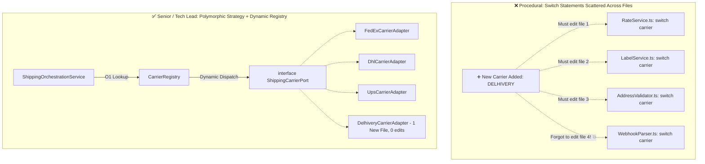

# Production Drill: Polymorphism in Production (Multi-Carrier Logistics & Dynamic Registry)

> **Track:** LLD & Clean Architecture  
> **Topic:** Polymorphism, Dynamic Dispatch, Strategy Pattern, & Self-Registering Dynamic Registry  
> **Level:** SDE-1 / SDE-2 $\rightarrow$ Senior Engineer / Tech Lead  
> **Real-World Reference:** Global Multi-Carrier Logistics Engine (FedEx, DHL, UPS, Delhivery, BlueDart)

---

## 🧭 Executive Summary

In procedural codebases, polymorphic decisions are implemented using `switch(type)` or `if-else` branching trees scattered across multiple service files.

This leads to the **"Shotgun Surgery"** code smell and production outages:
- Onboarding a new provider requires hunting down and modifying **5+ different files**.
- Forgetting a single `case` branch causes runtime crashes in production.

This guide demonstrates how **Dynamic Polymorphism**, the **Strategy Pattern**, and a **Self-Registering Dynamic Registry** eliminate `switch` statements completely, achieving 100% adherence to the **Open/Closed Principle (OCP)**.

---

## 💣 Part 1: The Problem — The "Switch-Statement Scatter" Anti-Pattern



---

### 🚨 The "Forgotten Switch Case" Outage Trace

```typescript
// ❌ SCATTERED PROCEDURAL CODEBASE

// File 1: RateCalculationService.ts
function getRate(carrier: string, parcel: any) {
    switch (carrier) {
        case "FEDEX": return calculateFedEx(parcel);
        case "DHL": return calculateDhl(parcel);
        case "DELHIVERY": return calculateDelhivery(parcel); // ✅ Engineer added here
    }
}

// File 2: WebhookIngestionService.ts (Located in a different directory)
function parseWebhook(carrier: string, payload: any) {
    switch (carrier) {
        case "FEDEX": return parseFedExWebhook(payload);
        case "DHL": return parseDhlWebhook(payload);
        // 🚨 ENGINEER FORGOT TO ADD "DELHIVERY" HERE!
        default:
            throw new Error(`Unhandled carrier webhook: ${carrier}`); // 💥 OUTAGE IN PROD!
    }
}
```

---

## ⚙️ Part 2: Mechanical Truth — CPU Branching vs. VTable Dynamic Dispatch

| Dimension | `switch(type)` Branching | Polymorphic Dynamic Dispatch |
| :--- | :--- | :--- |
| **CPU Execution** | Sequential comparison jumps (`cmp`, `je`). As cases grow, CPU branch predictor performance degrades. | **VTable Pointer Jump / Map Lookup:** Direct jump to function memory address in $O(1)$ time. |
| **Coupling** | **Tight & Centralized:** Every service file must know about every concrete carrier. | **Loose & Inverted:** Client knows only the abstract `ShippingCarrierPort` interface. |
| **Open/Closed Principle** | ❌ **Violated:** Every new carrier requires modifying $N$ existing files. | ✅ **Respected:** Adding a carrier requires adding $1$ new class file and $0$ existing file edits. |
| **Testing** | Must test every branch in every service. | Unit test each carrier adapter in complete isolation. |

---

## 🛠️ Part 3: The Production Solution — Polymorphic Strategy + Dynamic Registry

---

### 1. Pure Domain Types & Value Objects

```typescript
// domain/types.ts
export interface Address {
    street: string;
    city: string;
    state: string;
    postalCode: string;
    countryCode: string; // ISO-2 (e.g., "US", "IN")
}

export interface Parcel {
    weightInGrams: number;
    lengthCm: number;
    widthCm: number;
    heightCm: number;
    declaredValueCents: bigint;
}

export interface ValidationResult {
    isValid: boolean;
    errors: string[];
    normalizedAddress?: Address;
}

export interface ShippingLabel {
    trackingNumber: string;
    carrierName: string;
    labelUrl: string;
    rawZplBarcode?: string;
}

export interface TrackingEvent {
    trackingNumber: string;
    status: "CREATED" | "IN_TRANSIT" | "OUT_FOR_DELIVERY" | "DELIVERED" | "EXCEPTION";
    location: string;
    timestamp: Date;
    rawStatus: string;
}
```

---

### 2. The Carrier Strategy Port (Interface)

Every carrier encapsulates its own rate calculation, validation, label generation, and webhook parsing.

```typescript
// domain/ports/ShippingCarrierPort.ts
import { Address, Parcel, ValidationResult, ShippingLabel, TrackingEvent } from "../types";

export interface ShippingCarrierPort {
    /**
     * Unique carrier identifier (e.g. "FEDEX", "DHL", "UPS", "DELHIVERY")
     */
    readonly carrierId: string;

    /**
     * Validates postal address according to carrier-specific formatting rules.
     */
    validateAddress(address: Address): Promise<ValidationResult>;

    /**
     * Calculates shipping rate in cents.
     */
    calculateRate(parcel: Parcel, destination: Address): Promise<bigint>;

    /**
     * Calls carrier API to register shipment and obtain shipping barcode/label.
     */
    generateLabel(parcel: Parcel, destination: Address): Promise<ShippingLabel>;

    /**
     * Translates proprietary carrier webhook payloads into unified domain events.
     */
    parseWebhook(payload: Record<string, any>): TrackingEvent;
}
```

---

### 3. Concrete Carrier Adapters

#### Carrier Adapter 1: FedEx
```typescript
// infrastructure/carriers/FedExCarrierAdapter.ts
import { ShippingCarrierPort } from "../../domain/ports/ShippingCarrierPort";
import { Address, Parcel, ValidationResult, ShippingLabel, TrackingEvent } from "../../domain/types";

export class FedExCarrierAdapter implements ShippingCarrierPort {
    public readonly carrierId = "FEDEX";

    constructor(private readonly apiKey: string) {}

    async validateAddress(address: Address): Promise<ValidationResult> {
        // FedEx-specific postal verification logic
        const isValid = /^\d{5}(-\d{4})?$/.test(address.postalCode);
        return { isValid, errors: isValid ? [] : ["Invalid US ZIP format for FedEx"] };
    }

    async calculateRate(parcel: Parcel, destination: Address): Promise<bigint> {
        // FedEx dimensional weight calculation: (L * W * H) / 139
        const dimWeight = BigInt(Math.round((parcel.lengthCm * parcel.widthCm * parcel.heightCm) / 5));
        const billableWeight = dimWeight > BigInt(parcel.weightInGrams) ? dimWeight : BigInt(parcel.weightInGrams);
        return 1500n + billableWeight * 2n; // $15 base + weight rate
    }

    async generateLabel(parcel: Parcel, destination: Address): Promise<ShippingLabel> {
        return {
            trackingNumber: `FX-${Date.now()}`,
            carrierName: "FedEx Express",
            labelUrl: "https://labels.fedex.com/v1/print/FX-999.pdf"
        };
    }

    parseWebhook(payload: any): TrackingEvent {
        return {
            trackingNumber: payload.fedex_tracking_id,
            status: payload.event_type === "DLVD" ? "DELIVERED" : "IN_TRANSIT",
            location: payload.scan_location,
            timestamp: new Date(payload.event_timestamp),
            rawStatus: payload.event_type
        };
    }
}
```

#### Carrier Adapter 2: DHL Express
```typescript
// infrastructure/carriers/DhlCarrierAdapter.ts
import { ShippingCarrierPort } from "../../domain/ports/ShippingCarrierPort";
import { Address, Parcel, ValidationResult, ShippingLabel, TrackingEvent } from "../../domain/types";

export class DhlCarrierAdapter implements ShippingCarrierPort {
    public readonly carrierId = "DHL";

    constructor(private readonly dhlAccountNumber: string) {}

    async validateAddress(address: Address): Promise<ValidationResult> {
        // DHL international customs country-code check
        const isValid = Boolean(address.countryCode && address.countryCode.length === 2);
        return { isValid, errors: isValid ? [] : ["DHL requires valid ISO-2 Country Code"] };
    }

    async calculateRate(parcel: Parcel, destination: Address): Promise<bigint> {
        return 2800n + BigInt(parcel.weightInGrams) * 3n; // International base rate
    }

    async generateLabel(parcel: Parcel, destination: Address): Promise<ShippingLabel> {
        return {
            trackingNumber: `DHL-INT-${Date.now()}`,
            carrierName: "DHL Express Worldwide",
            labelUrl: "https://dhl.com/labels/download/DHL-INT.pdf"
        };
    }

    parseWebhook(payload: any): TrackingEvent {
        return {
            trackingNumber: payload.shipmentTrackingNumber,
            status: payload.statusCode === "OK_DELIVERED" ? "DELIVERED" : "IN_TRANSIT",
            location: payload.hubCity,
            timestamp: new Date(payload.timestamp),
            rawStatus: payload.statusCode
        };
    }
}
```

---

### 4. The Self-Registering Dynamic Registry (Zero Switch Statements!)

```typescript
// infrastructure/registry/CarrierRegistry.ts
import { ShippingCarrierPort } from "../../domain/ports/ShippingCarrierPort";

export class CarrierRegistry {
    private static readonly carriers = new Map<string, ShippingCarrierPort>();

    /**
     * Registers a carrier strategy at boot time.
     */
    public static register(carrier: ShippingCarrierPort): void {
        const key = carrier.carrierId.toUpperCase();
        if (this.carriers.has(key)) {
            console.warn(`⚠️ Overwriting existing carrier registration for: ${key}`);
        }
        this.carriers.set(key, carrier);
        console.log(`✅ [Registry] Carrier registered successfully: ${key}`);
    }

    /**
     * Fetches carrier strategy in O(1) time.
     */
    public static get(carrierId: string): ShippingCarrierPort {
        const key = carrierId.toUpperCase();
        const carrier = this.carriers.get(key);
        if (!carrier) {
            throw new Error(`CarrierNotFoundException: Unsupported carrier '${carrierId}'. Registered carriers: [${this.getAvailableCarriers().join(", ")}]`);
        }
        return carrier;
    }

    public static getAvailableCarriers(): string[] {
        return Array.from(this.carriers.keys());
    }
}
```

---

### 5. Clean Business Orchestration Service

Notice: **Zero `if-else` or `switch` statements.** The entire fulfillment flow is clean and declarative.

```typescript
// domain/services/ShippingOrchestrationService.ts
import { CarrierRegistry } from "../../infrastructure/registry/CarrierRegistry";
import { Address, Parcel, ShippingLabel } from "../types";

export class ShippingOrchestrationService {
    /**
     * Executes end-to-end fulfillment for any carrier polymorphically.
     */
    public async fulfillShipment(
        carrierId: string,
        destination: Address,
        parcel: Parcel
    ): Promise<{ costCents: bigint; label: ShippingLabel }> {
        // 1. Fetch carrier strategy in O(1)
        const carrier = CarrierRegistry.get(carrierId);

        // 2. Validate address
        const validation = await carrier.validateAddress(destination);
        if (!validation.isValid) {
            throw new Error(`Address validation failed for ${carrierId}: ${validation.errors.join(", ")}`);
        }

        // 3. Calculate rate
        const costCents = await carrier.calculateRate(parcel, destination);

        // 4. Generate label
        const label = await carrier.generateLabel(parcel, destination);

        return { costCents, label };
    }

    /**
     * Handles webhook updates for any carrier.
     */
    public handleCarrierWebhook(carrierId: string, payload: Record<string, any>) {
        const carrier = CarrierRegistry.get(carrierId);
        const event = carrier.parseWebhook(payload);
        
        console.log(`📢 [Tracking Update] ${event.carrierName || carrierId} -> Tracking: ${event.trackingNumber} | Status: ${event.status}`);
        return event;
    }
}
```

---

## 🌟 Part 4: Open/Closed Extensibility Proof (Adding "Delhivery")

Suppose product managers request onboarding **Delhivery** for Indian domestic shipments.

### Step 1: Create 1 New File
```typescript
// infrastructure/carriers/DelhiveryCarrierAdapter.ts (NEW FILE)
import { ShippingCarrierPort } from "../../domain/ports/ShippingCarrierPort";
import { Address, Parcel, ValidationResult, ShippingLabel, TrackingEvent } from "../../domain/types";

export class DelhiveryCarrierAdapter implements ShippingCarrierPort {
    public readonly carrierId = "DELHIVERY";

    async validateAddress(address: Address): Promise<ValidationResult> {
        const isValid = /^\d{6}$/.test(address.postalCode); // 6-digit Indian PIN code
        return { isValid, errors: isValid ? [] : ["Delhivery requires valid 6-digit Indian PIN Code"] };
    }

    async calculateRate(parcel: Parcel, destination: Address): Promise<bigint> {
        return 5000n + BigInt(parcel.weightInGrams) * 1n; // ₹50 base in paise
    }

    async generateLabel(parcel: Parcel, destination: Address): Promise<ShippingLabel> {
        return {
            trackingNumber: `DEL-${Date.now()}`,
            carrierName: "Delhivery Surface",
            labelUrl: "https://delhivery.com/labels/DEL-123.pdf"
        };
    }

    parseWebhook(payload: any): TrackingEvent {
        return {
            trackingNumber: payload.waybill,
            status: payload.status === "Delivered" ? "DELIVERED" : "IN_TRANSIT",
            location: payload.location,
            timestamp: new Date(payload.updated_at),
            rawStatus: payload.status
        };
    }
}
```

### Step 2: Register at App Startup (`index.ts`)
```typescript
// Register all active carrier adapters at server boot:
CarrierRegistry.register(new FedExCarrierAdapter("FX_KEY"));
CarrierRegistry.register(new DhlCarrierAdapter("DHL_ACCT"));
CarrierRegistry.register(new DelhiveryCarrierAdapter()); // 👈 Registered in 1 line!
```

**Result:**
- `ShippingOrchestrationService.ts` required **0 lines of edits**.
- `CarrierRegistry.ts` required **0 lines of edits**.
- Zero risk of regression across FedEx or DHL.

---

## 📊 Summary Comparison: SDE Evolution

| Dimension | Junior (2 YOE) | Senior / Tech Lead |
| :--- | :--- | :--- |
| **Branching Mechanism** | `switch(carrierType)` copy-pasted across 5 service files. | Polymorphic Interface (`ShippingCarrierPort`) with dynamic dispatch. |
| **Provider Resolution** | Hardcoded switch statements or `if-else` chains. | Self-registering `Map<string, Strategy>` Registry. |
| **Extensibility** | **High Fragility:** Missing a single `switch` case causes runtime production outages. | **100% OCP:** Adding a provider = 1 new adapter file + register at boot. |
| **Unit Testing** | Testing `RateService` requires mocking entire HTTP contexts. | Test each adapter in complete isolation with mock parcels. |

---

## 🔗 Related Vault Topics
- [01_polymorphism_over_conditionals_interface_segregation.md](file:///Users/flixstock/Desktop/personal%20project/learn/06-LLD-AND-CLEAN-ARCHITECTURE/01-oops/polymorphism/01_polymorphism_over_conditionals_interface_segregation.md)
- [01_abstraction_domain_contracts_and_boundary_isolation.md](file:///Users/flixstock/Desktop/personal%20project/learn/06-LLD-AND-CLEAN-ARCHITECTURE/01-oops/abstraction/01_abstraction_domain_contracts_and_boundary_isolation.md)
- [02_production_drill_http_client_combinatorial_explosion_decorator_pipeline.md](file:///Users/flixstock/Desktop/personal%20project/learn/06-LLD-AND-CLEAN-ARCHITECTURE/01-oops/inheritance/02_production_drill_http_client_combinatorial_explosion_decorator_pipeline.md)
- [00_oop_core_fundamentals_interview_layman_guide.md](file:///Users/flixstock/Desktop/personal%20project/learn/06-LLD-AND-CLEAN-ARCHITECTURE/01-oops/00_oop_core_fundamentals_interview_layman_guide.md)
