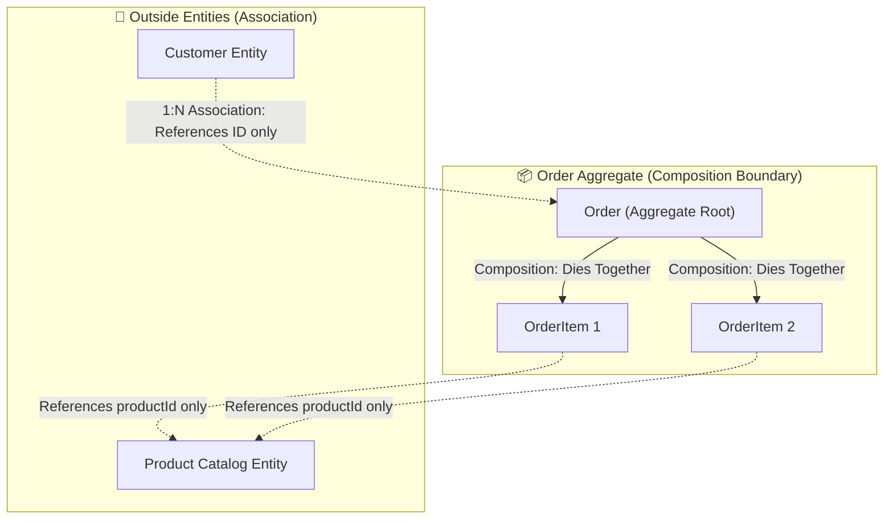

# Object Relationships & Domain Modeling: Association, Aggregation, Composition, & Cardinality

> **Track:** LLD & Clean Architecture  
> **Topic:** The 4 Core Object Relationships (Dependency, Association, Aggregation, Composition), Cardinality, Ownership, & Lifecycle Boundaries  
> **Level:** SDE-1 / SDE-2 $\rightarrow$ Senior Engineer / Tech Lead  
> **Purpose:** Layman analogies, formal interviewer terminology, concrete code implementations, and lifecycle mechanics.

---

## 🧭 Executive Summary & The Coupling Spectrum

In Object-Oriented Design, classes do not live in isolation. The way classes connect determines the **coupling, testability, and memory lifecycle** of the system.

```
┌────────────────────────────────────────────────────────────────────────────────────────────────┐
│                              THE OBJECT RELATIONSHIP SPECTRUM                                  │
│                                                                                                │
│  [Dependency] ──► [Association] ──► [Aggregation] ──► [Composition] ──► [Inheritance]          │
│   (Loosest)                                                              (Tightest)            │
│   "Uses-A"         "Knows-A"         "Has-A (Weak)"   "Has-A (Strong)"    "Is-A"               │
│   (Temporary)      (Peer-to-Peer)    (Lives On)       (Dies Together)     (Welded)             │
└────────────────────────────────────────────────────────────────────────────────────────────────┘
```

---

## 1. The 4 Object Relationships (Deep Breakdown)

---

### 1.1 Dependency ("Uses-A" — The Temporary Tool)

* **👶 Layman Analogy:** **Borrowing a pen from a stranger at the bank.**  
  You use the pen to sign a deposit slip. Once signed, you return the pen. The pen does not go home with you, and you do not own the pen.
* **🎓 Interviewer Terms:**  
  > *"A **Dependency** is a transient, short-lived relationship where Class A utilizes Class B during the execution of a specific method. Class A does not store a reference to Class B as an instance field."*
* **⚙️ Code Implementation:**
  ```typescript
  export class InvoicePdfGenerator {
      // 🔗 DEPENDENCY: FileStorageService is passed as a method argument only
      public generateAndUpload(invoiceId: string, storageService: FileStorageService): string {
          const pdfBytes = this.buildPdf(invoiceId);
          return storageService.upload(pdfBytes);
      }
      private buildPdf(id: string): Buffer { return Buffer.from("PDF"); }
  }
  ```
* **💀 Lifecycle Impact:** If `InvoicePdfGenerator` is destroyed/garbage-collected, `FileStorageService` is 100% unaffected.

---

### 1.2 Association ("Knows-A" — The Peer-to-Peer Link)

* **👶 Layman Analogy:** **A Doctor and a Patient.**  
  - A Doctor treats many Patients. A Patient visits many Doctors.
  - They know each other's details, but neither *owns* the other. If the Doctor retires, the Patient does not stop existing.
* **🎓 Interviewer Terms:**  
  > *"An **Association** is a structural relationship where Class A maintains a reference to Class B as an instance variable, representing a peer-to-peer connection. Both objects have completely independent lifecycles."*
* **⚙️ Code Implementation:**
  ```typescript
  export class Patient {
      constructor(public readonly patientId: string, public name: string) {}
  }

  export class Doctor {
      // 🔗 ASSOCIATION: Doctor maintains a list of patients, but does not manage their existence
      private assignedPatients: Patient[] = [];

      constructor(public readonly doctorId: string, public name: string) {}

      public assignPatient(patient: Patient): void {
          this.assignedPatients.push(patient);
      }
  }
  ```
* **💀 Lifecycle Impact:** Deleting the `Doctor` object from memory or DB does **NOT** delete the `Patient` records.

---

### 1.3 Aggregation ("Has-A" with Independent Lifecycle — Weak Ownership)

* **👶 Layman Analogy:** **A University Department and Professors** (or a Spotify Playlist and Songs).  
  - The Computer Science Department *has* professors.
  - If the department is closed down due to budget cuts, the professors do **not** die. They can join another department or university.
* **🎓 Interviewer Terms:**  
  > *"An **Aggregation** is a specialized 'Whole-Part' relationship with weak ownership. The Whole contains references to its Parts, but the Parts are instantiated outside the Whole and can exist independently after the Whole is destroyed."*
* **⚙️ Code Implementation:**
  ```typescript
  export class Professor {
      constructor(public readonly id: string, public name: string) {}
  }

  export class Department {
      private readonly professors: Professor[];

      // 🔗 AGGREGATION: Professors are created outside and injected into the department
      constructor(public readonly departmentName: string, initialProfessors: Professor[]) {
          this.professors = [...initialProfessors];
      }

      public addProfessor(prof: Professor): void {
          this.professors.push(prof);
      }
  }

  // 🧪 Lifecycle Demonstration:
  const prof1 = new Professor("p_01", "Dr. Alan Turing");
  let csDept: Department | null = new Department("Computer Science", [prof1]);

  csDept = null; // 💥 Department destroyed!
  console.log(prof1.name); // ✅ Dr. Alan Turing STILL ALIVE in memory!
  ```
* **💀 Lifecycle Impact:** The child (Part) **survives** the destruction of the parent (Whole).

---

### 1.4 Composition ("Has-A" with Co-Dependent Lifecycle — Strong Ownership)

* **👶 Layman Analogy:** **A Human Body and a Heart** (or an **E-Commerce Order and its OrderItems**).  
  - An `Order` consists of line items (e.g. 2x MacBook, 1x Mouse).
  - An `OrderItem` has **zero meaning or existence** outside its parent `Order`.
  - If the `Order` is deleted/cancelled, its `OrderItems` are destroyed along with it (Cascade Delete).
* **🎓 Interviewer Terms:**  
  > *"A **Composition** is a strict 'Whole-Part' relationship with strong ownership. The Part is created, managed, and destroyed exclusively by the Whole. The Part cannot belong to multiple Wholes and dies when the Whole is destroyed (Cascade Delete)."*
* **⚙️ Code Implementation:**
  ```typescript
  export class OrderItem {
      // 🔒 Internal class: OrderItem cannot exist without an Order
      constructor(
          public readonly productId: string,
          public readonly quantity: number,
          public readonly unitPriceCents: bigint
      ) {
          if (quantity <= 0) throw new Error("Quantity must be positive");
      }
  }

  export class Order {
      private readonly id: string;
      private readonly items: OrderItem[] = []; // 🔗 COMPOSITION: Order strictly owns items

      constructor(id: string) {
          this.id = id;
      }

      // 🔒 Order controls the instantiation & lifecycle of OrderItem
      public addItem(productId: string, quantity: number, unitPriceCents: bigint): void {
          const item = new OrderItem(productId, quantity, unitPriceCents);
          this.items.push(item);
      }

      public getItemsSnapshot(): readonly OrderItem[] {
          return Object.freeze([...this.items]);
      }
  }
  ```
* **💀 Lifecycle Impact:** The child (Part) **dies** when the parent (Whole) is destroyed.

---

## 2. Cardinality (Multiplicity) Deep-Dive

Cardinality defines **the quantitative relationship** between instances of two classes.

```
┌──────────────────────────────────────────────────────────────────────────────────────────────────┐
│                                   CARDINALITY NOTATIONS & PATTERNS                               │
├────────────────────┬───────────┬───────────────────────────────┬─────────────────────────────────┤
│ Cardinality        │ Symbol    │ Real-World Example            │ In-Memory Representation        │
├────────────────────┼───────────┼───────────────────────────────┼─────────────────────────────────┤
│ One-to-One         │ `1 : 1`   │ User ── PassportProfile       │ `user.passportProfile: Passport`│
│ One-to-Many        │ `1 : N`   │ Order ── OrderItems           │ `order.items: OrderItem[]`      │
│ Many-to-Many       │ `N : M`   │ Student ── Courses            │ `student.enrolledCourseIds: Set`│
│ Optional (Zero..1) │ `0..1`    │ Order ── DiscountCoupon       │ `order.coupon: Coupon | null`   │
│ Mandatory (1..*)   │ `1..*`    │ Car ── Wheels (Exactly 4)     │ `car.wheels: [W, W, W, W]`      │
└────────────────────┴───────────┴───────────────────────────────┴─────────────────────────────────┘
```

---

## 3. Ownership & Domain Boundaries (The Tech Lead View)

In Clean Architecture and Domain-Driven Design (DDD), understanding relationship boundaries prevents database bloat and race conditions.



### The 3 Senior Domain Modeling Rules:
1. **Rule 1 (The Aggregate Boundary):** Outside services must **never** hold a direct pointer to a child entity in a composition. All operations must flow through the **Aggregate Root** (`order.addItem()`, never `orderItemRepository.save()`).
2. **Rule 2 (ID Reference across Aggregates):** For **Association / Aggregation** across different entities, store the ID string (`customerId: string`), not the live in-memory object reference (`customer: Customer`).
3. **Rule 3 (Cascade Invariants):** In compositions, database schemas must enforce `ON DELETE CASCADE`. In aggregations, schemas must enforce `ON DELETE SET NULL` or `RESTRICT`.

---

## 📊 Summary Comparison Matrix

| Relationship | Coupling Level | Symbol / Term | Who creates the child? | Child lifecycle after parent death |
| :--- | :--- | :--- | :--- | :--- |
| **Dependency** | 🟢 Loosest | "Uses-a" | Passed into method | ✅ Lives on independently |
| **Association** | 🟡 Loose | "Knows-a" | Created independently | ✅ Lives on independently |
| **Aggregation** | 🟠 Medium | "Has-a" (Weak) | Created outside, passed in | ✅ Lives on independently |
| **Composition** | 🔴 Tight | "Has-a" (Strong)| **Created inside parent** | ❌ **Dies with parent (Cascade)** |
| **Inheritance** | 🟣 Tightest | "Is-a" | Subclass constructor | ❌ N/A (Welded subtype) |

---

## 🔗 Related Vault Topics
- [00_oop_core_fundamentals_interview_layman_guide.md](file:///Users/flixstock/Desktop/personal%20project/learn/06-LLD-AND-CLEAN-ARCHITECTURE/01-oops/00_oop_core_fundamentals_interview_layman_guide.md)
- [02_interface_vs_abstract_class_vs_base_class_is_a_has_a.md](file:///Users/flixstock/Desktop/personal%20project/learn/06-LLD-AND-CLEAN-ARCHITECTURE/01-oops/abstraction/02_interface_vs_abstract_class_vs_base_class_is_a_has_a.md)
- [04_production_drill_wallet_subscription_auto_renew_encapsulation.md](file:///Users/flixstock/Desktop/personal%20project/learn/06-LLD-AND-CLEAN-ARCHITECTURE/01-oops/encapsulation/04_production_drill_wallet_subscription_auto_renew_encapsulation.md)
