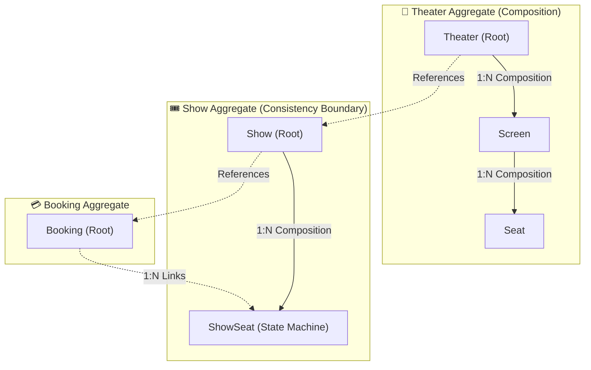

# LLD Interview Mastery: The 4-Step Framework, Cardinality & DB Schema Design

> **Track:** LLD & Clean Architecture  
> **Topic:** The 4-Step LLD Attack Plan, The 2-Way Cardinality Formula, DB Schema Mapping & End-to-End Case Study  
> **Level:** SDE-1 / SDE-2 $\rightarrow$ Senior Engineer / Tech Lead  
> **Real-World Reference:** Movie Ticket Booking Platform (BookMyShow / Fandango)

---

## 🧭 Executive Summary

In Low-Level Design (LLD) interviews, candidates often fail because they jump directly into writing classes and code before clarifying use cases, establishing boundaries, and resolving entity cardinalities.

This guide provides the **exact 4-step framework** used by Senior Engineers to break down any ambiguous LLD prompt, determine database schemas with the **2-Way Question Formula**, and model rich aggregate boundaries.

---

## 🏗️ The 4-Step LLD Attack Plan

```
┌─────────────────────────────────────────────────────────────────────────────┐
│                       THE 4-STEP LLD ATTACK PLAN                            │
│                                                                             │
│  STEP 1: Clarify Core Use-Cases (The 3-4 Essential User Flows)              │
│  STEP 2: Extract Nouns (Entities vs. Value Objects)                         │
│  STEP 3: Map Relationships & Cardinality (The 2-Way Cross-Check)            │
│  STEP 4: Define Rich Behaviors & Contracts (Tell, Don't Ask)                │
└─────────────────────────────────────────────────────────────────────────────┘
```

---

### Step 1: Clarify Core Use-Cases (Ask Probing Questions)
Never assume requirements. Spend the first 3-5 minutes locking down the functional scope:
- *"Can a user view movie showtimes across different theaters and screens?"*
- *"Can a user temporarily hold a seat for 10 minutes while completing payment?"*
- *"How do we prevent double-booking when two users select the same seat simultaneously?"*

---

### Step 2: Extract Core Nouns (Entities vs. Value Objects)
Read through your use-cases and extract the domain objects:
* **Entities (Have Unique Identity & Lifecycle):** `User`, `Movie`, `Theater`, `Screen`, `Show`, `Booking`.
* **Value Objects (Defined by Values, Immutable):** `Money`, `SeatLocation` (Row, Col), `ShowTimePeriod`.
* **Enums / Status Codes:** `SeatType` (`VIP`, `PREMIUM`, `REGULAR`), `BookingStatus` (`PENDING`, `CONFIRMED`, `CANCELLED`).

---

### Step 3: Map Relationships & Cardinality (The 2-Way Question Formula)

```
┌─────────────────────────────────────────────────────────────────────────────┐
│                      THE 2-WAY QUESTION FORMULA                             │
│                                                                             │
│  Direction 1: Ask: "Can ONE Entity A have MULTIPLE Entity B's?" (Yes / No)  │
│  Direction 2: Ask: "Can ONE Entity B belong to MULTIPLE Entity A's?" (Yes/No│
└─────────────────────────────────────────────────────────────────────────────┘
```

| Direction 1 ($A \rightarrow B$) | Direction 2 ($B \rightarrow A$) | Resulting Cardinality | Database Implementation |
| :--- | :--- | :--- | :--- |
| **No** (1 only) | **No** (1 only) | **`1 : 1` (One-to-One)** | FK on dependent table with **`UNIQUE`** constraint. |
| **Yes** (Multiple) | **No** (1 only) | **`1 : N` (One-to-Many)** | FK goes on the **"MANY"** side table ($B$). |
| **Yes** (Multiple) | **Yes** (Multiple) | **`N : M` (Many-to-Many)**| **Junction / Join Table** containing both FKs. |

---

### Step 4: Define Rich Behaviors & Contracts (Tell, Don't Ask)
Define behavioral domain methods instead of exposing raw setters:
- `Show.reserveSeats(seatIds, userId)` $\rightarrow$ Enforces temporal 10-minute hold.
- `Booking.confirmPayment(receipt)` $\rightarrow$ Transitions status atomically.

---

## 🎬 End-to-End Case Study: Movie Ticket Booking Platform (BookMyShow)

Let's apply the entire framework to design the domain model and database schemas for **BookMyShow**.

---

### 1. The Complete Cardinality Analysis Matrix

Let's use the **2-Way Question Formula** on every entity pair:

```
┌──────────────────────────────────────────────────────────────────────────────────────────────────────┐
│                               BOOKMYSHOW CARDINALITY MATRIX                                          │
├────────────────────┬─────────────────┬──────────────────────┬─────────────┬──────────────────────────┤
│ Entity Pair (A - B)│ A has Mult B?   │ B belongs to Mult A? │ Cardinality │ Relationship Type        │
├────────────────────┼─────────────────┼──────────────────────┼─────────────┼──────────────────────────┤
│ Theater ── Screen  │ YES (3 screens) │ NO (Screen in 1 mall)│ `1 : N`     │ **Composition** (Strong) │
│ Screen ── Seat     │ YES (200 seats) │ NO (Seat on 1 screen)│ `1 : N`     │ **Composition** (Strong) │
│ Movie ── Show      │ YES (50 shows)  │ NO (Show plays 1 mov)│ `1 : N`     │ **Association** (Loose)  │
│ Screen ── Show     │ YES (Multiple)  │ NO (Show on 1 screen)│ `1 : N`     │ **Association** (Loose)  │
│ Show ── ShowSeat   │ YES (200 seats) │ NO (Specific to show)│ `1 : N`     │ **Composition** (Strong) │
│ User ── Booking    │ YES (Many orders│ NO (1 buyer/booking) │ `1 : N`     │ **Association** (Loose)  │
│ Booking ── ShowSeat│ YES (Family tix)│ NO (1 active booking)│ `1 : N`     │ **Aggregation** (Hold)   │
│ Movie ── Actor     │ YES (Cast list) │ YES (Acts in movies) │ `N : M`     │ **Junction Table**       │
└────────────────────┴─────────────────┴──────────────────────┴─────────────┴──────────────────────────┘
```

---

## 🗄️ Relational Database Schema Design (PostgreSQL DDL)

Here is the exact production-grade schema showing Primary Keys, Foreign Keys, Unique Constraints, and Cascade rules:

```sql
-- 1. THEATERS & PHYSICAL SCREENS (1 : N Composition)
CREATE TABLE theaters (
    id VARCHAR(36) PRIMARY KEY,
    name VARCHAR(255) NOT NULL,
    city VARCHAR(100) NOT NULL,
    address TEXT NOT NULL,
    created_at TIMESTAMP WITH TIME ZONE DEFAULT NOW()
);

CREATE TABLE screens (
    id VARCHAR(36) PRIMARY KEY,
    theater_id VARCHAR(36) NOT NULL REFERENCES theaters(id) ON DELETE CASCADE,
    screen_number INT NOT NULL,
    total_seats INT NOT NULL,
    UNIQUE(theater_id, screen_number) -- A theater cannot have duplicate Screen 1s
);

-- 2. PHYSICAL SEATS IN A SCREEN (1 : N Composition)
CREATE TABLE seats (
    id VARCHAR(36) PRIMARY KEY,
    screen_id VARCHAR(36) NOT NULL REFERENCES screens(id) ON DELETE CASCADE,
    row_label VARCHAR(5) NOT NULL,    -- e.g. 'A', 'B', 'C'
    column_number INT NOT NULL,       -- e.g. 1, 2, 3
    seat_type VARCHAR(20) NOT NULL,   -- 'VIP', 'PREMIUM', 'REGULAR'
    UNIQUE(screen_id, row_label, column_number)
);

-- 3. MOVIES & SHOW SCHEDULES (1 : N Association)
CREATE TABLE movies (
    id VARCHAR(36) PRIMARY KEY,
    title VARCHAR(255) NOT NULL,
    duration_minutes INT NOT NULL,
    language VARCHAR(50) NOT NULL
);

CREATE TABLE shows (
    id VARCHAR(36) PRIMARY KEY,
    movie_id VARCHAR(36) NOT NULL REFERENCES movies(id) ON DELETE RESTRICT,
    screen_id VARCHAR(36) NOT NULL REFERENCES screens(id) ON DELETE RESTRICT,
    start_time TIMESTAMP WITH TIME ZONE NOT NULL,
    end_time TIMESTAMP WITH TIME ZONE NOT NULL,
    version INT NOT NULL DEFAULT 0, -- For Optimistic Locking
    UNIQUE(screen_id, start_time)   -- A screen cannot play two movies at the same time!
);

-- 4. REAL-TIME SHOW SEATS (State Invariant & Concurrency Protection)
-- 🚨 CRUCIAL TECH LEAD INSIGHT: Physical seats are static; ShowSeats track live booking state!
CREATE TABLE show_seats (
    id VARCHAR(36) PRIMARY KEY,
    show_id VARCHAR(36) NOT NULL REFERENCES shows(id) ON DELETE CASCADE,
    seat_id VARCHAR(36) NOT NULL REFERENCES seats(id) ON DELETE RESTRICT,
    price_cents BIGINT NOT NULL,
    status VARCHAR(20) NOT NULL DEFAULT 'AVAILABLE', -- 'AVAILABLE', 'LOCKED', 'BOOKED'
    locked_by_user_id VARCHAR(36),
    locked_until TIMESTAMP WITH TIME ZONE,           -- 10-minute temporary seat hold
    booking_id VARCHAR(36),                          -- Linked once payment succeeds
    version INT NOT NULL DEFAULT 0,                  -- Optimistic locking for concurrency
    UNIQUE(show_id, seat_id)
);

-- 5. USERS & BOOKINGS (1 : N Association)
CREATE TABLE users (
    id VARCHAR(36) PRIMARY KEY,
    email VARCHAR(255) UNIQUE NOT NULL,
    name VARCHAR(255) NOT NULL
);

CREATE TABLE bookings (
    id VARCHAR(36) PRIMARY KEY,
    user_id VARCHAR(36) NOT NULL REFERENCES users(id) ON DELETE RESTRICT,
    show_id VARCHAR(36) NOT NULL REFERENCES shows(id) ON DELETE RESTRICT,
    total_amount_cents BIGINT NOT NULL,
    status VARCHAR(20) NOT NULL DEFAULT 'PENDING', -- 'PENDING', 'CONFIRMED', 'CANCELLED'
    created_at TIMESTAMP WITH TIME ZONE DEFAULT NOW()
);

-- 6. MANY-TO-MANY JUNCTION TABLE: MOVIES & ACTORS (N : M)
CREATE TABLE actors (
    id VARCHAR(36) PRIMARY KEY,
    name VARCHAR(255) NOT NULL
);

CREATE TABLE movie_cast (
    movie_id VARCHAR(36) NOT NULL REFERENCES movies(id) ON DELETE CASCADE,
    actor_id VARCHAR(36) NOT NULL REFERENCES actors(id) ON DELETE CASCADE,
    role_name VARCHAR(100),
    PRIMARY KEY(movie_id, actor_id) -- Composite Primary Key
);
```

---

## 🏛️ Domain Model Architecture (TypeScript Implementation)



---

### 1. The `ShowSeat` Self-Defending Entity (Concurrency & Invariant Protection)

```typescript
export type ShowSeatStatus = "AVAILABLE" | "LOCKED" | "BOOKED";

export class ShowSeat {
    constructor(
        public readonly id: string,
        public readonly showId: string,
        public readonly seatId: string,
        public readonly priceCents: bigint,
        private status: ShowSeatStatus = "AVAILABLE",
        private lockedByUserId?: string,
        private lockedUntil?: Date,
        private version: number = 0
    ) {}

    // 🔒 BEHAVIORAL METHOD: Temporary Seat Hold Invariant
    public lock(userId: string, holdDurationSeconds: number = 600): void {
        const now = new Date();

        // If currently locked but hold expired, treat as available!
        const isHoldExpired = this.lockedUntil && this.lockedUntil < now;

        if (this.status === "BOOKED") {
            throw new Error(`Seat ${this.seatId} is already booked.`);
        }
        if (this.status === "LOCKED" && !isHoldExpired && this.lockedByUserId !== userId) {
            throw new Error(`Seat ${this.seatId} is temporarily reserved by another user.`);
        }

        this.status = "LOCKED";
        this.lockedByUserId = userId;
        this.lockedUntil = new Date(now.getTime() + holdDurationSeconds * 1000);
        this.version++;
    }

    public confirmBooking(bookingId: string, userId: string): void {
        if (this.status !== "LOCKED" || this.lockedByUserId !== userId) {
            throw new Error("Cannot confirm booking without a valid active seat lock.");
        }
        this.status = "BOOKED";
        this.version++;
    }

    public isAvailable(): boolean {
        if (this.status === "AVAILABLE") return true;
        if (this.status === "LOCKED" && this.lockedUntil && this.lockedUntil < new Date()) {
            return true; // Expired lock
        }
        return false;
    }
}
```

---

### 2. The `Show` Aggregate Root

```typescript
export class Show {
    constructor(
        public readonly id: string,
        public readonly movieId: string,
        public readonly screenId: string,
        public readonly startTime: Date,
        private readonly showSeats: Map<string, ShowSeat>
    ) {}

    // 🔒 Atomically locks multiple seats for a user
    public holdSeats(seatIds: string[], userId: string): bigint {
        let totalCost = 0n;

        // 1. Invariant check: Are all requested seats available?
        for (const seatId of seatIds) {
            const seat = this.showSeats.get(seatId);
            if (!seat || !seat.isAvailable()) {
                throw new Error(`Seat ${seatId} is not available for reservation.`);
            }
        }

        // 2. State transition: Lock all seats
        for (const seatId of seatIds) {
            const seat = this.showSeats.get(seatId)!;
            seat.lock(userId, 600); // 10-minute hold
            totalCost += seat.priceCents;
        }

        return totalCost;
    }
}
```

---

## 🎯 Summary Checklist: How to Ace Cardinality in LLD Interviews

1. **Always run the 2-Way Check:**
   - Check $A \rightarrow B$ and $B \rightarrow A$ out loud in front of the interviewer.
2. **Translate to Foreign Keys:**
   - `1 : N` $\rightarrow$ FK on the "Many" table.
   - `N : M` $\rightarrow$ Junction table with composite primary key.
   - `1 : 1` $\rightarrow$ Dependent table with unique FK.
3. **Decide Cascade Rules:**
   - `Composition` $\rightarrow$ `ON DELETE CASCADE`.
   - `Aggregation / Association` $\rightarrow$ `ON DELETE RESTRICT`.
4. **Model Temporal State Machines:**
   - Distinguish static layout (`Seat`) from dynamic runtime state (`ShowSeat` with `locked_until`).

---

## 🔗 Related Vault Topics
- [01_object_relationships_association_aggregation_composition.md](file:///Users/flixstock/Desktop/personal%20project/learn/06-LLD-AND-CLEAN-ARCHITECTURE/04-domain-modeling-and-clean-arch/01_object_relationships_association_aggregation_composition.md)
- [00_oop_core_fundamentals_interview_layman_guide.md](file:///Users/flixstock/Desktop/personal%20project/learn/06-LLD-AND-CLEAN-ARCHITECTURE/01-oops/00_oop_core_fundamentals_interview_layman_guide.md)
- [04_production_drill_wallet_subscription_auto_renew_encapsulation.md](file:///Users/flixstock/Desktop/personal%20project/learn/06-LLD-AND-CLEAN-ARCHITECTURE/01-oops/encapsulation/04_production_drill_wallet_subscription_auto_renew_encapsulation.md)
