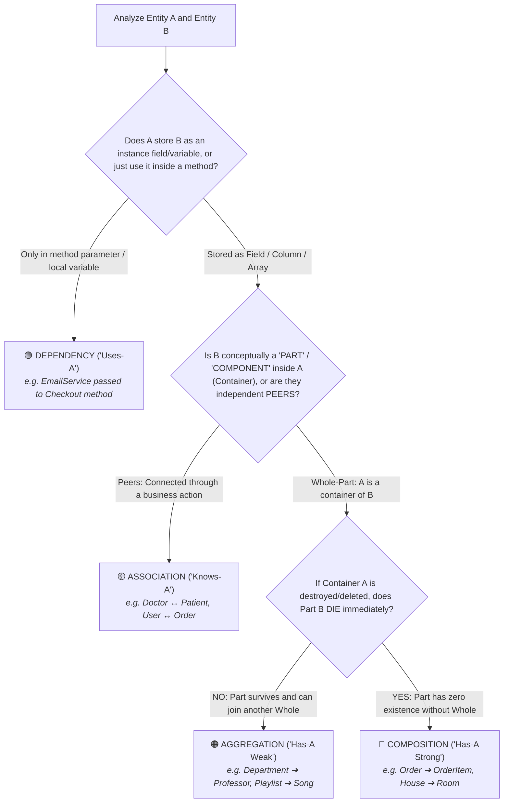

# Association vs. Aggregation Deep Dive: The "Whole-Part" & "Peer" Distinction

> **Track:** LLD & Domain Modeling  
> **Topic:** Demystifying Association vs. Aggregation vs. Composition vs. Dependency  
> **Level:** SDE-1 / SDE-2 $\rightarrow$ Senior Engineer / Tech Lead  
> **Purpose:** 100% precision in identifying relationship types with zero ambiguity.

---

## 🧭 Executive Summary: Validating the Theory

### Is the theory correct?
👉 **YES, 100%!** This is the exact formal standard defined by **UML (Unified Modeling Language)** and **Eric Evans' Domain-Driven Design (DDD)**.

```
┌──────────────────────────────────────────────────────────────────────────────────────────────────┐
│                            THE 1-SENTENCE GOLDEN DEFINITIONS                                     │
├─────────────────┬────────────────────────────────────────────────────────────────────────────────┤
│ 1. DEPENDENCY   │ "Uses-A" ➔ Class A temporarily uses Class B inside a method. (No field stored)│
│ 2. ASSOCIATION  │ "Connected-To" ➔ Class A and Class B are PEERS. Neither owns the other.        │
│ 3. AGGREGATION  │ "Has-A (Container)" ➔ A is a WHOLE, B is a PART, but B survives if A dies.     │
│ 4. COMPOSITION  │ "Has-A (Vital)" ➔ A is a WHOLE, B is a PART, and B DIES if A dies.             │
└─────────────────┴────────────────────────────────────────────────────────────────────────────────┘
```

---

## 🔬 The 2-Question Detection Algorithm (How to Never Get Confused)

Whenever you analyze the relationship between **Entity A** and **Entity B**, execute these **two sequential questions**:



---

## 1. Association vs. Aggregation (The Exact Boundary)

The #1 reason developers get confused between Association and Aggregation is that **in both cases, both objects can survive independently**.

### The Deciding Factor: The "Whole-Part (Container)" Test

| Dimension | **Association ("Connected Peers")** | **Aggregation ("Container of Parts")** |
| :--- | :--- | :--- |
| **Mental Model** | **Equal Partners / Action Link:** Two independent entities interact or know about each other. | **Container / Collection:** Entity A is an assembly or container made up of Entity B items. |
| **Is one a "part" of the other?** | ❌ **NO.** A Doctor is not a "component" of a Patient. | ✅ **YES.** A Song is a component of a Playlist; a Professor is a component of a Department. |
| **Real-World Examples** | • `Doctor ↔ Patient` (Doctor treats patient)<br/>• `Customer ↔ Order` (Customer placed order)<br/>• `Driver ↔ Ride` (Driver accepted ride) | • `Department ➔ Professor` (Dept consists of professors)<br/>• `SpotifyPlaylist ➔ Songs` (Playlist consists of songs)<br/>• `Team ➔ Players` (Team consists of players) |

---

## 2. Real-World Case Studies Analyzed

---

### Case Study 1: `Doctor` $\leftrightarrow$ `Clinic`

* **Step 1:** Are they connected as instance variables? $\rightarrow$ **YES**.
* **Step 2 (The Whole-Part Test):**
  - *Is the Doctor a physical component/part of the Clinic?*
    - If modeled as a hospital staff directory: **Aggregation** (`Clinic ➔ Doctor`).
    - If modeled as independent practitioners visiting clinics: **Association** (`Doctor ↔ Clinic`).
  - *In 95% of telemedicine systems:* They are modeled as **$N:M$ Association** because both are top-level independent entities connected via an affiliation contract.

---

### Case Study 2: `Spotify Playlist` $\leftrightarrow$ `Song`

* **Step 1:** Is a Song a component of a Playlist? $\rightarrow$ **YES (Whole-Part Container)**.
* **Step 2 (The Death Test):** If the user deletes their "Gym Workout" Playlist, are the songs purged from Spotify's servers?
  - **NO!** The songs survive and remain playable in other playlists.
* 👉 **Result:** **Aggregation**.

---

### Case Study 3: `E-Commerce Order` $\leftrightarrow$ `OrderItem`

* **Step 1:** Is an OrderItem a component of an Order? $\rightarrow$ **YES (Whole-Part Container)**.
* **Step 2 (The Death Test):** If the customer cancels/deletes the Order before checkout, does the specific line item *"2x Burgers for Order #99"* survive?
  - **NO! It dies with the order.**
* 👉 **Result:** **Composition**.

---

## 3. How this Translates into Code & Database Schemas

```
┌──────────────────────────────────────────────────────────────────────────────────────────────────┐
│                               ARCHITECTURAL & SCHEMA MAPPING                                     │
├─────────────────┬─────────────────────────────────┬──────────────────────────────────────────────┤
│ Relationship    │ TypeScript / Java Code          │ Database Schema Rule                         │
├─────────────────┼─────────────────────────────────┼──────────────────────────────────────────────┤
│ **Dependency**  │ Method parameter: `fn(b: B)`    │ Zero foreign keys.                           │
├─────────────────┼─────────────────────────────────┼──────────────────────────────────────────────┤
│ **Association** │ Stores ID: `patientId: string`  │ Foreign key with `ON DELETE RESTRICT` / SET  │
├─────────────────┼─────────────────────────────────┼──────────────────────────────────────────────┤
│ **Aggregation** │ Array of references: `songs: S[]`│ Junction table or `ON DELETE SET NULL`       │
├─────────────────┼─────────────────────────────────┼──────────────────────────────────────────────┤
│ **Composition** │ Root owns instances: `items: I[]`│ Foreign key with `ON DELETE CASCADE`         │
└─────────────────┴─────────────────────────────────┴──────────────────────────────────────────────┘
```

---

## 🔗 Related Vault Topics
- [01_object_relationships_association_aggregation_composition.md](file:///Users/flixstock/Desktop/personal%20project/learn/06-LLD-AND-CLEAN-ARCHITECTURE/04-domain-modeling-and-clean-arch/01_object_relationships_association_aggregation_composition.md)
- [03_deep_dive_cardinality_detection_questions_to_ask_and_junction_tables.md](file:///Users/flixstock/Desktop/personal%20project/learn/06-LLD-AND-CLEAN-ARCHITECTURE/04-domain-modeling-and-clean-arch/03_deep_dive_cardinality_detection_questions_to_ask_and_junction_tables.md)
- [08_golden_master_rulebook_cardinality_relationships_and_db_design.md](file:///Users/flixstock/Desktop/personal%20project/learn/06-LLD-AND-CLEAN-ARCHITECTURE/04-domain-modeling-and-clean-arch/08_golden_master_rulebook_cardinality_relationships_and_db_design.md)
