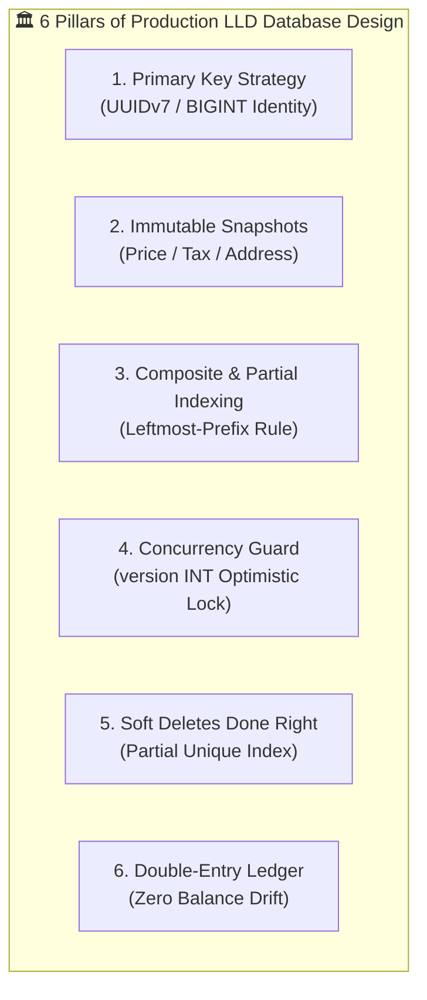

# Production Database Design: 1NF to 3NF, Strategic Denormalization, Indexing & Concurrency

> **Track:** LLD & Clean Architecture  
> **Topic:** Normalization (1NF, 2NF, 3NF), Intentional Snapshot Denormalization, Indexing Strategy, & Concurrency Control at Scale  
> **Level:** SDE-1 / SDE-2 $\rightarrow$ Senior Engineer / Tech Lead  
> **Purpose:** Eliminate textbook confusion, master 3NF design algorithms, and rock database design in LLD interviews.

---

## 🧭 Executive Summary: The Tech Lead Database Rule

```
┌──────────────────────────────────────────────────────────────────────────────────────────────────┐
│                            THE GOLDEN RULE OF LLD DATABASE DESIGN                                │
│                                                                                                  │
│  "Normalize to 3NF for Live Mutating State (Zero Anomalies),                                     │
│   Denormalize Strategically via Snapshots for Historical Transactions (Zero Price Drift)."      │
└──────────────────────────────────────────────────────────────────────────────────────────────────┘
```

---

## 1. What is Normalization & Why 3NF?

### 🚨 Why do un-normalized databases destroy production?
When data is not normalized, databases suffer from **The 3 Catastrophic Anomalies**:

```
1. INSERT ANOMALY ➔ You cannot record a course fee until a student enrolls in that course!
2. UPDATE ANOMALY ➔ Changing a user's address requires updating 50,000 order records.
                     If 1 update fails midway, the database is corrupt!
3. DELETE ANOMALY ➔ Deleting the last enrolled student accidentally deletes the course catalog!
```

**Normalization** is the systematic mathematical process of organizing table columns and relationships to **eliminate redundant data and prevent anomalies**.

---

## 2. The 3 Normal Forms Demystified (From First Principles)

> **The Famous Database Oath:**  
> *"Every non-key attribute must depend on **the key**, **the whole key**, and **nothing but the key** (so help me Codd)!"*

---

### 🟢 1NF (First Normal Form): "Atomic Values & Unique Rows"

* **Rule 1:** Every column must contain **atomic (indivisible) values** (No comma-separated lists, no JSON arrays stored in text columns).
* **Rule 2:** Each record must have a unique identifier (Primary Key).

#### ❌ 1NF Violation:
```text
| user_id | name  | phone_numbers            |
| :------ | :---- | :----------------------- |
| 101     | Alice | "9876543210, 8765432109" | 🚨 Comma-separated list!
```

#### ✅ 1NF Compliant:
```text
| user_id | name  | phone_number |
| :------ | :---- | :----------- |
| 101     | Alice | 9876543210   |
| 101     | Alice | 8765432109   |
```

---

### 🟡 2NF (Second Normal Form): "No Partial Key Dependencies"

* **Rule 1:** Must be in **1NF**.
* **Rule 2:** **No Partial Dependency:** Every non-key column must depend on the **ENTIRE Composite Primary Key**, not just part of it.  
  *(Note: If a table has a single-column Primary Key like `id`, it is automatically in 2NF!)*

#### ❌ 2NF Violation (Composite Key: `student_id` + `course_id`):
```text
Table: student_course_enrollments
Composite PK: (student_id, course_id)

| student_id (PK) | course_id (PK) | enrollment_date | course_fee |
| :-------------- | :------------- | :-------------- | :--------- |
| S1              | C101           | 2026-01-10      | $500       | 🚨 course_fee depends ONLY
| S2              | C101           | 2026-01-12      | $500       |    on course_id, NOT student_id!
```
*Why this fails:* If the fee of course `C101` changes, you must update multiple rows. If no student enrolls, you cannot store the course fee!

#### ✅ 2NF Compliant (Split into 2 Tables):
```text
Table: courses
PK: course_id
| course_id (PK) | course_name  | course_fee |
| :------------- | :----------- | :--------- |
| C101           | Algorithms   | $500       |

Table: enrollments
Composite PK: (student_id, course_id)
| student_id (PK) | course_id (PK/FK) | enrollment_date |
| :-------------- | :---------------- | :-------------- |
| S1              | C101              | 2026-01-10      |
| S2              | C101              | 2026-01-12      |
```

---

### 🔵 3NF (Third Normal Form): "No Transitive Dependencies"

* **Rule 1:** Must be in **2NF**.
* **Rule 2:** **No Transitive Dependency:** Non-key columns must **NOT depend on other non-key columns**. (They must depend *only* on the Primary Key).

#### ❌ 3NF Violation:
```text
Table: users
PK: user_id

| user_id (PK) | name  | zip_code | city      | state |
| :----------- | :---- | :------- | :-------- | :---- |
| 101          | Alice | 94016    | Daly City | CA    |
| 102          | Bob   | 94016    | Daly City | CA    | 🚨 city & state depend on zip_code!
```
*Why this fails:* `user_id` $\rightarrow$ `zip_code` $\rightarrow$ `city, state`. If a city name changes or a typo is fixed, you have to update thousands of user rows!

#### ✅ 3NF Compliant (Extract Transitive Dependency):
```text
Table: users
| user_id (PK) | name  | zip_code (FK) |
| :----------- | :---- | :------------ |
| 101          | Alice | 94016         |

Table: zip_locations
| zip_code (PK) | city      | state |
| :------------ | :-------- | :---- |
| 94016         | Daly City | CA    |
```

---

## 3. When to Break 3NF: The "Immutable Snapshot" Pattern

In academic textbooks, people are told to normalize everything to 3NF/BCNF.  
In real-world production, **blind 3NF causes financial and legal bugs in e-commerce, banking, and invoicing**.

```
┌─────────────────────────────────────────────────────────────────────────────┐
│                   THE FINANCIAL SNAPSHOT PRINCIPLE                          │
│                                                                             │
│  "Live Catalogs mutate over time (Products change price).                    │
│   Transactional Records represent LEGAL HISTORY and must NEVER change."     │
└─────────────────────────────────────────────────────────────────────────────┘
```

#### The Production Catastrophe:
1. Today: Customer buys `iPhone 15` for **$800.00**.
2. Next Month: Store raises the price of `iPhone 15` to **$950.00**.
3. If `order_items` only has `product_id` (pure 3NF):
   When the user opens their invoice, the query joins with `products` and shows: **"You paid $950.00"**! 💥

#### ✅ The Intentional Snapshot Design:
```sql
CREATE TABLE order_items (
    id VARCHAR(36) PRIMARY KEY,
    order_id VARCHAR(36) NOT NULL REFERENCES orders(id) ON DELETE CASCADE,
    product_id VARCHAR(36) NOT NULL REFERENCES products(id),
    
    -- 📸 POINT-IN-TIME SNAPSHOTS (Intentional Denormalization)
    product_name_snapshot VARCHAR(255) NOT NULL,
    unit_price_cents_snapshot BIGINT NOT NULL, -- Locked at $800.00 forever!
    tax_rate_snapshot NUMERIC(5, 2) NOT NULL,
    shipping_address_snapshot JSONB NOT NULL   -- User moving homes won't alter past receipts!
);
```

---

## 4. The 6 Critical Pillars of LLD Database Design at Scale



---

### Pillar 1: Primary Key Strategy (UUIDv7 vs BIGINT vs Random UUIDv4)

* **Random UUIDv4 (`crypto.randomUUID()`):** ❌ Causes massive B-Tree index fragmentation & random I/O page splits once the table exceeds RAM cache.
* **Auto-Increment INT:** ❌ 32-bit overflows at 2.1B rows; sequential IDs expose business metrics (`/orders/100`).
* **✅ Senior Choice:**
  1. **Internal `BIGINT GENERATED ALWAYS AS IDENTITY`** (64-bit, compact 8 bytes, zero fragmentation).
  2. **`UUIDv7` or `ULID`** (Time-ordered 128-bit UUID: globally unique, unguessable, and naturally ordered by timestamp, meaning zero B-Tree page splits!).

---

### Pillar 2: Indexing Strategy & The Leftmost Prefix Rule

In LLD interviews, designing tables without indexes shows a lack of production experience.

```sql
-- Query: "Find all pending orders for User X created in the last 24h"
SELECT * FROM orders 
WHERE user_id = 'usr_101' AND status = 'PENDING' 
ORDER BY created_at DESC;

-- ✅ OPTIMAL COMPOSITE INDEX (Equality filters first, then Sort/Range)
CREATE INDEX idx_orders_user_status_created 
ON orders (user_id, status, created_at DESC);
```

#### Partial Indexes for Hot Worker Queues:
If 98% of orders are `COMPLETED` and only 2% are `PENDING`:
```sql
-- Index is 98% smaller, fits 100% in RAM, and lightning fast!
CREATE INDEX idx_orders_unprocessed 
ON orders (created_at ASC) 
WHERE status = 'PENDING';
```

---

### Pillar 3: Concurrency Control (`version` column)

To prevent two concurrent requests from overwriting each other (Lost Update Anomaly):

```sql
CREATE TABLE inventory_items (
    id VARCHAR(36) PRIMARY KEY,
    product_id VARCHAR(36) UNIQUE NOT NULL,
    available_stock INT NOT NULL CHECK (available_stock >= 0),
    version INT NOT NULL DEFAULT 0 -- 🔒 Optimistic Lock
);
```

#### Optimistic Lock Execution:
```sql
UPDATE inventory_items 
SET available_stock = available_stock - 1, version = version + 1 
WHERE product_id = 'prod_iphone' AND version = 3;
-- If rows_affected == 0 -> Another checkout took the stock! Retry or abort cleanly.
```

---

### Pillar 4: Soft Deletes Done Right (The Unique Index Trap)

* **The Problem:** Table has `UNIQUE(email)`. User soft-deletes (`deleted_at = NOW()`). Later, someone registers with the same email. `INSERT` fails due to unique constraint!
* **✅ The Fix (Partial Unique Index):**
  ```sql
  CREATE TABLE users (
      id VARCHAR(36) PRIMARY KEY,
      email VARCHAR(255) NOT NULL,
      deleted_at TIMESTAMP WITH TIME ZONE DEFAULT NULL
  );

  -- 🔒 Uniqueness is only enforced for ACTIVE (non-deleted) accounts!
  CREATE UNIQUE INDEX uq_active_users_email 
  ON users (email) 
  WHERE deleted_at IS NULL;
  ```

---

### Pillar 5: The Double-Entry Ledger Pattern (Zero Money Drift)

In payment, wallet, or credit systems, **never just mutate a balance number**. Maintain an append-only ledger:

```sql
CREATE TABLE wallet_ledger (
    id VARCHAR(36) PRIMARY KEY,
    wallet_id VARCHAR(36) NOT NULL REFERENCES wallets(id),
    amount_cents BIGINT NOT NULL, -- Positive for Credit, Negative for Debit
    balance_after_cents BIGINT NOT NULL,
    transaction_type VARCHAR(50) NOT NULL, -- 'TOPUP', 'ORDER_PAYMENT', 'REFUND'
    idempotency_key VARCHAR(100) UNIQUE NOT NULL,
    created_at TIMESTAMP WITH TIME ZONE DEFAULT NOW()
);
```

---

## 🎯 The 5-Minute LLD Interview DB Design Script

When the interviewer asks for database design in an LLD interview, speak with this structure:

1. **"I will first normalize our core mutating entities into 3NF:** (`Users`, `Products`, `Theaters`, `Screens`) to ensure zero update/delete anomalies."
2. **"For transactional and historical domains (`Orders`, `Bookings`, `Invoices`):** I will intentionally snapshot volatile data (`price_snapshot`, `tax_snapshot`) so historical transactions remain immutable."
3. **"For Cardinality:** `1:N` relationships place foreign keys on the child with `ON DELETE CASCADE` (for compositions) or `RESTRICT` (for independent references). `N:M` relations use dedicated junction tables with composite primary keys."
4. **"For Concurrency & Scale:** I am adding `version` columns for Optimistic Concurrency Control, database `CHECK` constraints for invariants (e.g. `balance >= 0`), and partial composite indexes on hot query filters."

---

## 🔗 Related Vault Topics
- [02_lld_interview_framework_cardinality_and_db_schema_design.md](file:///Users/flixstock/Desktop/personal%20project/learn/06-LLD-AND-CLEAN-ARCHITECTURE/04-domain-modeling-and-clean-arch/02_lld_interview_framework_cardinality_and_db_schema_design.md)
- [01_object_relationships_association_aggregation_composition.md](file:///Users/flixstock/Desktop/personal%20project/learn/06-LLD-AND-CLEAN-ARCHITECTURE/04-domain-modeling-and-clean-arch/01_object_relationships_association_aggregation_composition.md)
- [04_production_drill_wallet_subscription_auto_renew_encapsulation.md](file:///Users/flixstock/Desktop/personal%20project/learn/06-LLD-AND-CLEAN-ARCHITECTURE/01-oops/encapsulation/04_production_drill_wallet_subscription_auto_renew_encapsulation.md)
