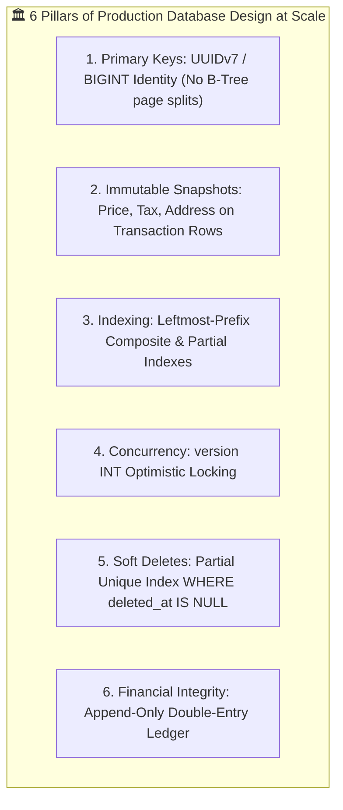

# The Golden Master Rulebook: Cardinality, Object Relationships & Database Design

> **Track:** LLD & Domain Modeling  
> **Type:** Master Reference & Cheat Sheet  
> **Level:** SDE-1 / SDE-2 $\rightarrow$ Senior Engineer / Tech Lead  
> **Purpose:** The single 1-page rulebook to open, consult, and solve ANY Low-Level Design or Database Modeling problem.

---

## 🧭 Master Part 1: The 4 Object Relationships at a Glance

```
┌──────────────────────────────────────────────────────────────────────────────────────────────────┐
│                                 THE 4 OBJECT RELATIONSHIPS                                       │
├─────────────────┬──────────┬─────────────────────────────┬──────────────┬────────────────────────┤
│ Relationship    │ Symbol   │ Mental Model                │ Child Dies?  │ Database Rule          │
├─────────────────┼──────────┼─────────────────────────────┼──────────────┼────────────────────────┤
│ **DEPENDENCY**  │ Uses-A   │ Temporary tool in method    │ Lives on     │ Zero foreign keys      │
│ **ASSOCIATION** │ Knows-A  │ Connected independent peers │ Lives on     │ FK with RESTRICT       │
│ **AGGREGATION** │ Has-A    │ Container of parts          │ Lives on     │ Junction / SET NULL    │
│ **COMPOSITION** │ Has-A    │ Vital body organ of whole   │ ❌ **DIES**   │ FK with CASCADE DELETE │
└─────────────────┴──────────┴─────────────────────────────┴──────────────┴────────────────────────┘
```

---

## 🧭 Master Part 2: The 2-Step Universal Decision Tree

Whenever you analyze ANY pair of classes (Entity A and Entity B), run these **Two Tests**:

```
┌──────────────────────────────────────────────────────────────────────────────────────────────────┐
│                                 THE 2-STEP UNIVERSAL DECISION TREE                               │
│                                                                                                  │
│  STEP 1: THE MULTIPLICITY TEST (Determines Cardinality ➔ 1:1, 1:N, N:M)                          │
│  • Ask: "Can ONE A have MULTIPLE B's?" (Yes / No)                                                │
│  • Ask: "Can ONE B belong to MULTIPLE A's?" (Yes / No)                                           │
│    ├─ (NO, NO)   ➔ 1 : 1 (One-to-One)                                                            │
│    ├─ (YES, NO)  ➔ 1 : N (One-to-Many)                                                           │
│    └─ (YES, YES) ➔ N : M (Many-to-Many ➔ MUST USE JUNCTION TABLE!)                              │
│                                                                                                  │
│  STEP 2: THE WHOLE-PART & DEATH TEST (Determines Relationship Type)                              │
│  • Is B a component/part inside container A, or are they independent peers?                      │
│    ├─ Independent Peers ➔ ASSOCIATION (e.g. Doctor ↔ Patient, User ↔ Order)                      │
│    └─ Whole-Part Container ➔ Ask the Death Question:                                            │
│         "If Container A is deleted, does Part B DIE immediately?"                                │
│         ├─ YES (Cannot live alone) ➔ COMPOSITION (e.g. Order ➔ OrderItem)                        │
│         └─ NO (Lives on / joins other) ➔ AGGREGATION (e.g. Playlist ➔ Song, Dept ➔ Professor)    │
└──────────────────────────────────────────────────────────────────────────────────────────────────┘
```

---

## 🧭 Master Part 3: Database Mapping Rules (PostgreSQL / MySQL)

```
┌──────────────────────────────────────────────────────────────────────────────────────────────────┐
│                               RELATIONAL DATABASE MAPPING RULES                                  │
├────────────────────┬──────────────────────────────────────────────────┬──────────────────────────┤
│ Cardinality / Type │ SQL Schema Implementation Rule                   │ Concrete SQL Snippet     │
├────────────────────┼──────────────────────────────────────────────────┼──────────────────────────┤
│ **1 : 1**          │ Foreign Key on child table with **UNIQUE**       │ `user_id FK UNIQUE`      │
├────────────────────┼──────────────────────────────────────────────────┼──────────────────────────┤
│ **1 : N**          │ Foreign Key placed strictly on the **MANY side** │ `restaurant_id FK` on items│
├────────────────────┼──────────────────────────────────────────────────┼──────────────────────────┤
│ **N : M**          │ **Dedicated Junction Table** with Composite PK   │ `PRIMARY KEY (doc_id, cl_id)`│
├────────────────────┼──────────────────────────────────────────────────┼──────────────────────────┤
│ **Composition**    │ Cascade Deletion on Foreign Key                  │ `ON DELETE CASCADE`      │
├────────────────────┼──────────────────────────────────────────────────┼──────────────────────────┤
│ **Association**    │ Prevent Accidental Deletion                      │ `ON DELETE RESTRICT`     │
└────────────────────┴──────────────────────────────────────────────────┴──────────────────────────┘
```

---

## 🧭 Master Part 4: The 5 Questions to Ask the Interviewer

Never guess business rules. Ask these 5 questions during the first 3 minutes:

1. **Multi-Vendor Scope:** *"Can an order/cart contain items from multiple restaurants/merchants, or is it strictly 1 restaurant per order?"*
2. **Exclusivity vs. Shared Staff:** *"Are doctors/drivers exclusive to a single hospital/fleet, or can they consult/deliver across multiple clinics/platforms ($N:M$)?"*
3. **Account Deletion & History:** *"If a patient/customer deletes their profile, do we cascade-delete their orders, or retain anonymized history for legal/financial compliance?"*
4. **Reassignment & Audit Trail:** *"When a driver cancels or an appointment is rescheduled, do we overwrite the pointer or maintain an audit history log?"*
5. **Coupons & Modifiers:** *"Can a user stack multiple promo codes on one cart, or is it strictly 1 coupon per order?"*

---

## 🧭 Master Part 5: The 6 Scalable Database Design Pillars



---

## 🎯 Master Part 6: Complete Quick Reference Matrix

| Entity Pair | Question 1 ($A \rightarrow B$) | Question 2 ($B \rightarrow A$) | Multiplicity | Is it Whole-Part? | Does Child Die? | Resulting Link |
| :--- | :--- | :--- | :--- | :--- | :--- | :--- |
| **`Doctor ── Clinic`** | YES (Visits many) | YES (Has many) | **`N : M`** | No (Peers) | No | **$N:M$ Association (Junction Table)** |
| **`Doctor ── TimeSlot`** | YES (Publishes many) | NO (Belongs to 1) | **`1 : N`** | Yes (Container) | Yes (Future slots die)| **`1 : N` Composition** |
| **`Patient ── Appt`** | YES (Many visits) | NO (1 patient/appt)| **`1 : N`** | No (Peers) | No (Patient lives) | **`1 : N` Association** |
| **`Appt ── TimeSlot`** | NO (1 active slot) | NO (1 active appt) | **`1 : 1`** | No (Peers) | No (Slot freed up) | **`1 : 1` Association (`UNIQUE`)** |
| **`Presc ── MedItem`** | YES (Many drugs) | NO (1 specific line)| **`1 : N`** | Yes (Container) | Yes (Line dies) | **`1 : N` Composition (`CASCADE`)** |
| **`MedItem ── Drug`** | NO (References 1) | YES (In many presc)| **`N : 1`** | No (Peers) | No (Catalog lives) | **`N : 1` Association** |
| **`Order ── OrderItem`**| YES (Many dishes) | NO (1 order line) | **`1 : N`** | Yes (Container) | Yes (Line dies) | **`1 : N` Composition (`CASCADE`)** |
| **`OrderItem ── Modif`**| YES (Extra cheese) | NO (1 dish topping)| **`1 : N`** | Yes (Container) | Yes (Topping dies) | **`1 : N` Composition (`CASCADE`)** |
| **`Playlist ── Song`** | YES (Many songs) | YES (In many lists)| **`N : M`** | Yes (Container) | No (Song lives on) | **`N : M` Aggregation (Junction)** |

---

## 🔗 Related Vault Topics
- [01_object_relationships_association_aggregation_composition.md](file:///Users/flixstock/Desktop/personal%20project/learn/06-LLD-AND-CLEAN-ARCHITECTURE/04-domain-modeling-and-clean-arch/01_object_relationships_association_aggregation_composition.md)
- [02_lld_interview_framework_cardinality_and_db_schema_design.md](file:///Users/flixstock/Desktop/personal%20project/learn/06-LLD-AND-CLEAN-ARCHITECTURE/04-domain-modeling-and-clean-arch/02_lld_interview_framework_cardinality_and_db_schema_design.md)
- [03_deep_dive_cardinality_detection_questions_to_ask_and_junction_tables.md](file:///Users/flixstock/Desktop/personal%20project/learn/06-LLD-AND-CLEAN-ARCHITECTURE/04-domain-modeling-and-clean-arch/03_deep_dive_cardinality_detection_questions_to_ask_and_junction_tables.md)
- [04_production_db_design_normalization_3nf_indexing_concurrency.md](file:///Users/flixstock/Desktop/personal%20project/learn/06-LLD-AND-CLEAN-ARCHITECTURE/04-domain-modeling-and-clean-arch/04_production_db_design_normalization_3nf_indexing_concurrency.md)
- [06_production_drill_telemedicine_prescription_aggregate_and_relationship_discovery.md](file:///Users/flixstock/Desktop/personal%20project/learn/06-LLD-AND-CLEAN-ARCHITECTURE/04-domain-modeling-and-clean-arch/06_production_drill_telemedicine_prescription_aggregate_and_relationship_discovery.md)
- [07_association_vs_aggregation_deep_dive_the_whole_part_test.md](file:///Users/flixstock/Desktop/personal%20project/learn/06-LLD-AND-CLEAN-ARCHITECTURE/04-domain-modeling-and-clean-arch/07_association_vs_aggregation_deep_dive_the_whole_part_test.md)
