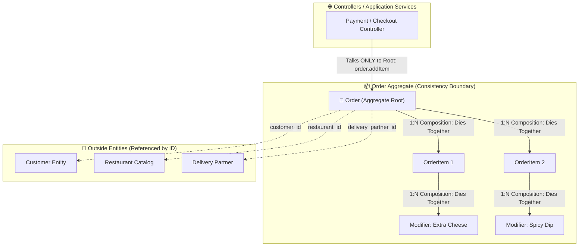

# Production Drill: Food Delivery Order Aggregate & Domain Relationships (Swiggy / DoorDash)

> **Track:** LLD & Clean Architecture  
> **Topic:** Object Relationships (Composition vs. Association), Cardinality Direction, Aggregate Roots, & Snapshot Denormalization  
> **Level:** SDE-1 / SDE-2 $\rightarrow$ Senior Engineer / Tech Lead  
> **Case Study:** Food Delivery Order & Driver Dispatch Engine (Swiggy / DoorDash)

---

## 🧭 Executive Summary

In Domain-Driven Design (DDD) and LLD interviews, designing a transactional order engine requires balancing **strong ownership boundaries (Composition)** with **loose external references (Association)**, while preventing price drift through **Point-in-Time Snapshotting**.

This document captures a real-world drill, contrasting a candidate's initial intuition with the Senior/Tech Lead production solution, dissecting the exact mistakes made and providing the bulletproof architecture.

---

## 🏢 The Production Problem Scenario

Design the core domain model for an on-demand food delivery platform (like Swiggy, DoorDash, or UberEats):
1. **Cart & Line Items:** An order contains multiple food items (e.g. 2x Butter Chicken, 1x Biryani). Each item can have optional **Customization Modifiers** (e.g., "Extra Spicy", "Cheese Topping").
2. **Dynamic Menu Pricing:** Restaurants update menu prices frequently. When an order is placed, subsequent menu price updates must **never alter the price of past completed orders**.
3. **Driver Reassignments:** Drivers can accept, reject, or unassign from an order. The system must support driver reassignment without recreating or corrupting the order entity.
4. **Lifecycle & Cascade Rules:**
   - Deleting an unplaced order must delete its items and modifiers.
   - Deleting a customer or restaurant account must **never** delete past historical tax receipts or order invoices.

---

## 🔍 Candidate Thought Process vs. Tech Lead Production Solution

### 1. What the Candidate Initially Proposed:

```text
// Candidate's Initial Schemas:
order:      { id, resturantId, name, userid, price, currency, status }
orderItem:  { id, userId, resturantId, dishId, orderId, quantity, isActive }
modify:     { id, dishId, resturantId, orderItemId, quatity, isActive }

// Candidate's Initial Relationships:
• order <-> orderItem       : 1:1 Composition
• orderItem <-> modifier    : 1:N Aggregation
• order <-> restaurant      : N:M
• order <-> customer        : 1:1 Composition
• order <-> deliveryPartner : 1:N Association / Dependency
```

---

### 2. SDE Evaluation & Score (Calibrated for SDE ~2 YOE)

| Dimension | Rating | Observations |
| :--- | :--- | :--- |
| **Aggregate Root Intuition** | **9 / 10** | Correctly identified that `Order` is the root consistency boundary. |
| **Snapshot Intuition** | **8 / 10** | Correctly recognized that price/currency must be snapshotted against dish changes. |
| **Cardinality Detection** | **4 / 10** | Inverted cardinality direction on `Order <-> OrderItem` (1:1 instead of 1:N) and `Customer <-> Order` (1:1 instead of 1:N). |
| **Lifecycle & Coupling** | **4.5 / 10** | Marked `Customer <-> Order` as Composition (which would delete customers if orders delete!). Marked `OrderItem <-> Modifier` as Aggregation. |
| **Schema Normalization** | **5 / 10** | **Redundant Foreign Key Smell:** Put `userId` and `resturantId` inside child line items (`orderItem`, `modify`). |
| **Overall Score** | **6.1 / 10** | Good foundational instincts, but tripped up by cardinality direction and lifecycle boundaries. |

---

## 🚨 The 4 Critical Mistakes Analyzed

---

### Mistake 1: The Redundant Foreign Key Anti-Pattern
* **What went wrong:** Putting `userId` and `resturantId` inside `orderItem` and `modify`.
* **Why it breaks production:** `orderId` already links to `order`, which already knows the `userId` and `restaurantId`. Duplicating them across every line item creates a synchronization hazard where a bug can write `restaurantId: 'rest_A'` on the order, but `restaurantId: 'rest_B'` on the item, corrupting database consistency.
* **✅ The Fix:** Child entities inside a composition only need a reference to their immediate parent (`order_id` on `order_items`, `order_item_id` on `order_item_modifiers`).

---

### Mistake 2: Inverted Cardinality on `Order <-> OrderItem` (1:1 vs. 1:N)
* **What went wrong:** Candidate wrote `1:1 Composition`.
* **Why it breaks:** An order is not limited to 1 single dish! A family order can contain 3 pizzas, 2 drinks, and 1 dessert.
* **✅ The 2-Way Check:**
  1. *Can 1 Order have Multiple OrderItems?* $\rightarrow$ **YES ($1 \rightarrow N$)**
  2. *Can 1 specific OrderItem belong to Multiple Orders?* $\rightarrow$ **NO ($1 \leftarrow 1$)**
  👉 **Result:** **`1 : N` Composition**.

---

### Mistake 3: Lifecycle Confusion on `Customer <-> Order` (Composition vs. Association)
* **What went wrong:** Candidate wrote `1:1 Composition`.
* **Why it breaks:**
  1. **Cardinality:** A customer places multiple orders over their lifetime ($1 \rightarrow N$).
  2. **Lifecycle:** Composition implies that if the parent dies, the child dies. If `Customer <-> Order` were Composition, deleting a cancelled order would delete the customer's account!
* **✅ The Fix:** `Customer <-> Order` is a **`1 : N` Association**. They are independent entities connected loosely by `customer_id`.

---

### Mistake 4: Aggregation vs. Composition on `OrderItem <-> Modifier`
* **What went wrong:** Candidate wrote `1:N Aggregation` (thinking "Raita" can exist independently).
* **Why it breaks:** While the *concept* of Raita exists in the restaurant catalog, the **"Extra Raita on this specific Biryani OrderItem"** has zero existence outside that dish. If the customer removes the Biryani from their cart, that custom Raita modifier **dies with it**.
* **✅ The Fix:** `OrderItem <-> Modifier` is a **`1 : N` Composition**.

---

## 🧠 The Complete Cardinality & Relationship Matrix

```
┌──────────────────────────────────────────────────────────────────────────────────────────────────────┐
│                               RELATIONSHIP & CARDINALITY CHEAT SHEET                                 │
├────────────────────┬─────────────────┬──────────────────────┬─────────────┬──────────────────────────┤
│ Entity Pair (A - B)│ A has Mult B?   │ B belongs to Mult A? │ Cardinality │ Relationship Type        │
├────────────────────┼─────────────────┼──────────────────────┼─────────────┼──────────────────────────┤
│ Order ── OrderItem │ YES (Multi items│ NO (1 line on order) │ `1 : N`     │ **Composition** (Strong) │
│ OrderItem ── Modif │ YES (Many adds) │ NO (1 dish topping)  │ `1 : N`     │ **Composition** (Strong) │
│ Customer ── Order  │ YES (Lifelong)  │ NO (1 buyer/order)   │ `1 : N`     │ **Association** (Loose)  │
│ Restaurant ── Order│ YES (Daily flow)│ NO (1 kitchen/order) │ `1 : N`     │ **Association** (Loose)  │
│ Order ── Driver    │ NO (1 at a time)│ YES (Delivers many)  │ `1 : N`     │ **Association** (Loose)  │
└────────────────────┴─────────────────┴──────────────────────┴─────────────┴──────────────────────────┘
```

---

## 👑 The DDD Aggregate Root Demystified



### The Golden Aggregate Root Rule:
External services are **strictly forbidden** from mutating `OrderItem` or `Modifier` directly in the database (`orderItemRepo.save()`). All modifications must flow through `Order` (`order.addItem(...)`), allowing the Root to recalculate total taxes, enforce restaurant limits, and defend state invariants.

---

## 🗄️ Relational Database Schema (PostgreSQL DDL)

```sql
-- 1. LIVE RESTAURANT & MENU CATALOG (Source of Truth for Menu)
CREATE TABLE restaurants (
    id VARCHAR(36) PRIMARY KEY,
    name VARCHAR(255) NOT NULL,
    is_active BOOLEAN DEFAULT TRUE
);

CREATE TABLE menu_items (
    id VARCHAR(36) PRIMARY KEY,
    restaurant_id VARCHAR(36) NOT NULL REFERENCES restaurants(id),
    name VARCHAR(255) NOT NULL,
    price_cents BIGINT NOT NULL -- Current live price (can change anytime)
);

-- 2. ORDER AGGREGATE ROOT (Historical Financial Record)
CREATE TABLE orders (
    id VARCHAR(36) PRIMARY KEY,
    customer_id VARCHAR(36) NOT NULL,    -- 1:N Association (Loose)
    restaurant_id VARCHAR(36) NOT NULL,  -- 1:N Association (Loose)
    delivery_partner_id VARCHAR(36),     -- Nullable until driver assigned
    
    status VARCHAR(30) NOT NULL DEFAULT 'CREATED', -- 'CREATED', 'ACCEPTED', 'PREPARING', 'DISPATCHED', 'DELIVERED', 'CANCELLED'
    
    -- 📸 FINANCIAL SNAPSHOTS (Immutable Point-in-time)
    items_subtotal_cents BIGINT NOT NULL,
    tax_cents BIGINT NOT NULL,
    delivery_fee_cents BIGINT NOT NULL,
    total_amount_cents BIGINT NOT NULL,
    currency VARCHAR(3) NOT NULL DEFAULT 'INR',
    
    delivery_address_snapshot JSONB NOT NULL, -- User moving homes won't alter past receipts!
    version INT NOT NULL DEFAULT 0,            -- Optimistic Concurrency Control
    created_at TIMESTAMP WITH TIME ZONE DEFAULT NOW()
);

-- 3. ORDER ITEMS (Composition: 1:N with Order)
CREATE TABLE order_items (
    id VARCHAR(36) PRIMARY KEY,
    order_id VARCHAR(36) NOT NULL REFERENCES orders(id) ON DELETE CASCADE,
    menu_item_id VARCHAR(36) NOT NULL, -- Reference to catalog
    
    -- 📸 SNAPSHOTS
    item_name_snapshot VARCHAR(255) NOT NULL, 
    unit_price_cents_snapshot BIGINT NOT NULL, -- Price locked at checkout!
    quantity INT NOT NULL CHECK (quantity > 0)
);

-- 4. ORDER ITEM MODIFIERS (Composition: 1:N with OrderItem)
CREATE TABLE order_item_modifiers (
    id VARCHAR(36) PRIMARY KEY,
    order_item_id VARCHAR(36) NOT NULL REFERENCES order_items(id) ON DELETE CASCADE,
    modifier_id VARCHAR(36) NOT NULL,
    
    -- 📸 SNAPSHOTS
    modifier_name_snapshot VARCHAR(255) NOT NULL,
    price_cents_snapshot BIGINT NOT NULL
);

-- 5. DRIVER DISPATCH LOG (Supports Driver Reassignment without corrupting Order)
CREATE TABLE delivery_assignments (
    id VARCHAR(36) PRIMARY KEY,
    order_id VARCHAR(36) NOT NULL REFERENCES orders(id) ON DELETE CASCADE,
    driver_id VARCHAR(36) NOT NULL,
    status VARCHAR(20) NOT NULL, -- 'OFFERED', 'ACCEPTED', 'REJECTED', 'CANCELLED'
    assigned_at TIMESTAMP WITH TIME ZONE DEFAULT NOW()
);
```

---

## 🏛️ TypeScript Domain Model Implementation

```typescript
// Value Object: Modifier Snapshot
export class OrderItemModifier {
    constructor(
        public readonly modifierId: string,
        public readonly nameSnapshot: string,
        public readonly priceCentsSnapshot: bigint
    ) {
        Object.freeze(this);
    }
}

// Entity: OrderItem
export class OrderItem {
    constructor(
        public readonly id: string,
        public readonly menuItemId: string,
        public readonly nameSnapshot: string,
        public readonly unitPriceCentsSnapshot: bigint,
        public readonly quantity: number,
        public readonly modifiers: readonly OrderItemModifier[] = []
    ) {
        if (quantity <= 0) throw new Error("Quantity must be greater than zero.");
        Object.freeze(this);
    }

    public calculateSubtotal(): bigint {
        let itemTotal = this.unitPriceCentsSnapshot * BigInt(this.quantity);
        for (const mod of this.modifiers) {
            itemTotal += mod.priceCentsSnapshot * BigInt(this.quantity);
        }
        return itemTotal;
    }
}

// 👑 AGGREGATE ROOT: Order
export class Order {
    private items: OrderItem[] = [];
    private status: "CREATED" | "ACCEPTED" | "PREPARING" | "DISPATCHED" | "DELIVERED" | "CANCELLED" = "CREATED";
    private deliveryPartnerId?: string;
    private version: number = 0;

    constructor(
        public readonly id: string,
        public readonly customerId: string,
        public readonly restaurantId: string,
        public readonly deliveryAddressSnapshot: string,
        public readonly currency: string = "INR"
    ) {}

    // 🔒 Behavioral method: Outside services tell Order to add item
    public addItem(item: OrderItem): void {
        if (this.status !== "CREATED") {
            throw new Error("State Violation: Cannot modify items after order is accepted/cooking.");
        }
        this.items.push(item);
    }

    // 🔒 Behavioral method: Driver reassignment
    public assignDeliveryPartner(driverId: string): void {
        if (this.status === "CANCELLED" || this.status === "DELIVERED") {
            throw new Error("Cannot assign driver to a finished or cancelled order.");
        }
        this.deliveryPartnerId = driverId;
    }

    // 🔒 Calculate totals dynamically from immutable snapshots
    public calculateGrandTotal(): { subtotal: bigint; tax: bigint; deliveryFee: bigint; grandTotal: bigint } {
        let subtotal = 0n;
        for (const item of this.items) {
            subtotal += item.calculateSubtotal();
        }
        const tax = (subtotal * 5n) / 100n;   // 5% GST
        const deliveryFee = 4000n;           // ₹40 Flat Delivery Fee
        const grandTotal = subtotal + tax + deliveryFee;

        return { subtotal, tax, deliveryFee, grandTotal };
    }

    public getStatus() { return this.status; }
    public getItems(): readonly OrderItem[] { return Object.freeze([...this.items]); }
}
```

---

## 🔗 Related Vault Topics
- [01_object_relationships_association_aggregation_composition.md](file:///Users/flixstock/Desktop/personal%20project/learn/06-LLD-AND-CLEAN-ARCHITECTURE/04-domain-modeling-and-clean-arch/01_object_relationships_association_aggregation_composition.md)
- [02_lld_interview_framework_cardinality_and_db_schema_design.md](file:///Users/flixstock/Desktop/personal%20project/learn/06-LLD-AND-CLEAN-ARCHITECTURE/04-domain-modeling-and-clean-arch/02_lld_interview_framework_cardinality_and_db_schema_design.md)
- [03_production_db_design_normalization_3nf_indexing_concurrency.md](file:///Users/flixstock/Desktop/personal%20project/learn/06-LLD-AND-CLEAN-ARCHITECTURE/04-domain-modeling-and-clean-arch/03_production_db_design_normalization_3nf_indexing_concurrency.md)
