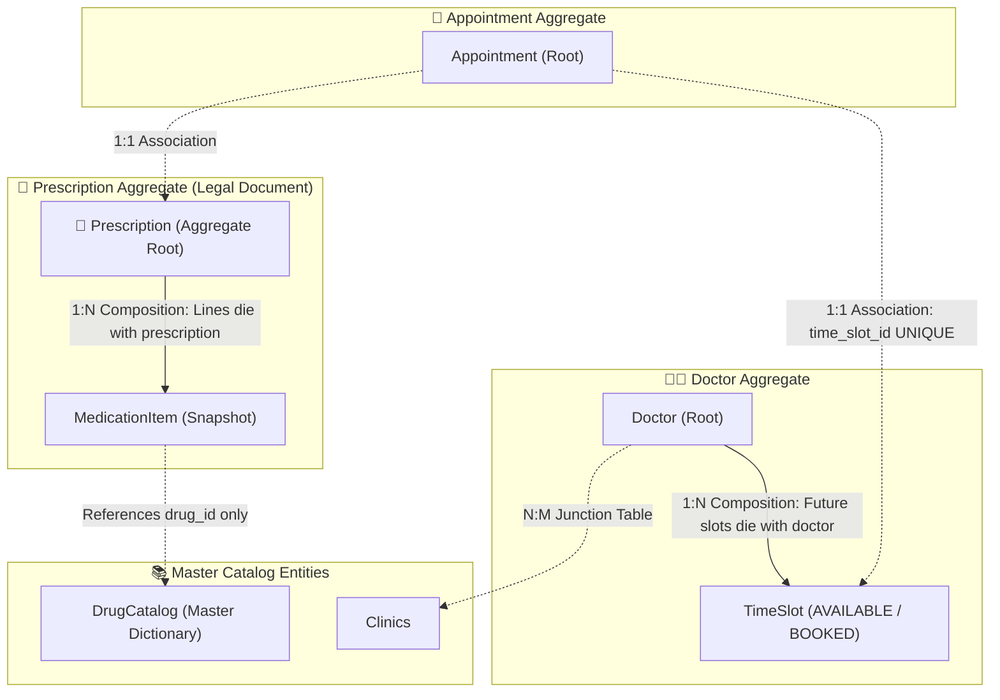

# Production Drill: Telemedicine & E-Prescription Domain Relationships & The Relationship Discovery Framework

> **Track:** LLD & Domain Modeling  
> **Topic:** The Relationship Discovery Framework (The Death Test & 2-Way Check), Candidate Mistake Analysis, DDD Aggregate Roots, & Healthcare Telemedicine LLD  
> **Level:** SDE-1 / SDE-2 $\rightarrow$ Senior Engineer / Tech Lead  
> **Case Study:** Telemedicine Platform & Digital Prescription Engine (Practo / Teladoc)

---

## 🧭 Executive Summary

In Domain-Driven Design (DDD) and LLD interviews, modeling clinical and legal systems requires strict separation between **immutable legal documents (Prescriptions)**, **concurrency-sensitive booking state (TimeSlots & Appointments)**, and **central master dictionaries (DrugCatalog)**.

This guide captures the complete Telemedicine drill: contrasting the candidate's initial proposal with the Tech Lead production solution, dissecting common lifecycle traps, and presenting the **Fail-Safe Relationship Discovery Framework**.

---

## 🏢 The Production Problem Scenario

Design the core domain model and database schema for an on-demand telemedicine platform (like Practo, Teladoc, or Zocdoc):
1. **Multi-Clinic Practice & TimeSlot Availability:**
   - A `Doctor` consults across multiple `Clinics` (and conducts online video calls).
   - Doctors publish consultation **`TimeSlots`** (e.g. 10:00 AM – 10:30 AM).
   - Patients book an **`Appointment`** for an available `TimeSlot`.
2. **Consultation & Digital Prescription:**
   - At consultation end, the doctor issues a signed **`Prescription`**.
   - A `Prescription` contains multiple **`MedicationItems`** (e.g. 1x Amoxicillin 500mg, dosage: "Twice daily after meals", duration: "5 days").
   - The platform maintains a central **`DrugCatalog`** of 50,000+ approved pharmaceuticals.
3. **Legal Immutability & Anti-Double-Booking:**
   - **Legal Immutability:** Once signed, a `Prescription` is a legal medical record. If the manufacturer updates the drug name or formula in `DrugCatalog` later, past issued prescriptions must **never change**.
   - **Anti-Double-Booking:** Two patients clicking "Book" on the exact same 10:00 AM slot simultaneously must **never** result in a double-booked appointment.
   - **GDPR / HIPAA Anonymization:** If a patient deletes their account, pending appointments are cancelled, but past consultation history and signed prescriptions must remain legally preserved (anonymized).

---

## 🔍 Candidate Thought Process vs. Tech Lead Reality

### 1. What the Candidate Initially Proposed:

```text
// Candidate's Proposed Relationships:
1. Doctor & Clinic          : N:M Association
2. Doctor & TimeSlot        : 1:N Composition
3. Patient & Appointment    : 1:N Composition  (🚨 Trap)
4. Appointment & TimeSlot   : 1:1 Composition  (🚨 Trap)
5. Prescription & MedItem   : 1:N Association  (🚨 Trap)
6. MedItem & DrugCatalog    : N:M Composition  (🚨 Trap)

// Candidate's Proposed Aggregate Roots:
"Doctor, Clinic, DrugCatalog" (Missed Prescription!)
"Who owns MedicationItem? -> DrugCatalog" (🚨 Major Ownership Trap)
```

---

### 2. SDE Evaluation & Score (Calibrated for SDE ~2 YOE)

| Dimension | Rating | Observations |
| :--- | :--- | :--- |
| **Cardinality Detection** | **8.5 / 10** | Great job spotting $N:M$ (`Doctor-Clinic`), $1:N$ (`Doctor-TimeSlot`), and $1:1$ (`Appt-TimeSlot`)! |
| **Relationship Lifecycles** | **4 / 10** | Failed the "Death Test" on 4 relationships (`Patient-Appt`, `Appt-TimeSlot`, `Presc-MedItem`, `MedItem-Catalog`). |
| **Aggregate Root Ownership** | **4 / 10** | Believed `DrugCatalog` owns `MedicationItem`. In reality, `Prescription` owns `MedicationItem`! |
| **Snapshot Strategy** | **8.5 / 10** | Excellent intuition on snapshotting drug name, chemical formula, and dosage instructions. |
| **Overall Score** | **6.3 / 10** | Strong progress on cardinalities; needs the "Death Test" framework to master relationship types. |

---

## 🧠 The Relationship Discovery Framework: "How to Think to Get the Correct Relationship?"

To determine both **Cardinality** and **Relationship Type** for ANY two entities, ask these **Two Golden Questions**:

```
┌──────────────────────────────────────────────────────────────────────────────────────────────────┐
│                             THE 2-STEP RELATIONSHIP DISCOVERY FORMULA                            │
│                                                                                                  │
│  STEP 1 (The Multiplicity Question ➔ Gives Cardinality):                                         │
│  • Forward: "Can 1 A have MULTIPLE B's?" (Yes / No)                                              │
│  • Backward: "Can 1 B belong to MULTIPLE A's?" (Yes / No)                                        │
│  ➔ (Yes, No = 1:N) | (Yes, Yes = N:M) | (No, No = 1:1)                                          │
│                                                                                                  │
│  STEP 2 (The Death Test Question ➔ Gives Relationship Type):                                     │
│  • Ask: "If Parent A is deleted / cancelled, does Child B DIE immediately?"                      │
│  ➔ If YES (Child cannot live alone) ➔ COMPOSITION (Strong Ownership, Cascade Delete)            │
│  ➔ If NO (Child is freed up or lives on) ➔ ASSOCIATION / AGGREGATION (Loose Reference)           │
└──────────────────────────────────────────────────────────────────────────────────────────────────┘
```

---

### Applying the Formula to the 4 Traps:

#### 1. `Patient` $\leftrightarrow$ `Appointment`
* **Step 1 (Multiplicity):** Can 1 Patient have multiple appointments? **YES ($1 \rightarrow N$)**. Can 1 appointment belong to multiple patients? **NO ($1 \leftarrow 1$)** $\rightarrow$ **`1 : N`**.
* **Step 2 (The Death Test):** If an appointment is cancelled or deleted, does the *Patient profile die*? **NO!** The patient remains active in the hospital system.
* 👉 **Result:** **`1 : N` Association** *(Not Composition)*.

---

#### 2. `Appointment` $\leftrightarrow$ `TimeSlot`
* **Step 1 (Multiplicity):** Can 1 active appointment have multiple slots? **NO ($1 \rightarrow 1$)**. Can 1 slot be booked by multiple active appointments? **NO ($1 \leftarrow 1$)** $\rightarrow$ **`1 : 1`**.
* **Step 2 (The Death Test):** If the appointment is cancelled by the patient, is the *TimeSlot deleted from existence*? **NO!** The TimeSlot status changes from `BOOKED` back to `AVAILABLE` so another patient can book it!
* 👉 **Result:** **`1 : 1` Association** *(Not Composition)*.

---

#### 3. `Prescription` $\leftrightarrow$ `MedicationItem`
* **Step 1 (Multiplicity):** Can 1 Prescription have multiple prescribed lines? **YES ($1 \rightarrow N$)**.
* **Step 2 (The Death Test):** If the Prescription is deleted or voided, does this specific custom medication instruction (e.g. *"2 tablets daily for John Doe"*) continue floating around alone? **NO! It dies with the prescription.**
* 👉 **Result:** **`1 : N` Composition** *(Not Association)*.

---

#### 4. `MedicationItem` $\leftrightarrow$ `DrugCatalog`
* **Step 1 (Multiplicity):** Can 1 Drug in the catalog be prescribed across thousands of medication items? **YES ($1 \rightarrow N$)**.
* **Step 2 (The Death Test):** If a patient's prescription is deleted, does *Amoxicillin disappear from the national pharmaceutical catalog*? **NO!**
* 👉 **Result:** **`N : 1` Association** *(Not Composition)*.

---

## 👑 The DDD Aggregate Root Demystified



### Who owns `MedicationItem`?
* **`DrugCatalog`** is just an external dictionary. It does not know who the patient is, what dosage they need, or what allergies they have.
* **`Prescription` is the Aggregate Root.** The doctor adds medicines to the `Prescription`. The `Prescription` enforces legal validation (e.g., cannot be modified after signing) and controls the entire lifecycle of its `MedicationItems`.

---

## 🗄️ Relational Database Schema (PostgreSQL DDL)

```sql
-- 1. CLINICS & DOCTORS (N : M Association via Junction Table)
CREATE TABLE clinics (
    id VARCHAR(36) PRIMARY KEY,
    name VARCHAR(255) NOT NULL,
    address TEXT NOT NULL,
    city VARCHAR(100) NOT NULL
);

CREATE TABLE doctors (
    id VARCHAR(36) PRIMARY KEY,
    name VARCHAR(255) NOT NULL,
    specialization VARCHAR(100) NOT NULL,
    license_number VARCHAR(50) UNIQUE NOT NULL
);

-- 🔗 N : M JUNCTION TABLE (With Relationship Metadata)
CREATE TABLE doctor_clinic_affiliations (
    doctor_id VARCHAR(36) NOT NULL REFERENCES doctors(id) ON DELETE CASCADE,
    clinic_id VARCHAR(36) NOT NULL REFERENCES clinics(id) ON DELETE CASCADE,
    consultation_fee_cents BIGINT NOT NULL, -- Dr. Strange charges $50 at Clinic A, but $80 at Clinic B!
    room_number VARCHAR(20),
    working_days VARCHAR(50),               -- e.g. "MON,WED,FRI"
    PRIMARY KEY (doctor_id, clinic_id)
);

-- 2. TIME SLOTS (Composition with Doctor: 1:N)
CREATE TABLE time_slots (
    id VARCHAR(36) PRIMARY KEY,
    doctor_id VARCHAR(36) NOT NULL REFERENCES doctors(id) ON DELETE CASCADE,
    clinic_id VARCHAR(36) REFERENCES clinics(id), -- Nullable for online telemedicine
    start_time TIMESTAMP WITH TIME ZONE NOT NULL,
    end_time TIMESTAMP WITH TIME ZONE NOT NULL,
    status VARCHAR(20) NOT NULL DEFAULT 'AVAILABLE', -- 'AVAILABLE', 'LOCKED', 'BOOKED'
    version INT NOT NULL DEFAULT 0,                  -- 🔒 Optimistic Concurrency Lock
    UNIQUE (doctor_id, start_time)                   -- 🔒 Doctor cannot have overlapping slots!
);

-- 3. PATIENTS & APPOINTMENTS (1:N Association with Patient, 1:1 with TimeSlot)
CREATE TABLE patients (
    id VARCHAR(36) PRIMARY KEY,
    email VARCHAR(255) UNIQUE NOT NULL,
    name VARCHAR(255) NOT NULL,
    date_of_birth DATE NOT NULL,
    is_anonymized BOOLEAN DEFAULT FALSE -- GDPR / HIPAA Privacy Anonymization Flag
);

CREATE TABLE appointments (
    id VARCHAR(36) PRIMARY KEY,
    patient_id VARCHAR(36) NOT NULL REFERENCES patients(id) ON DELETE RESTRICT,
    doctor_id VARCHAR(36) NOT NULL REFERENCES doctors(id) ON DELETE RESTRICT,
    time_slot_id VARCHAR(36) NOT NULL REFERENCES time_slots(id) ON DELETE RESTRICT,
    
    status VARCHAR(20) NOT NULL DEFAULT 'SCHEDULED', -- 'SCHEDULED', 'IN_PROGRESS', 'COMPLETED', 'CANCELLED'
    consultation_fee_cents_snapshot BIGINT NOT NULL, -- 📸 Price Snapshot!
    created_at TIMESTAMP WITH TIME ZONE DEFAULT NOW(),
    
    UNIQUE (time_slot_id) -- 🔒 ANTI-DOUBLE-BOOKING SHIELD: 1 Slot = Exactly 1 Active Appointment!
);

-- 4. MASTER DRUG CATALOG (Source of Truth for Pharmaceuticals)
CREATE TABLE drug_catalog (
    id VARCHAR(36) PRIMARY KEY,
    brand_name VARCHAR(255) NOT NULL,
    generic_formula VARCHAR(255) NOT NULL, -- e.g. "Amoxicillin + Clavulanic Acid"
    strength VARCHAR(50) NOT NULL,          -- e.g. "500mg"
    manufacturer VARCHAR(255) NOT NULL
);

-- 5. PRESCRIPTION AGGREGATE ROOT (Legal Medical Document)
CREATE TABLE prescriptions (
    id VARCHAR(36) PRIMARY KEY,
    appointment_id VARCHAR(36) UNIQUE NOT NULL REFERENCES appointments(id) ON DELETE RESTRICT,
    doctor_id VARCHAR(36) NOT NULL REFERENCES doctors(id),
    patient_id VARCHAR(36) NOT NULL REFERENCES patients(id),
    diagnosis TEXT NOT NULL,
    digital_signature VARCHAR(255) NOT NULL,
    issued_at TIMESTAMP WITH TIME ZONE DEFAULT NOW()
);

-- 6. MEDICATION ITEMS (Composition with Prescription: 1:N)
CREATE TABLE medication_items (
    id VARCHAR(36) PRIMARY KEY,
    prescription_id VARCHAR(36) NOT NULL REFERENCES prescriptions(id) ON DELETE CASCADE,
    drug_id VARCHAR(36) NOT NULL REFERENCES drug_catalog(id) ON DELETE RESTRICT,
    
    -- 📸 LEGAL MEDICAL SNAPSHOTS (Immunizes prescription from drug catalog changes!)
    drug_brand_name_snapshot VARCHAR(255) NOT NULL,
    generic_formula_snapshot VARCHAR(255) NOT NULL,
    strength_snapshot VARCHAR(50) NOT NULL,
    
    dosage_instructions VARCHAR(255) NOT NULL, -- e.g. "1 Tablet after meals"
    frequency VARCHAR(50) NOT NULL,            -- e.g. "Twice daily"
    duration_days INT NOT NULL                 -- e.g. 5
);
```

---

## 🏛️ TypeScript Domain Model (Prescription Aggregate Root)

```typescript
// 💊 Value Object: Snapshot of a prescribed medication line
export class MedicationItem {
    constructor(
        public readonly id: string,
        public readonly drugId: string,
        public readonly drugBrandNameSnapshot: string,
        public readonly genericFormulaSnapshot: string,
        public readonly strengthSnapshot: string,
        public readonly dosageInstructions: string,
        public readonly durationDays: number
    ) {
        if (durationDays <= 0) throw new Error("Duration days must be positive.");
        Object.freeze(this);
    }
}

// 👑 AGGREGATE ROOT: Prescription
export class Prescription {
    private medications: MedicationItem[] = [];
    private isSigned: boolean = false;
    private digitalSignature?: string;

    constructor(
        public readonly id: string,
        public readonly appointmentId: string,
        public readonly doctorId: string,
        public readonly patientId: string,
        public readonly diagnosis: string
    ) {}

    // 🔒 Behavioral Method: Doctor adds medicine before signing
    public addMedication(item: MedicationItem): void {
        if (this.isSigned) {
            throw new Error("Legal Invariant Violation: Cannot modify a signed prescription.");
        }
        this.medications.push(item);
    }

    // 🔒 Behavioral Method: Doctor signs and seals the legal document
    public signPrescription(signatureHash: string): void {
        if (this.medications.length === 0) {
            throw new Error("Cannot sign a prescription with zero medication items.");
        }
        this.digitalSignature = signatureHash;
        this.isSigned = true;
    }

    public getMedications(): readonly MedicationItem[] {
        return Object.freeze([...this.medications]);
    }
}
```

---

## 📊 Summary Cheat Sheet: Relationship Types & Rules

| Relationship | Cardinality | Type | Who owns whom? | DB Constraint / FK |
| :--- | :--- | :--- | :--- | :--- |
| **`Doctor ── Clinic`** | `N : M` | **Association** | Independent peers | **Junction Table** `(doctor_id, clinic_id)` |
| **`Doctor ── TimeSlot`** | `1 : N` | **Composition** | Doctor owns slots | `doctor_id FK ON DELETE CASCADE` |
| **`Patient ── Appt`** | `1 : N` | **Association** | Independent entities | `patient_id FK ON DELETE RESTRICT` |
| **`Appt ── TimeSlot`** | `1 : 1` | **Association** | 1 active reservation | `time_slot_id FK UNIQUE` |
| **`Presc ── MedItem`** | `1 : N` | **Composition** | Prescription owns lines | `prescription_id FK ON DELETE CASCADE` |
| **`MedItem ── Catalog`** | `N : 1` | **Association** | Item references catalog | `drug_id FK ON DELETE RESTRICT` |

---

## 🔗 Related Vault Topics
- [01_object_relationships_association_aggregation_composition.md](file:///Users/flixstock/Desktop/personal%20project/learn/06-LLD-AND-CLEAN-ARCHITECTURE/04-domain-modeling-and-clean-arch/01_object_relationships_association_aggregation_composition.md)
- [02_lld_interview_framework_cardinality_and_db_schema_design.md](file:///Users/flixstock/Desktop/personal%20project/learn/06-LLD-AND-CLEAN-ARCHITECTURE/04-domain-modeling-and-clean-arch/02_lld_interview_framework_cardinality_and_db_schema_design.md)
- [03_deep_dive_cardinality_detection_questions_to_ask_and_junction_tables.md](file:///Users/flixstock/Desktop/personal%20project/learn/06-LLD-AND-CLEAN-ARCHITECTURE/04-domain-modeling-and-clean-arch/03_deep_dive_cardinality_detection_questions_to_ask_and_junction_tables.md)
- [04_production_db_design_normalization_3nf_indexing_concurrency.md](file:///Users/flixstock/Desktop/personal%20project/learn/06-LLD-AND-CLEAN-ARCHITECTURE/04-domain-modeling-and-clean-arch/04_production_db_design_normalization_3nf_indexing_concurrency.md)
- [05_production_drill_food_delivery_order_aggregate_relationships.md](file:///Users/flixstock/Desktop/personal%20project/learn/06-LLD-AND-CLEAN-ARCHITECTURE/04-domain-modeling-and-clean-arch/05_production_drill_food_delivery_order_aggregate_relationships.md)
