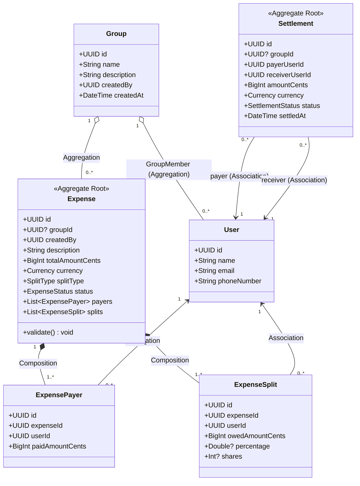

# Production Drill: Peer-to-Peer Expense Sharing & Debt Settlement Engine (Splitwise)

> **Track:** LLD & Domain Modeling  
> **Topic:** Multi-Payer Expense Modeling, DDD Aggregate Roots, Double-Entry Financial Invariants, Debt Simplification, & Database Schema Design  
> **Level:** SDE-1 / SDE-2 $\rightarrow$ Senior Engineer / Tech Lead  
> **Case Study:** Peer-to-Peer Group Expense & Settlement Engine (Splitwise / Venmo / Tricount)

---

## 🧭 Executive Summary

Designing an expense-sharing engine like **Splitwise** tests whether a backend engineer understands **double-entry ledger invariants**, **multi-payer vs. multi-debtor splits**, and **financial state modeling**.

A common candidate trap is treating an expense as a simple one-to-one or single-payer record with messy denormalized columns (`amount you owed to userId`, `amount you paid to userId`), or creating redundant empty junction tables. In production financial systems, **Money must balance down to the exact cent**, **Aggregate Roots must guard ledger invariants**, and **Settlement payments must be recorded as first-class transactions**.

This guide provides the complete post-mortem of the candidate's proposal, explains where and why it failed, and presents the production-grade domain model, clean database schema, and debt simplification algorithm.

---

## 🏢 The Production Problem Scenario

Design the low-level domain model and database schema for an expense-sharing and debt settlement platform (Splitwise):

1. **Groups & Non-Group Expenses:**
   - Users can create `Groups` (e.g. "Goa Trip 2026", "Roommates").
   - A user can be a member of multiple groups ($N:M$).
   - An `Expense` can belong to a `Group`, or can be a direct non-group expense between individual friends.
2. **Multi-Payer & Multi-Debtor Expenses:**
   - **Multi-Payer:** In real life, Alice may pay \$60 and Bob pays \$40 for a \$100 dinner.
   - **Multi-Debtor (Splits):** The \$100 expense is split among Alice, Bob, Charlie, and Dave using different strategies:
     - **EQUAL:** Divided equally (handling remainder cents deterministically).
     - **EXACT:** Exact custom amounts per user (e.g. Alice: \$25, Bob: \$35, Charlie: \$20, Dave: \$20).
     - **PERCENTAGE:** Split by percentage (summing to exactly $100.00\%$).
     - **SHARE:** Split by ratio/units (e.g. 2 shares vs 1 share).
3. **The Core Financial Rule:**
   `Total Money Paid = Total Money Owed = Total Expense Amount`
   - If any split is off by even 1 cent ($0.01), the transaction is immediately rejected.
4. **Debt Settlement & Balance Graph:**
   - A `Settlement` is a direct payment from User A to User B to clear accumulated debt.
   - The platform can compute **Net Balances** and run **Debt Simplification** (minimizing the total number of transactions required to settle up across a group).

---

## 🔍 Candidate Proposal vs. Tech Lead Reality

### 1. What the Candidate Proposed:

```text
// Candidate's Relationships:
1. user and group                -> N:M, aggregation
2. group and expense              -> 1:N, aggregation
3. expense and expensesplit       -> 1:N, composition
4. user and expense               -> N:M, aggregation
5. expense and settlement payment -> 1:N, composition  (🚨 Trap)

// Candidate's Answers to Domain Questions:
- Aggregate Roots: "User or Expense"
- Invariant Validator: "expensesplit is responsible for verifying that split sums equal total expense" (🚨 Trap)

// Candidate's Proposed Schema:
user: { id, name, mobile_number, email }
group: { id, name, createdAt, currentActiveUser }
user-group: { id, userId, groupId, JoinAt }
expense: { id, groupId, total money paid, expense created date }
user-expense junction table: { id, expenseId, userId, expenseSlipId }  (🚨 Redundant)

expensesplit: {
  id,
  userid,
  amount you owed to userId,      (🚨 Fatal Anti-Pattern)
  amount you paid to userId,
  total amount,
  amout you owed,
  amout paid by you,
  amount_paid_at,
  amount_payment_status
}
```

---

### 2. SDE Evaluation & Score (Calibrated for SDE ~2 YOE)

| Dimension | Rating | Observations |
| :--- | :--- | :--- |
| **Cardinality Detection** | **8.0 / 10** | Correctly identified `User-Group` ($N:M$), `Group-Expense` ($1:N$), and `Expense-Split` ($1:N$). |
| **Lifecycle & Relationship Types** | **5.0 / 10** | Misclassified `Expense-Settlement` as Composition (Settlement is an independent transaction). |
| **Aggregate Root Invariants** | **3.0 / 10** | Made `ExpenseSplit` validate the split sum. Line items cannot validate whole aggregates! |
| **Schema Normalization & Design** | **3.5 / 10** | Created redundant `user-expense` junction table; conflated Debtor & Creditor in `expensesplit`. |
| **Financial State Modeling** | **4.0 / 10** | Relied on UI-perspective columns (`amount you owed to userId`) instead of normalized double-entry ledger. |
| **Overall Score** | **4.7 / 10** | Shows good intuition for real-world entities, but requires mastery of DDD boundaries and clean schema modeling. |

---

## 💣 Detailed Autopsy: The 6 Traps Where the Candidate Failed

### Trap 1: The UI-Perspective Anti-Pattern in `expensesplit`
* **Candidate's columns:** `amount you owed to userId`, `amount you paid to userId`, `amout you owed`, `amout paid by you`.
* **The Fatal Flaw:** The candidate modeled the database table around how a single user's mobile screen looks (*"You owe Bob \$10"*).
* **The Production Reality:** A database table stores **objective domain facts**, not computed subjective UI perspectives.
  - In an expense, there are two distinct lists of facts:
    1. **Who funded the expense?** (`ExpensePayer` $\rightarrow$ `user_id`, `paid_amount`)
    2. **Who consumed the expense?** (`ExpenseSplit` $\rightarrow$ `user_id`, `owed_amount`)
  - The UI calculates *"You owe Bob \$10"* dynamically by subtracting your total consumption from your total payments across the ledger!

---

### Trap 2: The Redundant Junction Table Trap (`user-expense`)
* **Candidate's design:**
  ```text
  user-expense junction table: { id, expenseId, userId, expenseSlipId }
  ```
* **The Fatal Flaw:** The candidate created an empty junction table *in addition to* `expensesplit`.
* **The Production Rule:** If an entity already contains Foreign Keys to both parents along with rich metadata (e.g., `expense_splits` has `expense_id`, `user_id`, `owed_amount`), **that entity IS the junction table**. Adding a separate `user-expense` table is 100% duplicate data that introduces data divergence bugs.

---

### Trap 3: Misplacing the Invariant Validator (`ExpenseSplit` vs `Expense`)
* **Candidate's answer:** *"expensesplit is responsible for verifying that split sums equal total amount."*
* **The Fatal Flaw:** An individual line item (`ExpenseSplit`) only knows about its own user and its own \$25.00 share. It has zero visibility into sibling splits, payer totals, or the global expense sum.
* **The Production Rule (DDD Aggregate Root Invariant):**
  > **The Aggregate Root (`Expense`) is the ONLY boundary permitted to validate multi-entity invariants.**
  > `Expense.validate()` iterates through its internal list of `ExpensePayers` and `ExpenseSplits` to enforce that $\sum \text{Paid} = \sum \text{Owed} = \text{Total}$.

---

### Trap 4: `Expense` $\leftrightarrow$ `Settlement Payment` Lifecycle Trap
* **Candidate's answer:** `Expense and settlement payment -> 1:N, composition`.
* **The Fatal Flaw:**
  1. A `Settlement` (e.g. Alice sending \$50 to Bob via Venmo/UPI) is **NOT** a sub-item of an Expense.
  2. A settlement often clears debt accumulated across **15 different expenses** over 3 months. It cannot be owned by a single expense.
* **The Production Rule:**
  - `Expense` is an Aggregate Root representing **Debt Creation**.
  - `Settlement` (or `PaymentTransaction`) is an independent Aggregate Root representing **Debt Clearance**.
  - They are linked via the **Ledger/Balance Engine**, not parent-child Composition.

---

### Trap 5: The Single-Payer Blindspot
* **Candidate's column:** `expense.total money paid`.
* **The Fatal Flaw:** Assumes exactly one person pays for the entire expense.
* **The Production Reality:** In group trips, Alice pays \$60 for food, Bob pays \$40 for drinks, but it's recorded as a single \$100 "Dinner" expense.
* **The Solution:** An expense must support **Multi-Payer** through an `ExpensePayer` child entity.

---

### Trap 6: Floating-Point Financial Disasters
* **The Fatal Flaw:** Storing money as `FLOAT` or `DOUBLE` in SQL or code leads to IEEE 754 precision bugs (e.g. `0.1 + 0.2 = 0.30000000000000004`).
* **The Production Standard:**
  1. In DB: Store currency amounts as `BIGINT` representing the smallest currency unit (e.g. **cents / paise** $\rightarrow$ \$100.00 is stored as `10000`).
  2. Alternatively, use `DECIMAL(12, 2)` or `NUMERIC(12, 2)`.

---

## 👑 Clean Domain Model & DDD Aggregates



---

## 🧮 Double-Entry Ledger & Debt Simplification Algorithm

```text
User's Net Balance = (Total money you paid for others) - (Total money you owe others)
```

* **Positive balance (+):** The group owes you money (you are a Creditor).
* **Negative balance (-):** You owe the group money (you are a Debtor).
* **Zero balance (0):** You are completely settled up!
* **Golden Rule:** In any group, the sum of all balances always equals zero (every dollar owed is a dollar to be received).

---

### 2. Debt Simplification (Min-Cash-Flow via Greedy Heap)

If Alice owes Bob \$10, and Bob owes Charlie \$10, Bob does not need to intermediate. Alice can pay Charlie \$10 directly! This reduces $N$ transactions to at most $N - 1$ transactions.

```
Initial Graph (3 Transactions):
[Alice] --$10--> [Bob] --$10--> [Charlie] --$10--> [Alice] ➔ Loop!

Simplified Graph (0 Transactions):
Net Balances: Alice: $0, Bob: $0, Charlie: $0 ➔ Everyone is settled!
```

#### The Greedy Min-Cash-Flow Algorithm:
1. Compute Net Balance for every user. Filter out users with `balance == 0`.
2. Push debtors into a `Max-Heap` (sorted by max debt).
3. Push creditors into a `Max-Heap` (sorted by max credit).
4. Pop top debtor $D$ (owes $X$) and top creditor $C$ (is owed $Y$).
5. Settle $\min(X, Y)$ directly from $D \rightarrow C$.
6. If debtor still has remaining debt, push back with $X - \min(X, Y)$.
7. If creditor still has remaining credit, push back with $Y - \min(X, Y)$.
8. Repeat until heaps are empty. **Time Complexity:** $O(N \log N)$.

---

## 🗄️ Production Database Schema (PostgreSQL 3NF DDL)

```sql
-- ============================================================================
-- 1. USERS & GROUPS
-- ============================================================================

CREATE TABLE users (
    id UUID PRIMARY KEY DEFAULT gen_random_uuid(),
    name VARCHAR(100) NOT NULL,
    email VARCHAR(255) NOT NULL UNIQUE,
    phone_number VARCHAR(20) NOT NULL UNIQUE,
    created_at TIMESTAMPTZ NOT NULL DEFAULT CURRENT_TIMESTAMP,
    updated_at TIMESTAMPTZ NOT NULL DEFAULT CURRENT_TIMESTAMP
);

CREATE TABLE groups (
    id UUID PRIMARY KEY DEFAULT gen_random_uuid(),
    name VARCHAR(150) NOT NULL,
    description TEXT,
    created_by UUID NOT NULL REFERENCES users(id) ON DELETE RESTRICT,
    created_at TIMESTAMPTZ NOT NULL DEFAULT CURRENT_TIMESTAMP
);

-- Junction Table: Users in Groups
CREATE TABLE group_members (
    group_id UUID NOT NULL REFERENCES groups(id) ON DELETE CASCADE,
    user_id UUID NOT NULL REFERENCES users(id) ON DELETE CASCADE,
    joined_at TIMESTAMPTZ NOT NULL DEFAULT CURRENT_TIMESTAMP,
    is_admin BOOLEAN NOT NULL DEFAULT FALSE,
    PRIMARY KEY (group_id, user_id)
);

CREATE INDEX idx_group_members_user ON group_members(user_id);

-- ============================================================================
-- 2. EXPENSES & MULTI-PAYER / MULTI-DEBTOR SPLITS
-- ============================================================================

CREATE TYPE split_type_enum AS ENUM ('EQUAL', 'EXACT', 'PERCENTAGE', 'SHARE');
CREATE TYPE expense_status_enum AS ENUM ('ACTIVE', 'DELETED', 'VOIDED');

CREATE TABLE expenses (
    id UUID PRIMARY KEY DEFAULT gen_random_uuid(),
    group_id UUID REFERENCES groups(id) ON DELETE SET NULL, -- NULL indicates non-group friend expense
    description VARCHAR(255) NOT NULL,
    total_amount_cents BIGINT NOT NULL CHECK (total_amount_cents > 0),
    currency VARCHAR(3) NOT NULL DEFAULT 'USD',
    split_type split_type_enum NOT NULL,
    status expense_status_enum NOT NULL DEFAULT 'ACTIVE',
    created_by UUID NOT NULL REFERENCES users(id) ON DELETE RESTRICT,
    expense_date TIMESTAMPTZ NOT NULL DEFAULT CURRENT_TIMESTAMP,
    created_at TIMESTAMPTZ NOT NULL DEFAULT CURRENT_TIMESTAMP,
    updated_at TIMESTAMPTZ NOT NULL DEFAULT CURRENT_TIMESTAMP
);

CREATE INDEX idx_expenses_group_date ON expenses(group_id, expense_date DESC);
CREATE INDEX idx_expenses_created_by ON expenses(created_by);

-- 1:N Composition: Payers who funded the expense
CREATE TABLE expense_payers (
    id UUID PRIMARY KEY DEFAULT gen_random_uuid(),
    expense_id UUID NOT NULL REFERENCES expenses(id) ON DELETE CASCADE,
    user_id UUID NOT NULL REFERENCES users(id) ON DELETE RESTRICT,
    paid_amount_cents BIGINT NOT NULL CHECK (paid_amount_cents > 0),
    created_at TIMESTAMPTZ NOT NULL DEFAULT CURRENT_TIMESTAMP,
    CONSTRAINT uq_expense_payer UNIQUE (expense_id, user_id)
);

CREATE INDEX idx_expense_payers_user ON expense_payers(user_id);

-- 1:N Composition: Debtors who share/consume the expense
CREATE TABLE expense_splits (
    id UUID PRIMARY KEY DEFAULT gen_random_uuid(),
    expense_id UUID NOT NULL REFERENCES expenses(id) ON DELETE CASCADE,
    user_id UUID NOT NULL REFERENCES users(id) ON DELETE RESTRICT,
    owed_amount_cents BIGINT NOT NULL CHECK (owed_amount_cents >= 0),
    percentage NUMERIC(5, 2), -- e.g. 33.33 (Used when split_type = 'PERCENTAGE')
    shares INT,              -- e.g. 2 (Used when split_type = 'SHARE')
    created_at TIMESTAMPTZ NOT NULL DEFAULT CURRENT_TIMESTAMP,
    CONSTRAINT uq_expense_split UNIQUE (expense_id, user_id)
);

CREATE INDEX idx_expense_splits_user ON expense_splits(user_id);

-- ============================================================================
-- 3. SETTLEMENTS (DEBT CLEARANCE PAYMENTS)
-- ============================================================================

CREATE TYPE settlement_status_enum AS ENUM ('PENDING', 'COMPLETED', 'FAILED', 'CANCELLED');

CREATE TABLE settlements (
    id UUID PRIMARY KEY DEFAULT gen_random_uuid(),
    group_id UUID REFERENCES groups(id) ON DELETE SET NULL,
    payer_id UUID NOT NULL REFERENCES users(id) ON DELETE RESTRICT,
    receiver_id UUID NOT NULL REFERENCES users(id) ON DELETE RESTRICT,
    amount_cents BIGINT NOT NULL CHECK (amount_cents > 0),
    currency VARCHAR(3) NOT NULL DEFAULT 'USD',
    payment_method VARCHAR(50), -- 'UPI', 'VENMO', 'CASH', 'PAYPAL'
    transaction_reference VARCHAR(255),
    status settlement_status_enum NOT NULL DEFAULT 'COMPLETED',
    settled_at TIMESTAMPTZ NOT NULL DEFAULT CURRENT_TIMESTAMP,
    CONSTRAINT chk_different_settlement_users CHECK (payer_id <> receiver_id)
);

CREATE INDEX idx_settlements_group ON settlements(group_id);
CREATE INDEX idx_settlements_payer ON settlements(payer_id);
CREATE INDEX idx_settlements_receiver ON settlements(receiver_id);
```

---

## 💻 Clean Domain Implementation (TypeScript)

### 1. Value Object & Enums

```typescript
export enum SplitType {
  EQUAL = 'EQUAL',
  EXACT = 'EXACT',
  PERCENTAGE = 'PERCENTAGE',
  SHARE = 'SHARE'
}

export class Money {
  constructor(public readonly cents: bigint, public readonly currency: string = 'USD') {
    if (cents < 0n) {
      throw new Error("Money amount cannot be negative.");
    }
  }

  static fromDecimal(amount: number, currency: string = 'USD'): Money {
    return new Money(BigInt(Math.round(amount * 100)), currency);
  }

  add(other: Money): Money {
    this.assertSameCurrency(other);
    return new Money(this.cents + other.cents, this.currency);
  }

  subtract(other: Money): Money {
    this.assertSameCurrency(other);
    if (this.cents < other.cents) {
      throw new Error("Resulting money cannot be negative.");
    }
    return new Money(this.cents - other.cents, this.currency);
  }

  equals(other: Money): boolean {
    return this.cents === other.cents && this.currency === other.currency;
  }

  private assertSameCurrency(other: Money): void {
    if (this.currency !== other.currency) {
      throw new Error(`Currency mismatch: ${this.currency} vs ${other.currency}`);
    }
  }
}
```

---

### 2. Strategy Pattern for Expense Split Invariant Calculation

```typescript
export interface SplitAllocationRequest {
  userId: string;
  exactAmountCents?: bigint;
  percentage?: number;
  shares?: number;
}

export interface SplitStrategy {
  calculateSplits(
    totalAmount: Money,
    requests: SplitAllocationRequest[]
  ): Map<string, Money>;
}

export class EqualSplitStrategy implements SplitStrategy {
  calculateSplits(totalAmount: Money, requests: SplitAllocationRequest[]): Map<string, Money> {
    const count = BigInt(requests.length);
    if (count === 0n) throw new Error("At least one user must be included in split.");

    const baseAmount = totalAmount.cents / count;
    let remainder = totalAmount.cents % count;

    const result = new Map<string, Money>();

    // Deterministically distribute remainder cents to the first N participants
    for (const req of requests) {
      const extraCent = remainder > 0n ? 1n : 0n;
      if (remainder > 0n) remainder--;

      result.set(req.userId, new Money(baseAmount + extraCent, totalAmount.currency));
    }

    return result;
  }
}

export class ExactSplitStrategy implements SplitStrategy {
  calculateSplits(totalAmount: Money, requests: SplitAllocationRequest[]): Map<string, Money> {
    const result = new Map<string, Money>();
    let sum = 0n;

    for (const req of requests) {
      if (req.exactAmountCents === undefined || req.exactAmountCents < 0n) {
        throw new Error(`Exact amount required for user ${req.userId}`);
      }
      result.set(req.userId, new Money(req.exactAmountCents, totalAmount.currency));
      sum += req.exactAmountCents;
    }

    if (sum !== totalAmount.cents) {
      throw new Error(`Exact splits sum (${sum} cents) does not match total (${totalAmount.cents} cents)`);
    }

    return result;
  }
}

export class PercentageSplitStrategy implements SplitStrategy {
  calculateSplits(totalAmount: Money, requests: SplitAllocationRequest[]): Map<string, Money> {
    const totalPercentage = requests.reduce((acc, req) => acc + (req.percentage || 0), 0);
    if (Math.abs(totalPercentage - 100.0) > 0.001) {
      throw new Error(`Percentages must sum to 100%. Current sum: ${totalPercentage}%`);
    }

    const result = new Map<string, Money>();
    let allocatedCents = 0n;

    for (let i = 0; i < requests.length; i++) {
      const req = requests[i];
      if (i === requests.length - 1) {
        // Last member absorbs rounding remainder
        const remaining = totalAmount.cents - allocatedCents;
        result.set(req.userId, new Money(remaining, totalAmount.currency));
      } else {
        const shareCents = BigInt(Math.round((Number(totalAmount.cents) * (req.percentage!)) / 100));
        result.set(req.userId, new Money(shareCents, totalAmount.currency));
        allocatedCents += shareCents;
      }
    }

    return result;
  }
}
```

---

### 3. The `Expense` Aggregate Root (Guarding Invariants)

```typescript
export interface PayerShare {
  userId: string;
  amount: Money;
}

export interface DebtorShare {
  userId: string;
  amount: Money;
}

export class Expense {
  private readonly _payers: PayerShare[] = [];
  private readonly _splits: DebtorShare[] = [];

  constructor(
    public readonly id: string,
    public readonly description: string,
    public readonly totalAmount: Money,
    public readonly splitType: SplitType,
    public readonly createdBy: string,
    public readonly groupId?: string
  ) {}

  public setFinancials(payers: PayerShare[], splits: DebtorShare[]): void {
    if (payers.length === 0) throw new Error("An expense must have at least one payer.");
    if (splits.length === 0) throw new Error("An expense must have at least one split debtor.");

    // INVARIANT 1: Sum of Payers must equal Expense Total
    const totalPaid = payers.reduce(
      (acc, p) => acc + p.amount.cents,
      0n
    );
    if (totalPaid !== this.totalAmount.cents) {
      throw new Error(`Total paid (${totalPaid}) does not equal expense total (${this.totalAmount.cents})`);
    }

    // INVARIANT 2: Sum of Splits must equal Expense Total
    const totalOwed = splits.reduce(
      (acc, s) => acc + s.amount.cents,
      0n
    );
    if (totalOwed !== this.totalAmount.cents) {
      throw new Error(`Total owed (${totalOwed}) does not equal expense total (${this.totalAmount.cents})`);
    }

    this._payers.length = 0;
    this._payers.push(...payers);

    this._splits.length = 0;
    this._splits.push(...splits);
  }

  get payers(): readonly PayerShare[] {
    return this._payers;
  }

  get splits(): readonly DebtorShare[] {
    return this._splits;
  }
}
```

---

### 4. Greedy Debt Simplification Engine

```typescript
interface UserBalance {
  userId: string;
  netBalanceCents: bigint;
}

export interface SimplifiedTransaction {
  fromUserId: string;
  toUserId: string;
  amountCents: bigint;
}

export class DebtSimplificationEngine {
  public static simplifyDebts(balances: UserBalance[]): SimplifiedTransaction[] {
    const transactions: SimplifiedTransaction[] = [];

    // Separate into Debtors (negative) and Creditors (positive)
    const debtors: { userId: string; debt: bigint }[] = [];
    const creditors: { userId: string; credit: bigint }[] = [];

    for (const b of balances) {
      if (b.netBalanceCents < 0n) {
        debtors.push({ userId: b.userId, debt: -b.netBalanceCents });
      } else if (b.netBalanceCents > 0n) {
        creditors.push({ userId: b.userId, credit: b.netBalanceCents });
      }
    }

    let i = 0; // debtor index
    let j = 0; // creditor index

    while (i < debtors.length && j < creditors.length) {
      const debtor = debtors[i];
      const creditor = creditors[j];

      const settlementAmount = debtor.debt < creditor.credit ? debtor.debt : creditor.credit;

      transactions.push({
        fromUserId: debtor.userId,
        toUserId: creditor.userId,
        amountCents: settlementAmount
      });

      debtor.debt -= settlementAmount;
      creditor.credit -= settlementAmount;

      if (debtor.debt === 0n) i++;
      if (creditor.credit === 0n) j++;
    }

    return transactions;
  }
}
```

---

## 🎯 Master Summary Checklist for LLD Interviews

```
┌─────────────────────────────────────────────────────────────────────────────────────────────┐
│                       PEER-TO-PEER EXPENSE SHARING GOLDEN RULES                             │
├─────────────────────────────────────────────────────────────────────────────────────────────┤
│ 1. NEVER store UI perspectives in tables ("amount you owe to Bob"). Store raw ledger facts: │
│    • Who Paid? (ExpensePayer: expense_id, user_id, paid_amount)                             │
│    • Who Owed? (ExpenseSplit: expense_id, user_id, owed_amount)                             │
│                                                                                             │
│ 2. Expense is the Aggregate Root. Child lines (ExpenseSplit) NEVER validate sibling state.   │
│    Expense.validate() enforces: SUM(paid) == SUM(owed) == total_amount.                     │
│                                                                                             │
│ 3. Never use float for currency. Always use BIGINT cents / paise or DECIMAL(12, 2).         │
│                                                                                             │
│ 4. Settlement is an independent Aggregate Root (Debt Clearance), not an Expense child.      │
│                                                                                             │
│ 5. Use the Strategy Pattern for Split Algorithms (Equal, Exact, Percentage, Share).         │
└─────────────────────────────────────────────────────────────────────────────────────────────┘
```
