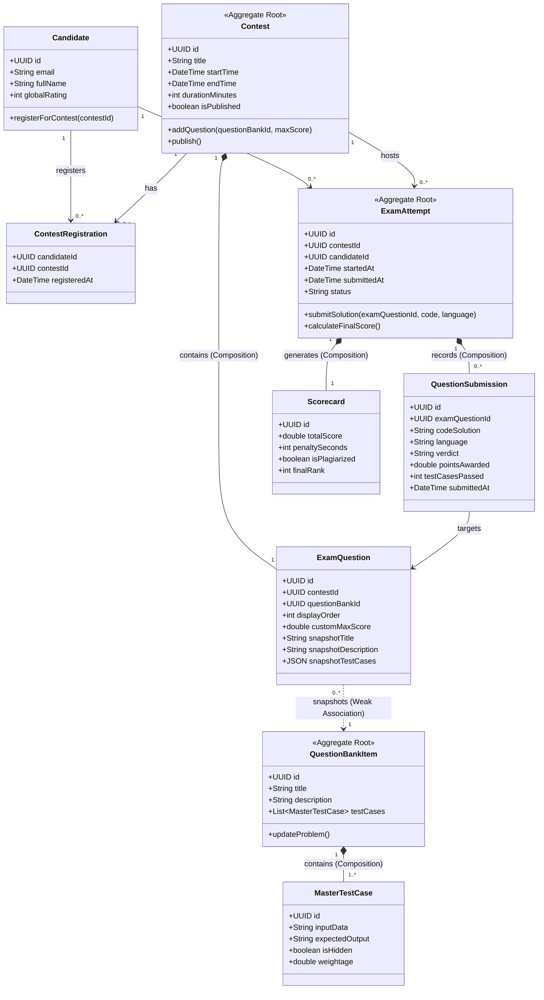

# Production Drill: Online Assessment & Examination Engine (HackerRank / LeetCode Contests)

> **Track:** LLD & Clean Architecture  
> **Topic:** The Relationship Discovery Framework, Aggregate Roots, Legal Immutability & Snapshotting, Candidate Mistake Breakdown  
> **Level:** SDE-1 / SDE-2 $\rightarrow$ Senior Engineer / Tech Lead  
> **Case Study:** Distributed Online Coding Contest & Examination Engine (HackerRank / LeetCode / Mettl)

---

## 🧭 Executive Summary

In high-concurrency assessment platforms (HackerRank, LeetCode, Codility), systems must balance three conflicting architectural requirements:
1. **Catalog Reusability:** A central, evolving repository of problems and test cases.
2. **Contest Customization:** Contests attaching arbitrary problems with custom scoring, time limits, and point weightage.
3. **Legal Immutability & Historical Integrity:** Future modifications or deletions in the master question bank must never alter historical scores, test evaluations, or leaderboard rankings.

This guide provides the complete drill analysis: contrasting common candidate misconceptions with the Tech Lead production model, outlining Aggregate Roots, invariants, full 3NF PostgreSQL DDL, and a complete UML Class Diagram.

---

## 🏢 Business Context & Problem Statement

Design the core domain model and database schema for a multi-tenant Online Assessment & Examination Engine:

1. **Contest / Exam Creation & Custom Marking:**
   - An Organization or Recruiter creates a `Contest` (e.g., *"Google Fall SDE Assessment 2026"*).
   - The platform maintains a global `QuestionBank` of 100,000+ coding problems and MCQs (title, description, test cases, baseline difficulty).
   - The recruiter selects questions from `QuestionBank` and attaches them to the `Contest` as `ExamQuestion` items with custom weightage/max scores (e.g., Problem A is worth 20 points in Contest 1, but 50 points in Contest 2).

2. **Student Participation & Exam Attempts:**
   - A `Candidate` registers for and starts a timed `ExamAttempt`.
   - During the attempt, the candidate submits code/answers for each question (`QuestionSubmission`).

3. **Legal Snapshot & Immutability:**
   - If an author edits or deletes a problem in the global `QuestionBank` tomorrow, past contests, candidate submissions, test case runs, and awarded scores **must never change or break**.

4. **Scoring & Leaderboard:**
   - Each `ExamAttempt` produces a final `Scorecard` containing total points, penalty time, and pass/fail verdict.

---

## 🔍 Candidate Thought Process vs. Tech Lead Reality

### 1. What the Candidate Initially Proposed:

```text
// Candidate's Proposed Relationships:
1. Candidate <-> Contest          : N:M Aggregation (Junction table)
2. Contest <-> ExamQuestion       : N:M Composition                 (🚨 Cardinality Trap)
3. ExamQuestion <-> QuestionBank  : 1:N Composition                 (🚨 Lifecycle / Death Test Trap)
4. Candidate <-> ExamAttempt      : 1:N Association
5. ExamAttempt <-> Submission     : 1:1 Composition                 (🚨 Multiplicity Trap)
6. ExamAttempt <-> Scorecard      : 1:N Aggregation                 (🚨 Cardinality & Lifecycle Trap)

// Candidate's Proposed Aggregate Roots:
"Contest" (Missed QuestionBank, Candidate, and ExamAttempt!)
"Who owns QuestionAnswer? -> Candidate"                             (🚨 Transactional Boundary Trap)
"Who enforces Total Score Invariant? -> Submission"                (🚨 Scope Invariant Trap)

// Candidate's Proposed Schema:
Attempt: { id, submissionId, contestId, candidateId, examQuestionId } (🚨 Inverted Foreign Key)
Scorecard: { submissionId, contestId, attemptId }                     (🚨 Granularity Trap)
```

---

### 2. SDE Evaluation & Score (Calibrated for SDE ~2 YOE)

| Dimension | Rating | Observations |
| :--- | :--- | :--- |
| **Cardinality Detection** | **6.0 / 10** | Correctly identified `Candidate-Contest` ($N:M$) and `Candidate-Attempt` ($1:N$). Inverted `Attempt-Submission` ($1:1$ instead of $1:N$) and `Attempt-Scorecard` ($1:N$ instead of $1:1$). |
| **Relationship Lifecycles** | **4.5 / 10** | Failed the "Death Test" on `ExamQuestion-QuestionBank` (marked Composition instead of loose Association). |
| **Aggregate Root Boundaries** | **5.0 / 10** | Assigned submission ownership to `Candidate` instead of `ExamAttempt`. Mistook `Submission` for the total score invariant enforcer. |
| **Snapshot Intuition** | **8.0 / 10** | Good intuition on copying question text, options, and constraints to prevent mutation. |
| **Schema Integrity** | **5.0 / 10** | Inverted FK on `attempt` table (`submissionId` inside attempt); incorrect granularity on `scorecard`. |
| **Overall Score** | **5.7 / 10** | Promising domain intuition; needs discipline on transactional boundaries and relational FK placement. |

---

### 3. Deep Dive on the 5 Candidate Misconceptions

#### Misconception 1: `ExamQuestion` $\longleftrightarrow$ `QuestionBank` is Composition
- **Candidate Logic:** "An exam question comes from the question bank, so they are tightly coupled."
- **Tech Lead Correction:** Run the **Death Test**: If an author deletes or renames a problem in the global `QuestionBank` next week, should all past contests that used this question get deleted or corrupted? **Never.** `ExamQuestion` takes an immutable snapshot. The relationship is a loose **Association / Weak Reference** (`ON DELETE SET NULL`), not Composition.

#### Misconception 2: `ExamAttempt` $\longleftrightarrow$ `Submission` is 1:1
- **Candidate Logic:** "An attempt submits code."
- **Tech Lead Correction:** An exam consists of $K$ questions (e.g., 5 coding problems). A candidate submits code multiple times per question (run tests, final submit). Therefore, 1 `ExamAttempt` contains **1:N** `QuestionSubmissions`.

#### Misconception 3: `ExamAttempt` $\longleftrightarrow$ `Scorecard` is 1:N Aggregation
- **Candidate Logic:** "Scorecard records the scores."
- **Tech Lead Correction:** 1 Exam Attempt produces exactly **1** consolidated `Scorecard` (`1:1`). If the attempt is wiped, the scorecard cannot exist independently (`Composition`).

#### Misconception 4: `Candidate` owns `QuestionAnswer`
- **Candidate Logic:** "The candidate is the one typing the answer."
- **Tech Lead Correction:** In DDD, an **Aggregate Root** is the transactional consistency boundary. If `Candidate` owned submissions, taking multiple tests or concurrent grading would lock the entire User entity. `ExamAttempt` is the transactional root: it manages time limits, active status, submission counts, and atomic score computation.

#### Misconception 5: Inverted Foreign Key in Schema
- **Candidate Schema:** `Attempt` table contains `submissionId`.
- **Tech Lead Correction:** In 1:N relationships, the **child entity** (`submissions`) holds the foreign key (`attempt_id`). Putting `submissionId` on `attempt` restricts the attempt to a single submission.

---

## 🧠 The Relationship Discovery Matrix

| Pair | Multiplicity (Cardinality) | Lifecycle / Death Test | Relationship Type | Key Production Rationale |
|---|---|---|---|---|
| **`Candidate` $\longleftrightarrow$ `Contest`** | `N : M` | Deleting a contest does not delete users. Deleting a user anonymizes past contest history. | **Association / Aggregation** | Joined via `contest_registrations` table. |
| **`Contest` $\longleftrightarrow$ `ExamQuestion`** | `1 : N` | Deleting a contest deletes its question attachments and custom score overrides. | **Composition** | `ExamQuestion` is contest-scoped and stores custom points. |
| **`ExamQuestion` $\longleftrightarrow$ `QuestionBank`** | `N : 1` | Deleting master question must **never** delete historical contest questions. | **Association** | Weak foreign key + full snapshot of text & test cases. |
| **`Candidate` $\longleftrightarrow$ `ExamAttempt`** | `1 : N` | A student can attempt multiple exams over time. | **Association** | Candidate references attempts; attempt belongs to candidate. |
| **`ExamAttempt` $\longleftrightarrow$ `QuestionSubmission`** | `1 : N` | Submissions belong exclusively to a single timed attempt session. | **Composition** | `ON DELETE CASCADE` from Attempt to Submissions. |
| **`ExamAttempt` $\longleftrightarrow$ `Scorecard`** | `1 : 1` | Exactly one consolidated result per attempt session. | **Composition** | `attempt_id UNIQUE` on `scorecards`. |

---

## 🏗️ Domain Model & Aggregate Roots

```
┌────────────────────────────────────────────────────────────────────────┐
│                        DOMAIN AGGREGATE ROOTS                          │
├───────────────────┬───────────────────┬────────────────────────────────┤
│ 1. QuestionBank   │ 2. Contest        │ 3. ExamAttempt                 │
│ (Catalog Root)    │ (Template Root)   │ (Runtime & Scoring Root)       │
├───────────────────┼───────────────────┼────────────────────────────────┤
│ - QuestionBankItem│ - Contest         │ - ExamAttempt                  │
│ - MasterTestCase  │ - ExamQuestion    │ - QuestionSubmission           │
│ - Editorial       │ - RegistrationRule│ - Scorecard                    │
└───────────────────┴───────────────────┴────────────────────────────────┘
```

### Invariant Enforcement Rules:
1. **Time Window Invariant:** An `ExamAttempt` can only accept submissions if $\text{CurrentTime} \le \text{StartedAt} + \text{DurationMinutes}$ and $\text{CurrentTime} \le \text{Contest.EndTime}$.
2. **Score Consistency Invariant:** The `Scorecard.total_score` is strictly computed as $\sum \max(\text{points\_awarded for each ExamQuestion})$.
3. **Snapshot Invariant:** `ExamQuestion` captures an immutable deep copy of test cases, constraints, and descriptions at the moment the contest is published.

---

## 🗄️ Production PostgreSQL Database Schema (3NF)

```sql
-- ============================================================================
-- 1. QUESTION BANK BOUNDED CONTEXT (Mutable Master Catalog)
-- ============================================================================
CREATE TABLE question_bank (
    id UUID PRIMARY KEY DEFAULT gen_random_uuid(),
    title VARCHAR(255) NOT NULL,
    description_markdown TEXT NOT NULL,
    default_difficulty VARCHAR(32) NOT NULL CHECK (default_difficulty IN ('EASY', 'MEDIUM', 'HARD')),
    author_id UUID NOT NULL,
    created_at TIMESTAMP WITH TIME ZONE DEFAULT NOW(),
    updated_at TIMESTAMP WITH TIME ZONE DEFAULT NOW()
);

CREATE TABLE master_test_cases (
    id UUID PRIMARY KEY DEFAULT gen_random_uuid(),
    question_bank_id UUID NOT NULL REFERENCES question_bank(id) ON DELETE CASCADE,
    input_data TEXT NOT NULL,
    expected_output TEXT NOT NULL,
    is_hidden BOOLEAN NOT NULL DEFAULT TRUE,
    weightage NUMERIC(5, 2) NOT NULL DEFAULT 1.00
);

-- ============================================================================
-- 2. CONTEST TEMPLATE BOUNDED CONTEXT
-- ============================================================================
CREATE TABLE contests (
    id UUID PRIMARY KEY DEFAULT gen_random_uuid(),
    organization_id UUID NOT NULL,
    title VARCHAR(255) NOT NULL,
    slug VARCHAR(255) UNIQUE NOT NULL,
    start_time TIMESTAMP WITH TIME ZONE NOT NULL,
    end_time TIMESTAMP WITH TIME ZONE NOT NULL,
    duration_minutes INT NOT NULL CHECK (duration_minutes > 0),
    is_published BOOLEAN DEFAULT FALSE,
    created_at TIMESTAMP WITH TIME ZONE DEFAULT NOW(),
    CONSTRAINT valid_contest_window CHECK (end_time > start_time)
);

-- Exam Question (Composition of Contest + Immutable Snapshot)
CREATE TABLE exam_questions (
    id UUID PRIMARY KEY DEFAULT gen_random_uuid(),
    contest_id UUID NOT NULL REFERENCES contests(id) ON DELETE CASCADE,
    question_bank_id UUID REFERENCES question_bank(id) ON DELETE SET NULL, -- Loose reference
    display_order INT NOT NULL,
    custom_max_score NUMERIC(5, 2) NOT NULL CHECK (custom_max_score > 0),
    time_limit_ms INT NOT NULL DEFAULT 2000,
    memory_limit_mb INT NOT NULL DEFAULT 256,
    
    -- Immutable Snapshot Payload
    snapshot_title VARCHAR(255) NOT NULL,
    snapshot_description TEXT NOT NULL,
    snapshot_test_cases JSONB NOT NULL, -- Array of {input, expected_output, is_hidden, weight}
    
    created_at TIMESTAMP WITH TIME ZONE DEFAULT NOW(),
    UNIQUE(contest_id, display_order)
);

-- ============================================================================
-- 3. CANDIDATE & REGISTRATION
-- ============================================================================
CREATE TABLE candidates (
    id UUID PRIMARY KEY DEFAULT gen_random_uuid(),
    email VARCHAR(255) UNIQUE NOT NULL,
    full_name VARCHAR(255) NOT NULL,
    global_rating INT DEFAULT 1500,
    created_at TIMESTAMP WITH TIME ZONE DEFAULT NOW()
);

CREATE TABLE contest_registrations (
    id UUID PRIMARY KEY DEFAULT gen_random_uuid(),
    candidate_id UUID NOT NULL REFERENCES candidates(id),
    contest_id UUID NOT NULL REFERENCES contests(id) ON DELETE CASCADE,
    registered_at TIMESTAMP WITH TIME ZONE DEFAULT NOW(),
    UNIQUE(candidate_id, contest_id)
);

-- ============================================================================
-- 4. EXAM EXECUTION & SCORING BOUNDED CONTEXT (Attempt Aggregate Root)
-- ============================================================================
CREATE TABLE exam_attempts (
    id UUID PRIMARY KEY DEFAULT gen_random_uuid(),
    contest_id UUID NOT NULL REFERENCES contests(id),
    candidate_id UUID NOT NULL REFERENCES candidates(id),
    started_at TIMESTAMP WITH TIME ZONE NOT NULL DEFAULT NOW(),
    submitted_at TIMESTAMP WITH TIME ZONE,
    status VARCHAR(32) NOT NULL CHECK (status IN ('IN_PROGRESS', 'SUBMITTED', 'DISQUALIFIED', 'TIMED_OUT')),
    created_at TIMESTAMP WITH TIME ZONE DEFAULT NOW(),
    UNIQUE(contest_id, candidate_id) -- 1 attempt per contest per candidate
);

-- Individual Question Submissions (1:N with Attempt)
CREATE TABLE question_submissions (
    id UUID PRIMARY KEY DEFAULT gen_random_uuid(),
    attempt_id UUID NOT NULL REFERENCES exam_attempts(id) ON DELETE CASCADE,
    exam_question_id UUID NOT NULL REFERENCES exam_questions(id),
    code_solution TEXT NOT NULL,
    language VARCHAR(32) NOT NULL,
    verdict VARCHAR(32) NOT NULL CHECK (verdict IN ('ACCEPTED', 'WRONG_ANSWER', 'TLE', 'MEMORY_LIMIT', 'RUNTIME_ERROR', 'PENDING')),
    points_awarded NUMERIC(5, 2) NOT NULL DEFAULT 0.00,
    test_cases_passed INT NOT NULL DEFAULT 0,
    total_test_cases INT NOT NULL,
    execution_time_ms INT,
    memory_used_kb INT,
    submitted_at TIMESTAMP WITH TIME ZONE NOT NULL DEFAULT NOW()
);

-- Consolidated Scorecard (1:1 with Attempt)
CREATE TABLE scorecards (
    id UUID PRIMARY KEY DEFAULT gen_random_uuid(),
    attempt_id UUID UNIQUE NOT NULL REFERENCES exam_attempts(id) ON DELETE CASCADE,
    total_score NUMERIC(6, 2) NOT NULL DEFAULT 0.00,
    penalty_seconds INT NOT NULL DEFAULT 0,
    is_plagiarized BOOLEAN DEFAULT FALSE,
    final_rank INT,
    generated_at TIMESTAMP WITH TIME ZONE DEFAULT NOW()
);

-- ============================================================================
-- 5. INDEXES FOR PERFORMANCE & CONCURRENCY
-- ============================================================================
CREATE INDEX idx_exam_questions_contest ON exam_questions(contest_id, display_order);
CREATE INDEX idx_submissions_attempt ON question_submissions(attempt_id, exam_question_id);
CREATE INDEX idx_scorecards_ranking ON scorecards(total_score DESC, penalty_seconds ASC);
```

---

## 📐 Complete Domain UML Class Diagram



---

## 🎯 Key Takeaways for SDE-2 $\rightarrow$ Senior / Lead

1. **Snapshots are Mandatory in Exam Engines:** Never perform a dynamic `JOIN` on live master catalogs for past contests. What is executed must be the exact state frozen when the contest started.
2. **The Aggregate Root Defines the Transaction Boundary:** `ExamAttempt` manages the session lifecycle. Adding submissions and grading updates must pass through the `ExamAttempt` invariant checks.
3. **Death Test Differentiates Association from Composition:** When testing whether $A$ composes $B$, always ask: *"If $A$ is deleted or altered, does business compliance require $B$ to survive?"* If $B$ must survive, it cannot be Composition.
