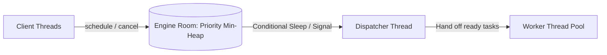

# LLD INTERVIEW MASTERY: THE TECH LEAD BLUEPRINT & STEP-BY-STEP PLAYBOOK

- **Topic ID**: `LLD-01-INTERVIEW-MASTERY-PLAYBOOK`
- **Date**: `2026-08-29`
- **Module**: `Phase 6 — LLD & Clean Architecture`
- **Target Maturity**: `SDE (~2 YOE) → Senior Engineer / Tech Lead`

---

## 🏛️ PART 1: What Interviewers Are ACTUALLY Grading

In top-tier engineering interviews (Uber, Stripe, Razorpay, Amazon, Google), an **LLD (Low-Level Design / Machine Coding)** round is **never** a typing contest or a syntax memorization test.

Junior candidates panic, assume they must immediately start coding, and end up writing monolithic, rigid classes. A Senior Engineer / Tech Lead approaches it like a **software architect co-designing an enterprise library with a peer**.

| Dimension | Junior SDE (0–2 YOE) Instinct | Senior / Tech Lead Execution |
| :--- | :--- | :--- |
| **Ambiguity** | Assumes requirements or starts coding immediately. | Actively extracts boundaries, constraints, and non-goals in the first 5 minutes. |
| **API Design** | Designs from the inside out (starts with DB/fields). | Designs from the outside in (starts with how the caller invokes the API). |
| **Extensibility** | Uses huge `switch-case` statements and nested `if-else`. | Uses Strategy, Factory, or Observer patterns adhering strictly to Open/Closed. |
| **Concurrency** | Ignores thread safety or places blanket `synchronized` on everything. | Chooses granular locks, concurrent data structures, and avoids busy-waiting. |
| **Error Handling** | Ignores exceptions or lets unhandled errors crash worker threads. | Encapsulates failures, isolates thread pools, and ensures graceful degradation. |

---

## ⏱️ PART 2: The 45-Minute Time-Boxed Architecture

Never violate this time budget during a 45–60 minute interview:

```mermaid
gantt
    title 45-Minute LLD Interview Execution Budget
    dateFormat  m
    axisFormat %M min
    section Step 1
    Clarify & Lock Boundaries        :active, 0, 5m
    section Step 2
    Public API & Client Ergonomics   :5, 12m
    section Step 3
    Entity Modeling & Noun-Verb Map  :12, 20m
    section Step 4
    Engine Room & Concurrency        :20, 27m
    section Step 5
    Clean Implementation & SOLID     :27, 40m
    section Step 6
    Edge Cases & Graceful Shutdown   :40, 45m
```



---

## 🧭 PART 3: The 6-Step Battle-Tested LLD Framework

### STEP 1: Clarify & Lock Scope (Minutes 0–5)
**The Trap**: Building a spaceship when the interviewer wanted a bicycle.
**The Fix**: Ask the 4 "Golden Boundary" questions out loud:

1. **In-Memory vs Distributed**:
   > *"Are we designing this strictly as an in-memory library/service within a single node process, or does state need to survive crashes via persistent storage (Redis/Postgres)?"*
2. **Synchronous vs Asynchronous**:
   > *"Should the caller block waiting for completion, or does the system acknowledge immediately and process work via background workers?"*
3. **Concurrency Level & Throughput**:
   > *"What scale are we targeting? Are multiple threads reading and writing concurrently?"*
4. **Non-Goals (What we are NOT building)**:
   > *"To keep our 45 minutes focused on the core scheduling/routing engine, I suggest we mock authentication and network transport. Does that sound good?"*

---

### STEP 2: Client Ergonomics First (Minutes 5–12)
**The Mental Model**: Before designing classes, ask: *"How will another engineer write code using my library?"*
Write the proposed client invocation on the whiteboard/editor first. This guarantees you don't build useless abstractions.

```java
// STEP 2 VISUALIZATION: How client code consumes our engine
CustomScheduler scheduler = new CustomScheduler(poolSize: 4);

// 1. One-off delayed task
ScheduledFuture<?> future = scheduler.schedule(() -> sendNotification("user_123"), 5, TimeUnit.SECONDS);

// 2. Cancellation
future.cancel();
```
*Ask the interviewer: "Does this API signature meet all your expectations before I dive into the internal domain entities?"* (Interviewers love this collaboration).

---

### STEP 3: Domain Entity Modeling (Minutes 12–20)
Use the **Noun-Verb-State Extraction Technique**:
Read the problem statement and highlight:
- **Nouns $\rightarrow$ Classes / Interfaces**
- **Verbs $\rightarrow$ Methods / Operations**
- **States $\rightarrow$ Enums**

```
Nouns: Task, Worker, Scheduler, PriorityQueue, Trigger
Verbs: schedule(), cancel(), execute(), poll(), shutdown()
States: SCHEDULED, RUNNING, COMPLETED, CANCELLED, FAILED
```

#### Core Separation Rule: Data vs Logic
1. **Domain Models (Entities)**: Hold identity and mutable lifecycle state (e.g., `ScheduledTask`).
2. **Engine / Services**: Coordinate operations, enforce thread safety, and orchestrate workers (e.g., `TaskScheduler`).
3. **Strategies / Policies**: Pluggable behaviors (e.g., `ExecutionStrategy`, `EvictionPolicy`).

---

### STEP 4: Choose the "Engine Room" (Minutes 20–27)
Every high-level LLD problem has an algorithmic core. State your data structure trade-offs clearly:



- **Why a Min-Heap / PriorityQueue over a List?**
  - List requires $O(N)$ scan every tick to find the next task.
  - Min-heap gives $O(1)$ peek at the earliest scheduled task and $O(\log N)$ insertion.
- **Why Condition Variables (`wait`/`notify` or `Condition.awaitNanos`) over Busy-Waiting?**
  - Busy-waiting (`while(true)`) consumes 100% CPU spinning.
  - A condition variable sleeps the thread until the exact nanosecond the earliest task is due, or wakes up immediately if a higher-priority/earlier task is added.

---

### STEP 5: Apply SOLID & Clean Code (Minutes 27–40)
Write modular, testable code following the 5 SOLID tenets:

1. **S - Single Responsibility**: A worker thread executes jobs; it does *not* calculate schedule math.
2. **O - Open/Closed**: Add new task types (e.g., cron expression tasks) by implementing an interface, not by adding `if (task.type == CRON)` branches.
3. **L - Liskov Substitution**: Any `Task` implementation must be executable without breaking the scheduler.
4. **I - Interface Segregation**: Clients only see `SchedulerService`; internal worker management is unexposed.
5. **D - Dependency Inversion**: Depend on abstractions (`Runnable`, `Lock`, `ExecutorService`) rather than concrete implementations.

---

### STEP 6: Edge Cases, Failure Modes & Extensibility (Minutes 40–45)
Demonstrate Tech Lead caliber by proactively calling out:
1. **Exception Isolation**: If a scheduled task throws `NullPointerException` or `OutOfMemory`, does it kill the worker thread or crash the scheduler? (*Wrap execution in `try-catch(Throwable t)`*).
2. **Clock Drifts & Leaps**: What happens during leap seconds or Daylight Saving Time? (*Use monotonic time `System.nanoTime()` for delays, not wall-clock `System.currentTimeMillis()`*).
3. **Graceful Shutdown**: What happens when `scheduler.shutdown()` is invoked? (*Stop accepting new tasks, allow in-flight tasks a grace period, then interrupt remaining*).

---

## 🚫 PART 4: The 7 Deadly Sins of LLD Interviews

1. **Writing Code in Minute 2**: Guarantees wrong assumptions and painful mid-interview rewrites.
2. **God Class Anti-Pattern**: Putting queue management, thread polling, task logic, and configuration in one 500-line class.
3. **Spin-Locking / Busy-Waiting**: Using `while (queue.peek().time > now) {}` burns CPU cycles and signals junior maturity.
4. **Over-Engineering Patterns**: Implementing AbstractFactory, Decorator, and Visitor when a simple Strategy pattern was sufficient.
5. **Ignoring Thread Interruption**: Swallowing `InterruptedException` without restoring interrupted status (`Thread.currentThread().interrupt()`).
6. **Silent Exceptions**: Leaving empty `catch (Exception e) {}` blocks.
7. **No Cancellation Contract**: Offering no way to stop a rogue recurring task once submitted.

---

## 📋 PART 5: Universal LLD Interview Cheat Sheet

When in doubt, use this quick checklist during your interview:

- [ ] **Step 1**: Confirmed In-Memory vs Distributed, Latency/Throughput, and Scope.
- [ ] **Step 2**: Wrote the client calling snippet on the board.
- [ ] **Step 3**: Created the Enums for States, Interfaces for Behaviors, Classes for Entities.
- [ ] **Step 4**: Selected the core data structure (Heap / Map / Deque) and explained the Big-O trade-off.
- [ ] **Step 5**: Handled concurrency with clear locking or non-blocking primitives.
- [ ] **Step 6**: Handled task exceptions, thread death prevention, and graceful shutdown.
