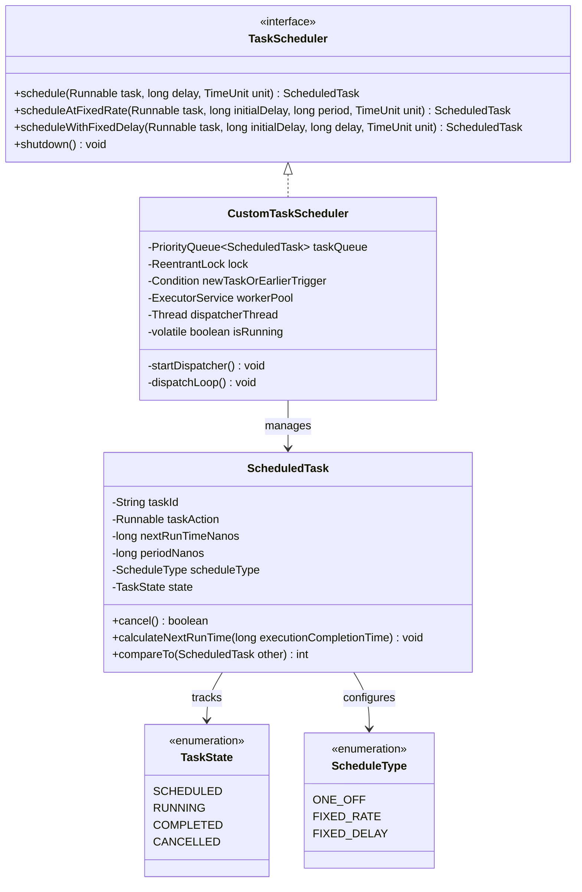
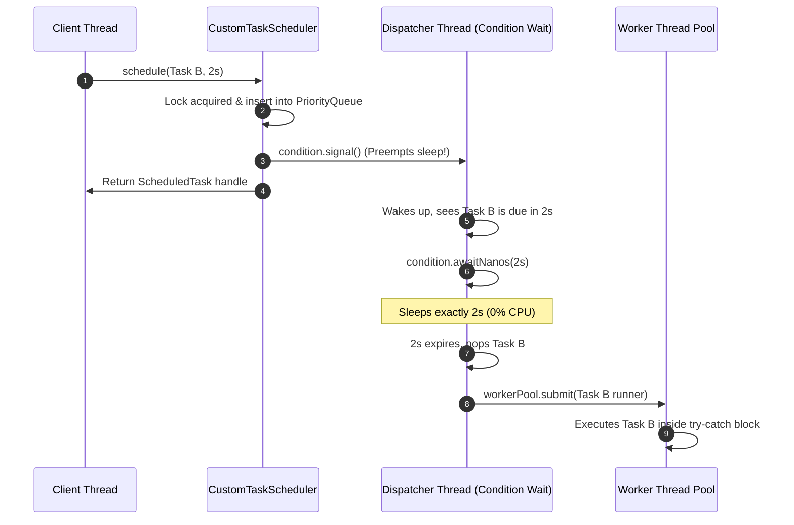

# TOPIC 02: HIGH-THROUGHPUT CONCURRENT IN-MEMORY TASK SCHEDULER

- **Topic ID**: `LLD-02-CONCURRENT-TASK-SCHEDULER`
- **Date**: `2026-08-29`
- **Module**: `Phase 6 — LLD & Clean Architecture`
- **Target Maturity**: `SDE (~2 YOE) → Senior Engineer / Tech Lead`
- **Distributed/HLD Counterpart**: [TOPIC_02 Distributed DAG Workflow Scheduler](file:///Users/flixstock/Desktop/personal%20project/learn/07-HLD-AND-PRODUCT-ARCHITECTURE/TOPIC_02_2026-08-29_distributed_dag_workflow_scheduler_production_architecture.md)

---

## 🏛️ PART 1: The Problem Description

### 1. Executive Summary (Brief)
Design an in-memory, thread-safe **Task Scheduler** library (similar to Java's `ScheduledThreadPoolExecutor` or Quartz worker node engine) capable of scheduling arbitrary tasks for one-off execution in the future, or recurring execution (at fixed rates or fixed delays). The scheduler must execute tasks asynchronously via a worker pool, support task cancellation, ensure zero CPU busy-waiting, and prevent rogue tasks from crashing worker threads.

### 2. Detailed Production Context
In distributed orchestrators (like Temporal, Airflow, or Kafka Consumer pollers), individual worker instances must schedule internal timeouts, retry loops, heartbeat pings, and batch flush timers. 

If this scheduler is poorly designed:
- **Busy-Spinning**: A naive polling loop will pin CPU cores at 100% while waiting for a task scheduled 1 hour later.
- **Worker Thread Death**: An unhandled exception in one task will terminate a worker thread, eventually starving the entire system.
- **Clock Drift Vulnerability**: Using wall-clock time (`System.currentTimeMillis()`) can cause tasks to trigger early, late, or never if NTP adjusts the host clock.
- **Head-of-Line Blocking**: Long-running recurring tasks can stall the dispatcher if execution isn't decoupled from scheduling.

---

## 📋 PART 2: Requirements & Specifications

### 1. Functional Requirements
1. **One-Off Execution (`schedule`)**:
   - Execute a `Runnable` task once after a specified delay $\Delta t$.
2. **Recurring Execution at Fixed Rate (`scheduleAtFixedRate`)**:
   - Execute periodically at fixed intervals (e.g., every 500ms), where interval is measured from the *scheduled start time* of previous runs.
3. **Recurring Execution with Fixed Delay (`scheduleWithFixedDelay`)**:
   - Execute periodically with a fixed idle gap $\Delta t$ *after* the previous execution finishes.
4. **Task Cancellation (`cancel`)**:
   - A caller can cancel a scheduled task at any point before execution. If currently running, flag it as cancelled so it does not reschedule.
5. **Graceful Shutdown (`shutdown`)**:
   - Stop accepting new tasks, allow in-flight tasks to complete within a timeout, and release resources.

### 2. Non-Functional & Concurrency Constraints
- **Thread Safety**: High concurrency on `schedule()`, `cancel()`, and internal dispatcher/worker threads.
- **Zero Busy-Waiting**: When no task is ready, threads must sleep using OS condition variables (`awaitNanos`).
- **Dynamic Earliest Task Preemption**: If a thread is sleeping waiting for Task A (scheduled at $T + 10s$), and a client suddenly submits Task B (scheduled at $T + 1s$), the scheduler must wake up immediately and prioritize Task B.
- **Decoupled Architecture**: Dispatching (determining which task is due) must be decoupled from execution (running the user's task payload).

---

## 📐 PART 3: Architecture & Class Diagram



---

## ⚙️ PART 4: Concurrency & Synchronization Engine Room

### Why `PriorityQueue` + `ReentrantLock` + `Condition`?
1. **The Min-Heap (`PriorityQueue`)**:
   - Tasks are ordered by `nextRunTimeNanos ASC`.
   - `peek()` gives the earliest due task in $O(1)$.
   - `offer()` inserts a new task in $O(\log N)$.
2. **The Condition Variable (`Condition.awaitNanos`)**:
   - The dispatcher thread locks the queue and peeks at the top element.
   - If the queue is empty: `condition.await()`.
   - If `delay = top.nextRunTimeNanos - now > 0`: `condition.awaitNanos(delay)`.
   - If a new task is inserted with an earlier execution time than `top`, `condition.signal()` wakes up the dispatcher immediately!



---

## 💻 PART 5: Production-Grade Implementation (Thread-Safe Java)

### 1. State & Scheduling Enums
```java
package com.techvault.scheduler;

public enum TaskState {
    SCHEDULED,
    RUNNING,
    COMPLETED,
    CANCELLED
}

public enum ScheduleType {
    ONE_OFF,
    FIXED_RATE,
    FIXED_DELAY
}
```

---

### 2. Domain Entity: `ScheduledTask`
```java
package com.techvault.scheduler;

import java.util.concurrent.TimeUnit;
import java.util.concurrent.atomic.AtomicReference;

public class ScheduledTask implements Comparable<ScheduledTask> {
    private final String taskId;
    private final Runnable action;
    private final ScheduleType scheduleType;
    private final long periodNanos;
    
    // Monotonic clock timestamp (nanoTime protects against NTP wall-clock jumps)
    private volatile long nextRunTimeNanos;
    private final AtomicReference<TaskState> state;

    public ScheduledTask(String taskId, Runnable action, long initialDelay, long period, 
                         TimeUnit unit, ScheduleType scheduleType) {
        this.taskId = taskId;
        this.action = action;
        this.scheduleType = scheduleType;
        this.periodNanos = unit.toNanos(period);
        this.nextRunTimeNanos = System.nanoTime() + unit.toNanos(initialDelay);
        this.state = new AtomicReference<>(TaskState.SCHEDULED);
    }

    public boolean cancel() {
        while (true) {
            TaskState current = state.get();
            if (current == TaskState.COMPLETED || current == TaskState.CANCELLED) {
                return false;
            }
            if (state.compareAndSet(current, TaskState.CANCELLED)) {
                return true;
            }
        }
    }

    public boolean isCancelled() {
        return state.get() == TaskState.CANCELLED;
    }

    public void updateNextRunTime(long executionFinishTimeNanos) {
        if (scheduleType == ScheduleType.FIXED_RATE) {
            // Next execution = scheduled time + period (preserves constant frequency)
            this.nextRunTimeNanos += periodNanos;
        } else if (scheduleType == ScheduleType.FIXED_DELAY) {
            // Next execution = actual finish time + period (preserves idle gap)
            this.nextRunTimeNanos = executionFinishTimeNanos + periodNanos;
        }
    }

    @Override
    public int compareTo(ScheduledTask other) {
        return Long.compare(this.nextRunTimeNanos, other.nextRunTimeNanos);
    }

    // Getters
    public String getTaskId() { return taskId; }
    public Runnable getAction() { return action; }
    public ScheduleType getScheduleType() { return scheduleType; }
    public long getNextRunTimeNanos() { return nextRunTimeNanos; }
    public AtomicReference<TaskState> getState() { return state; }
}
```

---

### 3. Public Interface: `TaskScheduler`
```java
package com.techvault.scheduler;

import java.util.concurrent.TimeUnit;

public interface TaskScheduler {
    ScheduledTask schedule(Runnable task, long delay, TimeUnit unit);
    ScheduledTask scheduleAtFixedRate(Runnable task, long initialDelay, long period, TimeUnit unit);
    ScheduledTask scheduleWithFixedDelay(Runnable task, long initialDelay, long delay, TimeUnit unit);
    void shutdown();
}
```

---

### 4. Core Engine: `CustomTaskScheduler`
```java
package com.techvault.scheduler;

import java.util.PriorityQueue;
import java.util.UUID;
import java.util.concurrent.*;
import java.util.concurrent.locks.Condition;
import java.util.concurrent.locks.ReentrantLock;

public class CustomTaskScheduler implements TaskScheduler {

    private final PriorityQueue<ScheduledTask> taskQueue;
    private final ReentrantLock lock;
    private final Condition taskAvailableOrUpdated;

    private final ExecutorService workerThreadPool;
    private final Thread dispatcherThread;
    private volatile boolean isRunning;

    public CustomTaskScheduler(int workerPoolSize) {
        this.taskQueue = new PriorityQueue<>();
        this.lock = new ReentrantLock();
        this.taskAvailableOrUpdated = lock.newCondition();
        this.isRunning = true;

        // Decouple task execution from the scheduling dispatcher
        this.workerThreadPool = Executors.newFixedThreadPool(workerPoolSize, r -> {
            Thread t = new Thread(r, "scheduler-worker-" + UUID.randomUUID().toString().substring(0, 5));
            t.setDaemon(true);
            return t;
        });

        this.dispatcherThread = new Thread(this::runDispatcherLoop, "scheduler-dispatcher");
        this.dispatcherThread.start();
    }

    @Override
    public ScheduledTask schedule(Runnable task, long delay, TimeUnit unit) {
        return enqueue(new ScheduledTask(UUID.randomUUID().toString(), task, delay, 0, unit, ScheduleType.ONE_OFF));
    }

    @Override
    public ScheduledTask scheduleAtFixedRate(Runnable task, long initialDelay, long period, TimeUnit unit) {
        return enqueue(new ScheduledTask(UUID.randomUUID().toString(), task, initialDelay, period, unit, ScheduleType.FIXED_RATE));
    }

    @Override
    public ScheduledTask scheduleWithFixedDelay(Runnable task, long initialDelay, long delay, TimeUnit unit) {
        return enqueue(new ScheduledTask(UUID.randomUUID().toString(), task, initialDelay, delay, unit, ScheduleType.FIXED_DELAY));
    }

    private ScheduledTask enqueue(ScheduledTask task) {
        lock.lock();
        try {
            if (!isRunning) {
                throw new IllegalStateException("Scheduler has been shut down.");
            }
            taskQueue.offer(task);
            // If the newly added task is at the head of the queue, wake the dispatcher immediately
            if (taskQueue.peek() == task) {
                taskAvailableOrUpdated.signal();
            }
            return task;
        } finally {
            lock.unlock();
        }
    }

    private void runDispatcherLoop() {
        while (isRunning) {
            ScheduledTask readyTask = null;
            lock.lock();
            try {
                // 1. Wait until queue has tasks
                while (taskQueue.isEmpty() && isRunning) {
                    taskAvailableOrUpdated.await();
                }

                if (!isRunning) break;

                // 2. Peek earliest task
                ScheduledTask top = taskQueue.peek();
                long now = System.nanoTime();
                long delayRemaining = top.getNextRunTimeNanos() - now;

                if (delayRemaining <= 0) {
                    // Task is ready for execution!
                    readyTask = taskQueue.poll();
                } else {
                    // Task not yet due: sleep for the remaining duration (zero busy-spin)
                    taskAvailableOrUpdated.awaitNanos(delayRemaining);
                    continue;
                }
            } catch (InterruptedException e) {
                if (!isRunning) break;
            } finally {
                lock.unlock();
            }

            // 3. Hand off ready task to worker pool (outside lock to prevent blocking scheduler)
            if (readyTask != null) {
                submitToWorker(readyTask);
            }
        }
    }

    private void submitToWorker(ScheduledTask scheduledTask) {
        if (scheduledTask.isCancelled()) {
            return;
        }

        workerThreadPool.submit(() -> {
            if (scheduledTask.isCancelled()) {
                return;
            }

            scheduledTask.getState().set(TaskState.RUNNING);
            try {
                // ISOLATION: Uncaught exception in user task must NEVER kill worker thread
                scheduledTask.getAction().run();
            } catch (Throwable t) {
                System.err.println("Uncaught exception in task " + scheduledTask.getTaskId() + ": " + t.getMessage());
            } finally {
                long finishTimeNanos = System.nanoTime();

                // Recurring Task Rescheduling
                if (!scheduledTask.isCancelled() && scheduledTask.getScheduleType() != ScheduleType.ONE_OFF) {
                    scheduledTask.updateNextRunTime(finishTimeNanos);
                    scheduledTask.getState().set(TaskState.SCHEDULED);

                    lock.lock();
                    try {
                        if (isRunning) {
                            taskQueue.offer(scheduledTask);
                            if (taskQueue.peek() == scheduledTask) {
                                taskAvailableOrUpdated.signal();
                            }
                        }
                    } finally {
                        lock.unlock();
                    }
                } else {
                    scheduledTask.getState().compareAndSet(TaskState.RUNNING, TaskState.COMPLETED);
                }
            }
        });
    }

    @Override
    public void shutdown() {
        lock.lock();
        try {
            isRunning = false;
            taskAvailableOrUpdated.signalAll();
        } finally {
            lock.unlock();
        }

        dispatcherThread.interrupt();
        workerThreadPool.shutdown();
        try {
            if (!workerThreadPool.awaitTermination(3, TimeUnit.SECONDS)) {
                workerThreadPool.shutdownNow();
            }
        } catch (InterruptedException e) {
            workerThreadPool.shutdownNow();
            Thread.currentThread().interrupt();
        }
    }
}
```

---

## 🔍 PART 6: Step-by-Step Lifecycle Dry Run

### Scenario:
1. `Thread A` schedules `Task 1` for $+10$ seconds.
2. `Thread B` schedules `Task 2` for $+2$ seconds (Preemption).

```
1. Thread A calls schedule(Task 1, 10s)
   - taskQueue.offer(Task 1). Heap size = 1.
   - Dispatcher thread wakes up from empty-queue wait.
   - Computes delayRemaining = 10s.
   - Dispatcher calls taskAvailableOrUpdated.awaitNanos(10s) -> Enters sleep state.

2. At t = 0.5s, Thread B calls schedule(Task 2, 2s)
   - taskQueue.offer(Task 2). Task 2 is earlier than Task 1!
   - taskQueue.peek() == Task 2 (True).
   - scheduler calls taskAvailableOrUpdated.signal().

3. Dispatcher thread is PREEMPTED from 10s sleep:
   - Re-evaluates top of queue: finds Task 2!
   - Computes delayRemaining for Task 2 = 1.5s.
   - Dispatcher calls taskAvailableOrUpdated.awaitNanos(1.5s).

4. At t = 2.0s:
   - Await expires. Task 2 delay <= 0.
   - Task 2 is polled from queue and submitted to workerThreadPool.
   - Worker thread executes Task 2.
   - Dispatcher re-loops, finds Task 1, and sleeps for remaining 8.5s!
```

---

## 🎯 PART 7: Senior Engineer / Tech Lead Edge Cases

| Failure Mode / Edge Case | Junior Instinct | Senior / Tech Lead Defensive Architecture |
| :--- | :--- | :--- |
| **System Wall-Clock Jump (NTP)** | Uses `System.currentTimeMillis()` | Uses **`System.nanoTime()`** (monotonic CPU cycle counter unaffected by clock adjustments). |
| **Task Execution Error** | Lets exception bubble up | Wraps task invocation in `try-catch(Throwable t)` inside worker pool. |
| **Rogue Long-Running Task** | Executes in dispatcher loop | **Decoupled Architecture**: Dispatcher only hands off; worker pool handles execution. |
| **Task Cancellation Race** | Deletes node from queue ($O(N)$) | **Lazy Cancellation**: Set atomic state to `CANCELLED`. Discard when polled from heap in $O(1)$. |
| **Fixed Rate Delay Accumulation** | If execution takes longer than period, spawns parallel duplicate runs | Updates next run time based on scheduled tick; worker ensures single active instance per task ID. |
