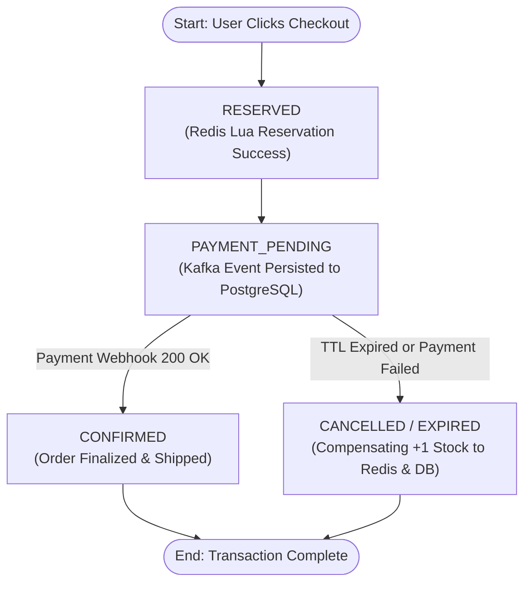

# TOPIC 01: SYSTEM DESIGN — HIGH-CONTENTION FLASH SALE & INVENTORY RESERVATION

**Date:** 2026-08-25  
**Track:** 07-HLD-AND-PRODUCT-ARCHITECTURE  
**Prerequisites:** Database Concurrency, Caching Strategies, Message Queues, Distributed Transactions  
**Target Profile:** Staff / Principal Software Engineer & Systems Architect  

---

## 🧭 Executive Summary & Core Objective

When an interviewer or engineering leadership presents:
> *"Design a Flash Sale System (e.g., iPhone launch / Taylor Swift Ticketmaster drop) where 100,000+ users attempt to purchase 1,000 limited-stock items simultaneously within seconds."*

This is **not** a database problem; it is a **multi-tier distributed systems problem**.

Under naive implementations:
* **Relational DB Crash:** 100,000 concurrent database connections attempting to lock 1 row exhaust connection pools and lock wait queues.
* **Overselling & Race Conditions:** Concurrent read-modify-write cycles cause multiple users to successfully purchase the same physical unit.
* **Ghost Payments:** Users pay for items after their reservation TTL has expired, resulting in financial discrepancies.

```
┌─────────────────────────────────────────────────────────────────────────────────────────────────┐
│                                   HIGH-LEVEL SYSTEM ARCHITECTURE                                │
├─────────────────────────────────────────────────────────────────────────────────────────────────┤
│ [100k Users] ──► [CDN/WAF] ──► [Virtual Waiting Room] ──► [App Cluster] ──► [Redis Cluster Lua] │
│                                                                                    │            │
│                       [PostgreSQL ACID Ledger] ◄── [Kafka Queue] ◄─────────────────┘ (Success)  │
└─────────────────────────────────────────────────────────────────────────────────────────────────┘
```

---

## 📋 1. Functional & Non-Functional Requirements

### Functional Requirements:
1. **Catalog & Availability:** Real-time stock status display.
2. **Atomic Reservation:** Reserve an item for 10 minutes upon entering checkout.
3. **Order Settlement:** Confirm order upon successful payment webhook.
4. **Auto-Release & Rollback:** Automatically restore inventory if payment is not completed within the 10-minute TTL.

### Non-Functional Requirements:
* **Strict Consistency (0 Overselling):** It is better to fail an order than to sell 1,001 items when only 1,000 exist.
* **Ultra-Low Latency:** Reservation response $\le 50\text{ms}$ at peak $100,000\text{ req/sec}$.
* **High Availability:** Catalog browsing must remain 99.99% available even during massive checkout spikes.
* **Idempotency:** Repeated network retries must never double-charge or double-reserve.

---

## 🏗️ 2. Multi-Tier Production Architecture

```
                  ┌───────────────────────────────────────────────────────────────┐
                  │          END-TO-END FLASH SALE PRODUCTION ARCHITECTURE        │
                  └───────────────────────────────────────────────────────────────┘

       100,000 req/s (Bots + Users)
    ────────────────────────────────►  [ Tier 1: Cloudflare CDN & WAF ]
                                         • Bot challenge / CAPTCHA
                                         • Static assets & cached product page (TTL 1s)
                                         • Drop 60% illegitimate bot traffic
                                                      │
                                                      ▼ 40,000 req/s
                                       [ Tier 2: Virtual Waiting Room ]
                                         • Token bucket traffic shaper
                                         • Admits 5,000 users/batch into checkout
                                                      │
                                                      ▼
                                       [ Tier 3: API Gateway & Auth ]
                                         • Rate Limiter per User ID
                                         • JWT authentication
                                                      │
                                                      ▼
                                       [ Tier 4: Order Reservation Service ]
                                                      │
                                                      ▼ (Sub-millisecond Atomic Check)
                                        [ Redis Cluster (Master + Replicas) ]
                                         • Atomic Lua Script (EVAL)
                                         • Decrements stock & issues Reservation Token
                                                      │
                       ┌──────────────────────────────┴──────────────────────────────┐
                       ▼ (Success: 1,000 Users)                                      ▼ (99,000 Out of Stock)
          [ Kafka Broker: 'order-reservations' ]                         [ Immediate 409 / 410 Fast Fail ]
                       │
                       ▼ (Controlled 200 writes/s)
          [ Async Order Processing Worker ]
                       │
                       ▼
          [ PostgreSQL Database (ACID Ledger) ]  ◄───► [ Payment Gateway (Stripe/PayPal) ]
          • Status: PENDING_PAYMENT (10m TTL)           • Webhook confirmation
```

---

## 🔬 3. Deep-Dive Tier Breakdown

### Tier 1: Edge Defense & Static Caching (CDN / WAF)
* **The Problem:** 100,000 users refreshing the product page simultaneously will saturate network bandwidth and crash load balancers.
* **Production Solution:**
  1. Product descriptions, static media, and base prices are cached on Cloudflare edge nodes with a 1-second TTL.
  2. The **"Buy Now"** button is disabled until the synchronized drop timestamp.
  3. Turnstile / Cloudflare Bot Management blocks headless bots and scrapers at the edge.

---

### Tier 2: Virtual Waiting Room (Traffic Shaping)
* **The Problem:** Forwarding 40,000 requests/sec directly to application microservices causes thread starvation and connection pool crashes.
* **Production Solution:**
  * Implement a **Fair-Queue Token Bucket** (similar to Cloudflare Waiting Room or Ticketmaster Queue-It).
  * Users wait in an active queue. Every 2 seconds, a batch of 5,000 users is issued a signed, short-lived JWT authorization ticket allowing access to the checkout reservation endpoint.

---

### Tier 3: In-Memory Atomic Reservation (Redis Cluster + Lua Script)

#### Why Lua Scripting is Mandatory:
In application code, `GET stock` $\rightarrow$ `if (stock > 0)` $\rightarrow$ `DECR stock` creates a **TOCTOU race condition**.  
Redis is single-threaded on its core event loop. A Lua script executes **atomically without interruption**.

```lua
-- KEYS[1] = "item:{999}:stock"
-- KEYS[2] = "user:{501}:has_reserved"
-- ARGV[1] = quantity (e.g., 1)
-- ARGV[2] = user_id (501)
-- ARGV[3] = reservation_token ("uuid-v4-token")
-- ARGV[4] = ttl_seconds (600)

-- Check if user already claimed an item (Prevent double claiming per user)
if redis.call('exists', KEYS[2]) == 1 then
    return -1 -- ALREADY_RESERVED
end

local stock = tonumber(redis.call('get', KEYS[1]))
if not stock or stock < tonumber(ARGV[1]) then
    return 0 -- OUT_OF_STOCK
end

-- 1. Atomically deduct stock
redis.call('decrby', KEYS[1], ARGV[1])

-- 2. Prevent user from re-buying
redis.call('set', KEYS[2], ARGV[3], 'EX', ARGV[4])

-- 3. Store reservation details with a 10-minute TTL
local reservation_key = "reservation:" .. ARGV[3]
redis.call('hset', reservation_key, "user_id", ARGV[2], "qty", ARGV[1], "status", "RESERVED")
redis.call('expire', reservation_key, ARGV[4])

return 1 -- SUCCESS
```

> [!IMPORTANT]
> **Redis Cluster Hash Tag `{999}`:**  
> In a Redis Cluster, keys are sharded across 16,384 hash slots. By using `{999}` in `item:{999}:stock` and `user:{501}:{999}:has_reserved`, Redis guarantees all keys for item 999 hash to the **exact same Redis node**, enabling multi-key Lua atomic execution.

---

### Tier 4: Order State Machine & Orchestrated Saga



---

## ⚡ 4. Staff-Level Edge Cases & Production Failure Modes

### 💀 Edge Case 1: The "Ghost Payment" Problem
* **The Scenario:**
  1. User A reserves an item with a 10-minute TTL at `T = 0`.
  2. User A takes 9m 58s on the checkout screen; payment webhook arrives delayed at `T = 10:03`.
  3. At `T = 10:00`, the reservation TTL expired, and the background sweeper released +1 stock back to Redis.
  4. User B immediately bought that released unit at `T = 10:01`.
  5. Both User A and User B paid for 1 item!

* **Production Defense (Two-Step Settlement Pattern):**
  1. When the payment webhook arrives, inspect the database record inside a transaction:
     ```sql
     SELECT status, expires_at FROM orders WHERE order_id = :id FOR UPDATE;
     ```
  2. If `NOW() > expires_at`:
     - Do **NOT** transition order to `CONFIRMED`.
     - Automatically trigger a **Payment Gateway Refund API call**.
     - Notify user: *"Your payment completed after the 10-minute reservation window. A full refund has been initiated."*

---

### 💀 Edge Case 2: Redis Master Node Crash & Async Replication Data Loss
* **The Scenario:**
  * Redis writes to Master in memory. Master replicates to Replicas asynchronously.
  * Master decrements stock from `1` to `0`, responds OK, and immediately crashes before replication.
  * Failover promotes Replica to Master (which still has `stock = 1`).
  * Another user buys the item $\rightarrow$ 1 item oversold.

* **Production Defense:**
  1. **Dual Validation in Async Consumer:** When the Kafka worker persists the order to PostgreSQL, it performs an atomic check:
     ```sql
     UPDATE inventory 
     SET available_stock = available_stock - 1,
         reserved_stock = reserved_stock + 1
     WHERE item_id = 999 AND available_stock >= 1;
     ```
  2. If PostgreSQL returns `0 rows affected` (Postgres has absolute ground truth), the worker triggers a **Compensating Saga**:
     - Cancels reservation.
     - Emits refund.
     - Alerts on-call engineering.

---

### 💀 Edge Case 3: Idempotency Under Network Drops
* **The Scenario:** The client taps "Pay Now", the network drops for 3 seconds, and the client retries 4 times.
* **Production Defense:**
  - Client sends a unique `idempotency_key` (UUID v4) with the request.
  - The API Gateway executes `SET payment:idempotency:{key} "PROCESSING" NX EX 120`.
  - Concurrent duplicate requests are rejected with `409 Conflict: Payment in Progress`.

---

## 📊 Summary Comparison Matrix

| Tier | Technology | Primary Function | Bottleneck Mitigated |
| :--- | :--- | :--- | :--- |
| **Edge** | Cloudflare WAF / CDN | Bot mitigation & static catalog cache | Network bandwidth saturation |
| **Traffic Shaper** | Virtual Waiting Room | Controlled batch admission | Application thread starvation |
| **In-Memory** | Redis Cluster + Lua | Lock-free sub-ms stock reservation | Database lock contention & overselling |
| **Message Queue** | Apache Kafka | Asynchronous DB write buffering | Relational connection pool exhaustion |
| **Ledger** | PostgreSQL 16 | ACID source of truth & audit trail | Financial inconsistency |
| **Compensation** | Refund Engine | Reconciles late & ghost payments | Inventory/Payment mismatch |
