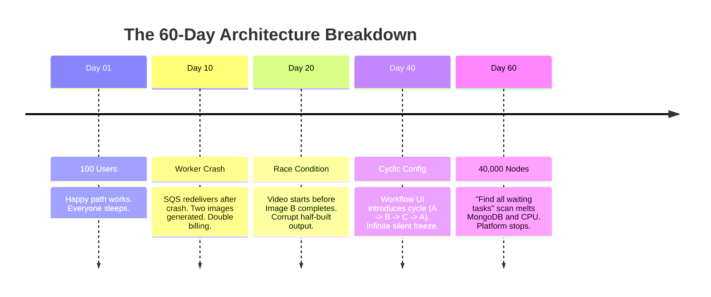
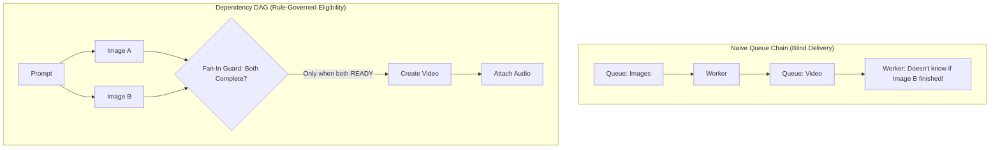
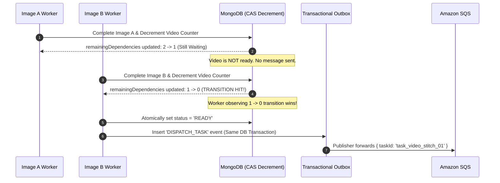
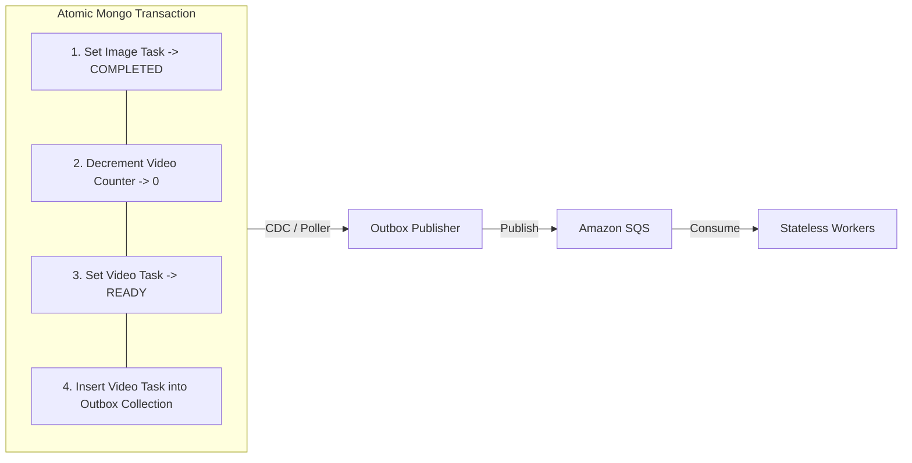

# TOPIC 02: HOW PRODUCTION WORKFLOW SCHEDULERS ACTUALLY WORK (DAGS, CAS, LEASES & OUTBOX)

- **Topic ID**: `HLD-02-DISTRIBUTED-DAG-WORKFLOW-SCHEDULER`
- **Date**: `2026-08-29`
- **Module**: `Phase 7 — HLD & Product Architecture`
- **Target Maturity**: `SDE (~2 YOE) → Senior Engineer / Tech Lead`
- **Cross-Reference**: [TOPIC_02 In-Memory Concurrent Task Scheduler](file:///Users/flixstock/Desktop/personal%20project/learn/06-LLD-AND-CLEAN-ARCHITECTURE/TOPIC_02_2026-08-29_concurrent_in_memory_task_scheduler.md)

---

## 🏛️ PART 1: The Production Evolution & Failure Timeline

This is not an academic tour of a toy scheduler. It is an investigation into how real-world workflow engines fail in production and why each mechanism exists.

### 1. The Naive Feature: "Generate Video from Prompt"
A product manager asks for a simple AI generation pipeline:
```
User Prompt ──► Generate Image A ──►
             ──► Generate Image B ──► Stitch Video ──► Attach Audio
```

Most teams start with one of two architectures:
1. **The Linear Queue Chain**: `Queue A` → `Worker` → `Queue B` → `Worker` → `Done`.
2. **The Straight Line of Awaits**: `await imageA(); await imageB(); await video(); await audio();`

It works perfectly on localhost and in staging. Then it hits real production.

---

### 2. The 60-Day Escalating Production Outage Timeline



1. **Day 10 (Worker Crash & Double Billing)**:
   - A GPU worker crashes after generating an image but *before* acknowledging the SQS message.
   - SQS visibility timeout expires; another worker picks up the task.
   - The same prompt is generated twice. Customers are double-billed; identical assets overwrite S3.
2. **Day 20 (Early Execution & Corrupted State)**:
   - Video generation starts when Image A finishes, but Image B is still rendering.
   - The queue happily delivered "Video work" because it was next in line. The queue had zero knowledge that Image B was a strict prerequisite.
3. **Day 40 (Cyclic Deadlock)**:
   - An operator modifies a workflow config: Task A $\rightarrow$ Task B $\rightarrow$ Task C $\rightarrow$ Task A.
   - Every task waits forever. No alerts fire, no errors throw — only complete silence.
4. **Day 60 (The Full-Graph Scan Meltdown)**:
   - Scale grows to 40,000 active tasks. The control plane runs what felt obvious on Day 1:
     $$\text{Every second} \longrightarrow \text{Query DB for waiting tasks} \longrightarrow \text{Check dependencies} \longrightarrow \text{Repeat}$$
   - CPU sits at 100%. MongoDB connection pools exhaust and melt down. The platform halts completely because the control plane scanned the universe every tick.

---

## 🧩 PART 2: Why Queues Alone Are Not Enough (Queue vs DAG)

> **Core Axiom**: A message queue **delivers work**. It does **not** understand execution rules.



### Direct Architectural Comparison

| Dimension | Linear Queues / `await` Chains | Dependency DAG Engine |
| :--- | :--- | :--- |
| **Dependency Awareness** | Blind: only knows "what's next in line". | Explicit: edges represent hard prerequisites. |
| **Parallel Fan-Out** | Brittle manual glue code across microservices. | First-class: all children without dependencies run in parallel. |
| **Fan-In Barrier** | High race condition risk (partial inputs). | First-class: child waits for $100\%$ of parents before waking. |
| **Cycle Safety** | Impossible to detect; causes silent deadlocks. | Rejected at workflow registration time via Kahn's Algorithm. |
| **Scan Overhead** | Control plane continuously scans database. | **Event-driven**: Completed parent decrements child counter. Zero scanning. |

---

## 📐 PART 3: The Core Algorithm: Event-Driven DAG Mechanics

### 1. Cycle Prevention: Kahn's Algorithm (Server-Side)
Before storing any workflow, the API computes the in-degree of all nodes:
- Repeatedly remove nodes with `in-degree = 0`.
- If nodes remain after the graph is drained, a **cycle exists** $\rightarrow$ **Reject with 400 Bad Request immediately**. Client-side validation is never trusted.

### 2. Zero-Scan Scheduling: The `remainingDependencies` Counter
Instead of scanning all tasks every second, the database stores **one atomic number** per task:

```json
{
  "taskId": "task_video_stitch_01",
  "workflowId": "wf_9921",
  "status": "WAITING_DEPENDENCIES",
  "remainingDependencies": 2,
  "dependsOn": ["task_img_a", "task_img_b"]
}
```



> **The Golden Rule**: Polling the graph to discover work destroys databases. **Completed parents must wake their direct children.**

---

## 🛡️ PART 4: Concurrency: Two Workers, One Door (CAS & Leases)

### 1. The Myth of Visibility Timeout
Many engineers believe SQS `VisibilityTimeout` guarantees single execution. **It does not.**
If a worker takes 31 seconds on a 30-second visibility timeout, SQS redelivers the message to Worker 2 while Worker 1 is still generating the video.

### 2. Compare-And-Set (CAS) Task Claiming
When a worker receives `{ taskId }` from SQS, it does not trust the queue. It executes a CAS atomic claim:

```javascript
// MongoDB Atomic Claim with Lease Minting
const claim = await db.collection('tasks').findOneAndUpdate(
  {
    taskId: message.taskId,
    status: 'READY' // MUST be READY (or expired lease)
  },
  {
    $set: {
      status: 'RUNNING',
      attemptId: crypto.randomUUID(), // Unique lease token
      leaseExpiresAt: new Date(Date.now() + 60 * 1000) // 60s lease
    }
  },
  { returnDocument: 'after' }
);

if (!claim.value) {
  // Lost the race! Another worker already claimed it. Drop message cleanly.
  return ackMessage(); 
}
```

### 3. Attempt-Scoped Finalization
When the worker finishes generating the video, it finalizes using the exact `attemptId` it was granted:

```javascript
// CAS Completion: Only the current valid lease holder can finalize
const finalize = await db.collection('tasks').findOneAndUpdate(
  {
    taskId: message.taskId,
    status: 'RUNNING',
    attemptId: myAttemptId // Guard against stale workers
  },
  {
    $set: {
      status: 'COMPLETED',
      outputS3Uri: 's3://bucket/video_final.mp4'
    }
  }
);

if (!finalize.value) {
  // Our lease expired and another worker took over! Discard side effects.
  console.warn("Lease expired before completion. Output dropped.");
}
```

---

## 📦 PART 5: The Transactional Outbox Pattern

### The Dual-Write Hazard
1. **Hazard A**: DB updates status to `READY`, but server crashes before pushing to SQS $\rightarrow$ Task stays `READY` forever and never runs.
2. **Hazard B**: SQS receives message, but DB transaction rolls back $\rightarrow$ Worker attempts to run a ghost task.

### The Solution
Update the task and write an Outbox document inside the **same database transaction**:



---

## 🚨 PART 6: Production Failure & Recovery Matrix

| Failure Mode | What Actually Breaks | Tech Lead Production Fix |
| :--- | :--- | :--- |
| **Worker Crashes Mid-Execution** | Task stuck in `RUNNING` or silently redelivered. | **Lease Expiry + Background Reconciler**: Reconciler finds `status == 'RUNNING' && leaseExpiresAt < now` and returns task to `READY`. |
| **Duplicate SQS Message** | Double execution, duplicate billing, corrupted S3 files. | **CAS Claim + Deterministic Output Keys**: Only one worker acquires the claim; output S3 keys are keyed by `s3://bucket/{taskId}/{attemptId}`. |
| **Downstream AI API Timeout** | Transient failure causes permanent workflow abort. | **Exponential Backoff with Jitter**: Move task to `WAITING_RETRY` with `retryAfter` timestamp; sleep/preempt without busy-waiting. |
| **Permanent Model Error** | Infinite retry storms burning thousands of dollars. | **Retry Budget & Dead-Letter Queue (DLQ)**: Maximum 3 retries $\rightarrow$ route to DLQ for human operator intervention. |
| **Cyclic Dependency in UI** | Control plane enters infinite hang. | **Server-Side Kahn's Algorithm**: Validate DAG topology at workflow creation. Reject cycles at the edge. |
| **High Fan-Out Outage (1 $\rightarrow$ 10,000)** | Completing one task attempts to decrement 10,000 rows in one transaction. | **Batched Outbox Fan-out**: Chunk child updates into batches of 250 with idempotency keys. |

---

## 📊 PART 7: Capacity Planning & Little's Law (1M Tasks/Day)

### The Production Math
- **Throughput ($X$)**:
  $$\frac{1,000,000 \text{ tasks}}{86,400 \text{ seconds}} \approx 11.6 \text{ tasks/sec average} \quad (\approx 116 \text{ tasks/sec at } 10\times \text{ burst})$$
- **Average Task Duration ($W$)**: 120 seconds (typical for AI image/video generation).
- **Concurrency ($L$) via Little's Law ($L = \lambda \times W$)**:
  $$L_{\text{average}} = 11.6 \times 120 \approx \mathbf{1,392 \text{ concurrent workers}}$$
  $$L_{\text{burst}} = 116 \times 120 \approx \mathbf{13,920 \text{ concurrent workers}}$$

> **Key Takeaway**: At 14,000 concurrent tasks, scanning the database to find ready work will instantly destroy any database. Event-driven parent-to-child wakeups with indexed ready queues are the **only** path to survivability.

---

## 🧠 PART 8: Senior Engineer / Tech Lead Mental Models

1. **A queue does not understand dependencies; it only delivers work.**
2. **DAGs are not diagrams — they are hard execution rules.**
3. **At-least-once delivery is easy; exactly-once execution is a myth. Idempotency and CAS are the real solutions.**
4. **Never scan the universe to discover ready work. Let completed parents wake their children.**
5. **Distributed systems fail in the gaps between components, not inside individual services.** Outbox, CAS, and leases exist specifically to bridge those gaps.
6. **Visibility timeout recovers delivery, NOT correctness.** Correctness comes from lease ownership, attempt IDs, and idempotent side effects.
