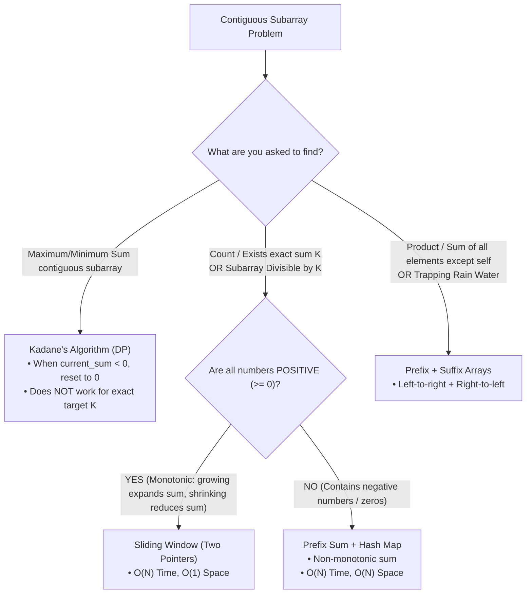

# 🧩 PREFIX & SUFFIX SUM: PATTERN RECOGNITION & MENTAL MODEL
## Deep Dive: *Subarray Sum Equals K* (LeetCode 560)

---

## 🧭 PART 1: The Core Distinctions (Kadane vs Sliding Window vs Prefix Sum)

Many engineers confuse these 3 array patterns because all three operate on contiguous subarrays. Here is the definitive mental model:

### 1. Kadane's Algorithm
- **Problem Type:** "Find the **maximum sum** of any contiguous subarray."
- **Why it resets to 0:** If the accumulated running sum drops below 0, carrying it forward only hurts any future subarray.
- **Why it FAILS for "Sum equals K":** Kadane throws away information. It cannot answer "how many subarrays equal 7" because an earlier negative prefix might be exactly what is needed to form a sum of 7 later.

### 2. Sliding Window (Two Pointers)
- **Problem Type:** "Find longest/shortest subarray with sum = $K$ or sum $\le K$."
- **Condition Required:** **Monotonicity** (all elements $\ge 0$). Expanding `right` *always* increases sum; shrinking `left` *always* decreases sum.
- **Why it FAILS with Negative Numbers:** Adding a negative number *decreases* the sum. If the sum exceeds $K$, shrinking the left pointer might actually *increase* the sum (if removing a negative number). The two-pointer greedy invariant breaks completely.

### 3. Prefix Sum + Hash Map
- **Problem Type:** "Count/Find subarrays with exact sum $K$", "Subarray sum divisible by $K$", or "Longest subarray with sum $K$ (with negatives)".
- **Core Principle:** Math transformation $Prefix[j] - Prefix[i-1] = K \implies Prefix[i-1] = Prefix[j] - K$.
- **Why it works with negatives:** Hash Map remembers the exact frequency of every prefix sum seen so far regardless of whether the sum went up or down.

---

## 🔍 PART 2: Prefix Sum vs. Suffix Sum Recognition Framework

| Pattern | What It Represents | When to Use | Classic Problem Triggers |
| :--- | :--- | :--- | :--- |
| **Prefix Sum Only** | Cumulative sum from index $0 \to i$ | You need subarray sums from $i \to j$: $\text{Sum}(i..j) = P[j] - P[i-1]$ | • Subarray Sum Equals $K$ • Continuous Subarray Sum ($Sum \% k == 0$) • Range Sum Queries ($O(1)$ lookup) |
| **Suffix Sum Only** | Cumulative sum from index $n-1 \to i$ | When decisions at index $i$ depend entirely on what lies ahead | • Number of ways to split array into valid partitions from right • Maximum score after taking elements from ends |
| **Prefix + Suffix (Two Passes)** | Combining information strictly to the left of $i$ with information strictly to the right of $i$ | When calculating an answer for index $i$ that excludes $i$ itself, or depends on boundaries on both sides | • **Product of Array Except Self** ($PrefixProd[i-1] \times SuffixProd[i+1]$) • **Trapping Rain Water** ($\min(MaxLeft[i], MaxRight[i]) - Height[i]$) • **Find Pivot Index** ($PrefixSum[i-1] == SuffixSum[i+1]$) |

---

## 🧮 PART 3: Step-by-Step Prefix Sum Dry Run: *Subarray Sum Equals K*

### The Core Equation:
$$\text{Current Running Sum} - \text{Target } K = \text{Needed Prefix Sum}$$

If that `Needed Prefix Sum` was observed previously, then every time it was observed marks the start of a valid subarray ending at the current index.

### Why initialize `map.set(0, 1)`?
The prefix sum $0$ has occurred once before reading any elements (an empty prefix). If a running sum from index $0$ to $i$ equals $K$ directly, `current_sum - K = 0`. Without `map.set(0, 1)`, we would miss valid subarrays that start at index $0$.

---

### Dry Run 1: `nums = [1, 2, 3]`, $k = 3$
- Initialize: `map = {0: 1}`, `current_sum = 0`, `count = 0`

| Step / Index | Element | `current_sum` | `needed = current_sum - k` | Is `needed` in Map? | `count` updated | Map state after step |
| :--- | :--- | :--- | :--- | :--- | :--- | :--- |
| **Init** | - | 0 | - | - | 0 | `{0: 1}` |
| **$i = 0$** | `1` | 1 | $1 - 3 = -2$ | No | 0 | `{0: 1, 1: 1}` |
| **$i = 1$** | `2` | 3 | $3 - 3 = 0$ | **Yes (freq: 1)** | $0 + 1 = 1$ *(Subarray `[1, 2]`)* | `{0: 1, 1: 1, 3: 1}` |
| **$i = 2$** | `3` | 6 | $6 - 3 = 3$ | **Yes (freq: 1)** | $1 + 1 = 2$ *(Subarray `[3]`)* | `{0: 1, 1: 1, 3: 1, 6: 1}` |

**Result:** `count = 2`.

---

### Dry Run 2 (Negative Numbers): `nums = [3, 4, 7, 2, -3, 1, 4, 2]`, $k = 7$
- Initialize: `map = {0: 1}`, `current_sum = 0`, `count = 0`

| Index | Num | `current_sum` | `needed = current_sum - 7` | Match in Map? | Subarrays found | Map State |
| :--- | :--- | :--- | :--- | :--- | :--- | :--- |
| Init | - | 0 | - | - | - | `{0: 1}` |
| 0 | 3 | 3 | $3 - 7 = -4$ | No | - | `{0:1, 3:1}` |
| 1 | 4 | 7 | $7 - 7 = 0$ | **Yes (freq 1)** | `[3, 4]` (count = 1) | `{0:1, 3:1, 7:1}` |
| 2 | 7 | 14 | $14 - 7 = 7$ | **Yes (freq 1)** | `[7]` (count = 2) | `{0:1, 3:1, 7:1, 14:1}` |
| 3 | 2 | 16 | $16 - 7 = 9$ | No | - | `..., 16:1` |
| 4 | -3 | 13 | $13 - 7 = 6$ | No | - | `..., 13:1` |
| 5 | 1 | 14 | $14 - 7 = 7$ | **Yes (freq 1)** | `[2, -3, 1, 7...]` -> `[2, -3, 1, 7]` ? Subarray between sum 7 (idx 2) and sum 14 (idx 5): `[2, -3, 1, 4]` wait: indices (3..5) is `[2, -3, 1]` sum = 0, so from sum 7 at idx 1 (`[3, 4]`), remaining `[7, 2, -3, 1]` sum is 7! (count = 3) | `..., 14:2` |
| 6 | 4 | 18 | $18 - 7 = 11$ | No | - | `..., 18:1` |
| 7 | 2 | 20 | $20 - 7 = 13$ | **Yes (freq 1)** | between sum 13 (idx 4) and sum 20 (idx 7): `[1, 4, 2]` sum = 7! (count = 4) | `..., 20:1` |

**Total Count:** `4`.

---

## ⚡ Complexity
- **Time Complexity:** $O(N)$ — Single pass through the array. Hash map lookups and insertions are $O(1)$ average time.
- **Space Complexity:** $O(N)$ — In the worst case, all prefix sums are distinct, storing $N + 1$ entries in the Hash Map.
